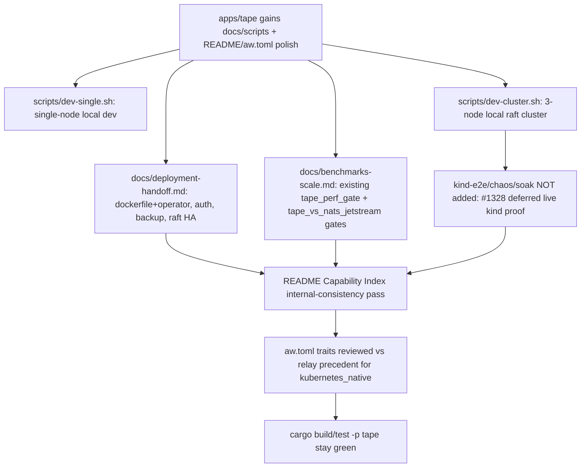

## Logic
<!-- type: logic lang: mermaid -->


## Unit Test
<!-- type: unit-test lang: mermaid -->

```mermaid
---
id: (fill: spec-id)-verification
requirements:
  example_requirement:
    id: R1
    text: "(fill: requirement text)"
    kind: functional
    risk: medium
    verify: (fill: concrete verification target, e.g. a test name)
---
flowchart TD
    r1[R1 example requirement] --> fill_concrete_verification_target_e_g_a_test_name[(fill: concrete verification target, e.g. a test name)]
```
## Changes
<!-- type: changes lang: yaml -->

```yaml
changes:
  - path: apps/tape/docs/deployment-handoff.md
    action: create
    section: logic
    impl_mode: hand-written
    description: "New docs page (mirrors projects/lumen/docs/deployment-handoff.md): image/binary (dockerfile render + serve), CLI surface, runbooks (binary/docker/k8s kustomize-equivalent operator path #1328), environment variables (TAPE_BIND/STORE/GRACE_SECS/AUTH/TOKEN_REGISTRY_FILE/DATA_DIR/PEER_SERVICE/PEERS #1326 #1327), HTTP surface and probes, smoke sequence, backup/restore runbook (#1329), and release-readiness gates."
  - path: apps/tape/docs/benchmarks-scale.md
    action: create
    section: logic
    impl_mode: hand-written
    description: "New docs page (mirrors projects/lumen/docs/benchmarks-scale.md shape, scoped to tape's actual gates): documents apps/tape/tests/tape_perf_gate.rs (local append/replay/checkpoint regression budget, no external peer win claims) and apps/tape/tests/tape_vs_nats_jetstream.rs (real nats-server -js 20k-event 128-byte-payload backlog replay, Tape zero-copy replay_refs >=1.5x win), how to reproduce both, and the explicit not-yet-calibrated peer list (Kafka/Redpanda/Pulsar/RabbitMQ Streams). No new benchmark classes invented."
  - path: apps/tape/scripts/dev-single.sh
    action: create
    section: logic
    impl_mode: hand-written
    description: "New script (mirrors projects/lumen/scripts/dev-single.sh): single-node local dev, embedded file-backed journal via TAPE_STORE, TAPE_BIND default 127.0.0.1:7137, TAPE_AUTH=off, runs cargo run -p tape --bin tape -- serve."
  - path: apps/tape/scripts/dev-cluster.sh
    action: create
    section: logic
    impl_mode: hand-written
    description: "New script (mirrors projects/lumen/scripts/dev-cluster.sh): 3-node local raft cluster, sets REPLICAS_PER_SHARD=3/SHARD_COUNT=1/VOTER_COUNT=3/POD_NAME plus TAPE_DATA_DIR/TAPE_PEER_SERVICE/TAPE_PEERS so raft_host::ClusterTopology::from_env resolves peers and TapeRaft::from_topology replicates append/checkpoint-put across 3 tape serve processes on distinct ports."
  - path: apps/tape/README.md
    action: modify
    section: logic
    impl_mode: hand-written
    description: "Capability Index internal-consistency pass: verify each row's Impl/Verification/Maturity/Production columns match its section prose below, fix any drift found. Retention And Backfill, Long-Running Stability, and Security Hardening maturity claims stay untouched (still planned/not_ready, out of scope for this epic)."
  - path: apps/tape/aw.toml
    action: modify
    section: logic
    impl_mode: hand-written
    description: "[capability.profile].traits reviewed against apps/relay/aw.toml precedent for kubernetes_native; only added if the Kubernetes-Native Deployment capability is genuinely implemented beyond offline render (checked against README's own no-live-kind-cluster-proof caveat)."
```
