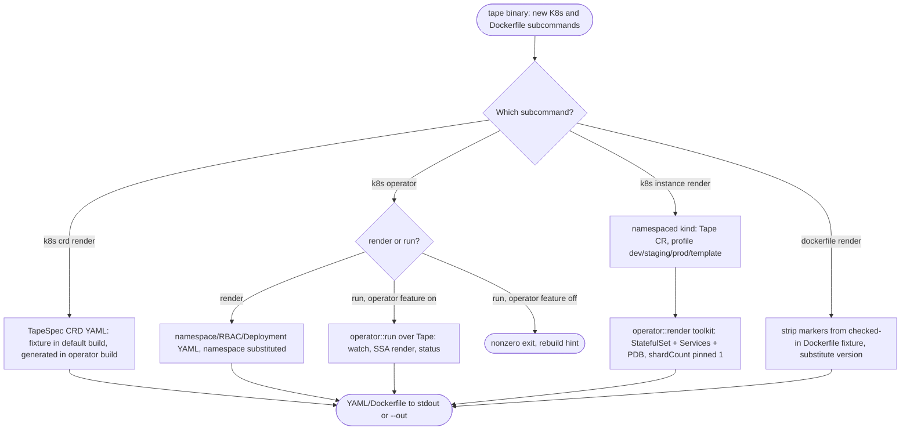

## Logic
<!-- type: logic lang: mermaid -->



## Unit Test

```mermaid
---
id: tape-operator-k8s-dockerfile-cli-verification
requirements:
  auth_secret_wiring_opt_in:
    id: R6
    text: "The token-registry Secret volume/env (TAPE_AUTH=required, TAPE_TOKEN_REGISTRY_FILE) is rendered only when spec.auth is required and spec.tokensSecret is set; otherwise the StatefulSet carries neither."
    kind: functional
    risk: medium
    verify: tests/operator.rs::token_registry_secret_wiring_is_opt_in
  crd_flattens_cluster_spec:
    id: R4
    text: "TapeSpec flattens operator::ClusterSpec directly into the CRD schema (no nested cluster wrapper) and pins shardCount to 1 in the render, matching tape's single-raft-group Primary Replicas topology."
    kind: functional
    risk: high
    verify: tests/operator.rs::crd_flattens_cluster_spec
  crd_structural_schema_safe:
    id: R3
    text: "The rendered TapeSpec CRD is Kubernetes structural-schema safe: no format: uint32/uint64, a minimum floor on normalized counts, group tape.dev, kind Tape."
    kind: functional
    risk: high
    verify: tests/deploy_cli.rs::crd_render_is_structural_schema_safe
  dockerfile_render_reproduces_fixtures:
    id: R1
    text: "tape dockerfile render --variant source reproduces the committed apps/tape/Dockerfile byte-for-byte, and --variant release reproduces apps/tape/Dockerfile.release byte-for-byte; --version substitutes the ARG/tag lines."
    kind: functional
    risk: medium
    verify: tests/deploy_cli.rs::dockerfile_render_reproduces_committed_fixtures
  k8s_render_verbs_offline:
    id: R2
    text: "tape k8s crd render, tape k8s operator render --namespace, and tape k8s instance render --profile dev|staging|prod|template all succeed offline in the default (kube-free) build and emit parseable YAML; tape k8s operator run without --features operator exits nonzero with a rebuild hint."
    kind: functional
    risk: medium
    verify: tests/deploy_cli.rs::render_verbs_emit_parseable_yaml_offline
  llm_topic_names_deploy_verbs:
    id: R10
    text: "The tape llm outline/operations topic documents the new k8s and dockerfile verbs so agent-facing docs stay honest about the CLI surface."
    kind: functional
    risk: low
    verify: tests/deploy_cli.rs::llm_topic_names_deploy_verbs
  operator_feature_build_green:
    id: R9
    text: "cargo build -p tape --features operator and cargo test -p tape --features operator succeed, exercising the real operator render/status-patch logic."
    kind: regression
    risk: medium
    verify: cargo test -p tape --features operator
  operator_feature_default_off:
    id: R8
    text: "The default cargo build of tape (no --features operator) does not link kube/k8s-openapi; cargo build -p tape and cargo test -p tape stay green without the feature, and the operator-gated tests only compile with --features operator."
    kind: regression
    risk: medium
    verify: cargo build -p tape && cargo test -p tape
  render_emits_downward_api_statefulset:
    id: R5
    text: "operator::render(Tape) always emits a StatefulSet (never a Deployment) carrying the downward-API env quartet, TAPE_PEER_SERVICE, TAPE_BIND/TAPE_DATA_DIR/TAPE_GRACE_SECS, a /data PVC sized from spec.storage, /healthz and /readyz probes, and a nonroot security context, plus ServiceAccount/headless+client Services/PodDisruptionBudget."
    kind: functional
    risk: high
    verify: tests/operator.rs::render_emits_expected_child_objects
  status_patch_phases:
    id: R7
    text: "ManagedService::status_patch for Tape reports Pending when no replicas are ready, Reconciling when some but not all of replicasPerShard are ready, and Ready when readyReplicas >= replicasPerShard."
    kind: functional
    risk: medium
    verify: tests/operator.rs::status_patch_reports_pending_reconciling_ready
---
flowchart TD
    r1[R1 dockerfile render reproduces fixtures] --> tests_deploy_cli_rs_dockerfile_render_reproduces_committed_fixtures[tests/deploy_cli.rs::dockerfile_render_reproduces_committed_fixtures]
    r2[R2 k8s render verbs offline] --> tests_deploy_cli_rs_render_verbs_emit_parseable_yaml_offline[tests/deploy_cli.rs::render_verbs_emit_parseable_yaml_offline]
    r3[R3 crd structural schema safe] --> tests_deploy_cli_rs_crd_render_is_structural_schema_safe[tests/deploy_cli.rs::crd_render_is_structural_schema_safe]
    r4[R4 crd flattens cluster spec] --> tests_operator_rs_crd_flattens_cluster_spec[tests/operator.rs::crd_flattens_cluster_spec]
    r5[R5 render emits downward api statefulset] --> tests_operator_rs_render_emits_expected_child_objects[tests/operator.rs::render_emits_expected_child_objects]
    r6[R6 auth secret wiring opt in] --> tests_operator_rs_token_registry_secret_wiring_is_opt_in[tests/operator.rs::token_registry_secret_wiring_is_opt_in]
    r7[R7 status patch phases] --> tests_operator_rs_status_patch_reports_pending_reconciling_ready[tests/operator.rs::status_patch_reports_pending_reconciling_ready]
    r8[R8 operator feature default off] --> cargo_build_p_tape_cargo_test_p_tape[cargo build -p tape && cargo test -p tape]
    r9[R9 operator feature build green] --> cargo_test_p_tape_features_operator[cargo test -p tape --features operator]
    r10[R10 llm topic names deploy verbs] --> tests_deploy_cli_rs_llm_topic_names_deploy_verbs[tests/deploy_cli.rs::llm_topic_names_deploy_verbs]
```

<!-- type: unit-test lang: mermaid -->


## Changes
<!-- type: changes lang: yaml -->

```yaml
changes:
  - path: apps/tape/Cargo.toml
    action: modify
    section: logic
    impl_mode: hand-written
    description: "Add the optional operator feature dependency set (kube, k8s-openapi, schemars, operator path dep), matching relay's versions so the workspace lockfile stays single-versioned; add an [features] operator = [dep:kube, dep:k8s-openapi, dep:schemars, dep:operator] entry (not default); serde_yaml is already an unconditional dependency."
  - path: apps/tape/Dockerfile
    action: create
    section: logic
    impl_mode: hand-written
    description: "Multi-stage from-source build of the tape binary (rust:1 builder + debian:bookworm-slim runtime, nonroot user, EXPOSE 7137), mirroring relay/lumen's Dockerfile shape; auto-mode HA needs no build-time branching."
  - path: apps/tape/Dockerfile.release
    action: create
    section: logic
    impl_mode: hand-written
    description: "Production image fetching a published tape@<version> release tarball (TARGETARCH-selected, sha256-verified) into a distroless nonroot runtime, mirroring relay's Dockerfile.release."
  - path: apps/tape/Dockerfile.dockerignore
    action: create
    section: logic
    impl_mode: hand-written
    description: "Trimmed build context for the repo-root-context Dockerfile builds (target, target-linux, .git, node_modules, markdown, pkg), mirroring relay's dockerignore."
  - path: apps/tape/k8s/operator/crd.yaml
    action: create
    section: logic
    impl_mode: hand-written
    description: "Checked-in TapeSpec CustomResourceDefinition YAML fixture (group tape.dev, v1alpha1, kind Tape) -- the default (kube-free) build's tape k8s crd render source; captured from the operator-feature build's live generation so the two stay in sync."
  - path: apps/tape/k8s/operator/rbac.yaml
    action: create
    section: logic
    impl_mode: hand-written
    description: "Checked-in operator control-plane Namespace/ServiceAccount/ClusterRole/ClusterRoleBinding fixture (namespace tape-system, namespace-substituted at render time), mirroring relay's k8s/operator/rbac.yaml."
  - path: apps/tape/k8s/operator/deployment.yaml
    action: create
    section: logic
    impl_mode: hand-written
    description: "Checked-in operator control-plane Deployment fixture running `tape k8s operator run` (built with --features operator), mirroring relay's k8s/operator/deployment.yaml."
  - path: apps/tape/src/operator/mod.rs
    action: create
    section: logic
    impl_mode: hand-written
    description: "Feature-gated (operator) module root: crd/render/reconcile submodules, re-exports (Tape, TapeSpec, TapeStatus, run), crd_yaml() = serde_json(Tape::crd()) -> normalize_kubernetes_schema_formats -> serde_yaml string (relay's pattern verbatim)."
  - path: apps/tape/src/operator/crd.rs
    action: create
    section: logic
    impl_mode: hand-written
    description: "TapeSpec CustomResource (group tape.dev, v1alpha1, kind Tape, plural tapes, shortname tp, namespaced, status TapeStatus, printcolumns Phase/Ready/Age): #[serde(flatten)] cluster: operator::ClusterSpec (shardCount defaults 1, pinned by the render -- tape is a single raft group) + storage (default 10Gi) + storageClass + graceSecs (default 10) + logLevel (Option) + auth (flat string off|required) + tokensSecret (Option<String>). TapeStatus { phase, observedGeneration, readyReplicas, desiredReplicas, message }."
  - path: apps/tape/src/operator/render.rs
    action: create
    section: logic
    impl_mode: hand-written
    description: "Pure render (no I/O), everything via the shared operator::render toolkit: RenderCtx (app tape, manager tape-operator, owner_ref from CR uid) -> ServiceAccount, StatefulSet via sharded_statefulset (command [tape, serve], port http 7137, shard_count pinned 1, headless_env_key TAPE_PEER_SERVICE, /data PVC with storage/storageClass, extra_env TAPE_BIND 0.0.0.0:7137 + TAPE_DATA_DIR /data + TAPE_GRACE_SECS + optional RUST_LOG + opt-in TAPE_AUTH/TAPE_TOKEN_REGISTRY_FILE with the token-registry Secret volume mounted read-only at /var/run/secrets/tape, off unless auth: required AND tokensSecret), then harden(): RollingUpdate + revisionHistoryLimit 5 + prometheus annotations + nonroot 65532 pod/container security contexts + readOnlyRootFilesystem + writable /tmp + terminationGracePeriodSeconds = graceSecs + readiness /readyz + liveness/startup /healthz probes; headless + client Services on 7137; PDB maxUnavailable 1."
  - path: apps/tape/src/operator/reconcile.rs
    action: create
    section: logic
    impl_mode: hand-written
    description: "impl ManagedService for Tape: MANAGER tape-operator (SSA field manager + leader-election Lease name); render() -> render::render; readiness_targets = [StatefulSet {name}]; status_patch = Pending|Reconciling|Ready from readyReplicas vs desiredReplicas (replicasPerShard, shard pinned 1) + observedGeneration + message; pub async fn run() = operator::run::<Tape>()."
  - path: apps/tape/src/lib.rs
    action: modify
    section: logic
    impl_mode: hand-written
    description: "Register #[cfg(feature = \"operator\")] pub mod operator;"
  - path: apps/tape/src/bin/tape.rs
    action: modify
    section: logic
    impl_mode: hand-written
    description: "Add K8s(K8sArgs) and Dockerfile(DockerfileArgs) subcommands alongside the existing Append/Replay/Checkpoint/Serve/Spec/Llm/Upgrade/Issue commands: tape k8s crd render, tape k8s operator render/run, tape k8s instance render --profile dev|staging|prod|template, tape dockerfile render --variant source|release [--version] [--out]; dispatch, write_or_print, and Dockerfile-fixture-diffing render helpers mirror relay's bin/relay.rs; adds an operations LLM topic naming the new verbs."
  - path: apps/tape/tests/deploy_cli.rs
    action: create
    section: unit-test
    impl_mode: hand-written
    description: "Offline deploy-CLI tests driving the COMPILED tape binary in the default build: every k8s/dockerfile render verb succeeds and round-trips serde_yaml; dockerfile source/release outputs equal the committed fixtures (+ --version substitution); the CRD render is structural-schema safe; operator run without the feature exits nonzero with the rebuild hint; the llm topic names the deploy verbs."
  - path: apps/tape/tests/operator.rs
    action: create
    section: unit-test
    impl_mode: hand-written
    description: "Feature-gated (operator) render-shape tests: CRD flattens ClusterSpec + tape knobs; render() emits the downward-API StatefulSet with the exact env/probe contract serve reads, plus ServiceAccount/Services/PDB; auth Secret wiring is opt-in; status_patch phases Pending/Reconciling/Ready."
  - path: apps/tape/README.md
    action: modify
    section: changes
    impl_mode: hand-written
    description: "Update the 'Kubernetes-Native Deployment' capability row's maturity/verification from planned/planned/none/not_ready to reflect the operator/k8s/dockerfile CLI actually landed and verified in this slice (only this row changes)."
```
