## Logic

```mermaid
---
id: tape-raft-host-flow
entry: boot
nodes:
  boot:
    kind: start
    label: "serve_main: existing config resolution unchanged (bind, store, grace, auth). New: --data-dir (TAPE_DATA_DIR) for durable raft state and --peer-service (TAPE_PEER_SERVICE, default tape) for the headless-Service peer DNS template"
  mode:
    kind: decision
    label: "raft_host::cluster::replica_mode(): REPLICAS_PER_SHARD > 1 from the standard downward-API quartet? Unset env or 1 replica = single-node -- the auto-mode switch; no tape-specific flags"
  single:
    kind: process
    label: "Single-node path (default, AC1): today's direct-journal router exactly -- append/replay/checkpoint hit Arc<Mutex<TapeJournal>> in-process, --store file persistence unchanged; no raft task, no peer surface, zero behavior change"
  peertls:
    kind: process
    label: "Peer TLS material (config-surface + fail-fast validation ONLY, mirroring relay #1209): tape::peer_tls::PeerTlsConfig::from_env() (TAPE_PEER_TLS_CERT/KEY/CA, TAPE_PEER_MTLS=on|off) loads + validates BEFORE the raft group spawns -- partial config or a mis-pointed path is a startup error. raft-host's h2c peer transport has no TLS acceptor/connector seam yet (the shared gap also filed against relay/keep/lumen), so termination is NOT applied; peer RPCs stay plain h2c either way"
  topo:
    kind: process
    label: "HA path: ClusterTopology::from_env('tape', peer_service, port-from-bind, 'TAPE_PEERS') -- node_id = replica index, voters 0..VOTER_COUNT, peer URLs tape-<ordinal>.<svc>:<port> or the TAPE_PEERS local override. NO local ordinal math"
  spawn:
    kind: process
    label: "TapeRaft::spawn: raft_host::RaftStore::open({data_dir}/raft, node_id, FsyncPolicy::Always); TapeStateMachine::new(Arc<Mutex<TapeJournal>>, marker path) recovers its applied floor from applied-<node_id>.idx; RaftHost::spawn(node_id, membership, peers, store, sm, HostConfig{ snapshot: EveryEntries(SNAPSHOT_EVERY) })"
  mount:
    kind: process
    label: "app = router(state-with-raft).merge(raft.router()): /raft/request-vote, /raft/append-entries, /raft/install-snapshot, /raft/propose, /raftz ride the SAME serve port but OUTSIDE the bearer-auth /topics data plane (cluster traffic, tokenless like probes)"
  write:
    kind: decision
    label: "Data-plane append / checkpoint-put: HA mode? Resolve the deterministic fields BEFORE proposing (timestamp_ms / updated_at_ms via now_ms() at the handler, never inside apply) so every replica computes the identical event/checkpoint"
  propose:
    kind: process
    label: "Encode TapeCommand::Append{topic,key,payload,timestamp_ms} or TapeCommand::CheckpointPut{topic,consumer,offset,updated_at_ms} and raft.propose(cmd) -- the host proposes locally on the leader or forwards to the leader (421 not-leader hint for a direct follower POST), waits for THIS node's apply (read-your-write)"
  apply:
    kind: process
    label: "TapeStateMachine::apply(index, cmd) on EVERY node, once, in index order: locks the shared TapeJournal and calls journal.append(..., Some(timestamp_ms)) or journal.put_checkpoint_at(..., updated_at_ms) -- the SAME validated domain methods the single-node path uses, unchanged append-ordering/retention/stale-checkpoint semantics; the outcome (TapeEvent or Result<ConsumerCheckpoint,TapeError>) is stashed in an OutcomeWindow keyed by raft index so the proposing handler returns the real domain result; then the applied marker file (tmp+rename+fsync in the raft dir) records the floor"
  floor:
    kind: process
    label: "Restart honesty: RaftHost cold-replays resident committed entries; entries at or below the recovered marker are SKIPPED. Tape's journal is pure-append (no delete-on-ack), so a naive replay is merely wasteful without a floor, but checkpoint-put replay could regress or reject a later checkpoint out of order -- the durable marker (relay's proven approach, NOT keep's derive-at-recovery) is the floor for both command kinds so cold replay can never re-apply an already-applied entry"
  snap:
    kind: process
    label: "SnapshotPolicy::EveryEntries: the host calls sm.snapshot() = serde_json of { up_to: applied index, journal: the whole TapeJournal (topics + checkpoints) } -- a full-state snapshot is correct (not a live/un-acked subset like relay) because tape never trims history; node.compact bounds the raft log. restore() (follower InstallSnapshot / cold-start) replaces the shared TapeJournal wholesale and sets the applied floor to up_to"
  local:
    kind: terminal
    label: "replay / checkpoint_get stay NODE-LOCAL reads against the same shared Arc<Mutex<TapeJournal>> the state machine mutates -- no raft round-trip needed for reads (linearizable-enough for this slice; strict read-index consistency is a documented follow-up, same as every other raft_core adopter's default read path)"
  serve:
    kind: terminal
    label: "Auto-mode CLI contract: TAPE_DATA_DIR required in replica/HA mode (fail fast otherwise); TAPE_PEER_SERVICE / TAPE_PEERS as above; TAPE_PEER_TLS_* / TAPE_PEER_MTLS validated at startup. No k8s manifest exists yet for tape (unlike relay) so this slice stops at the CLI + library layer -- a future WI adds the StatefulSet"
edges:
  - { from: boot, to: mode }
  - { from: mode, to: single, label: "no cluster env / 1 replica" }
  - { from: mode, to: peertls, label: "REPLICAS_PER_SHARD > 1" }
  - { from: peertls, to: topo }
  - { from: topo, to: spawn }
  - { from: spawn, to: mount }
  - { from: mount, to: write }
  - { from: write, to: propose, label: "HA mode" }
  - { from: propose, to: apply, label: "propose -> commit -> sole applier" }
  - { from: apply, to: floor, label: "marker persisted per apply" }
  - { from: apply, to: snap, label: "applied - snapshot_index >= threshold" }
  - { from: write, to: local, label: "non-write verbs" }
  - { from: snap, to: serve }
---
flowchart TD
    boot([serve_main: data-dir and peer-service resolved]) --> mode{replica_mode: REPLICAS_PER_SHARD gt 1?}
    mode -->|no| single[direct-journal path unchanged, zero flags, zero behavior change]
    mode -->|yes| peertls[peer_tls::PeerTlsConfig::from_env, config-surface + fail-fast validation only]
    peertls --> topo[ClusterTopology::from_env tape / TAPE_PEER_SERVICE / TAPE_PEERS, no local ordinal math]
    topo --> spawn[TapeRaft::spawn: raft_host RaftStore + TapeStateMachine + RaftHost]
    spawn --> mount[merge raft.router onto serve port outside bearer auth]
    mount --> write{append or checkpoint-put?}
    write -->|yes| propose[resolve timestamp_ms / updated_at_ms then TapeCommand -> raft.propose]
    propose --> apply[apply on every node: journal.append / put_checkpoint_at + OutcomeWindow + fsynced applied marker]
    write -->|no| local[replay / checkpoint-get stay node-local reads]
    apply --> floor[restart: cold-replay skips entries at or below the recovered marker]
    apply --> snap[snapshot = whole TapeJournal + applied index; restore replaces it wholesale; compaction bounds the raft log]
    snap --> serve([auto-mode CLI contract: TAPE_DATA_DIR / TAPE_PEER_SERVICE / TAPE_PEERS / TAPE_PEER_TLS_*])
    floor --> serve
```

<!-- type: logic lang: mermaid -->


## Unit Test
<!-- type: unit-test lang: mermaid -->

```mermaid
---
id: tape-raft-host-verification
requirements:
  applied_floor_survives_restart:
    id: R2
    text: "applied_index survives restart via the fsynced applied-<node>.idx marker in the raft data dir: a single-node group restarted from its data dir rejoins with applied state intact and cold-replay performs no double-apply (append does not duplicate, checkpoint-put does not re-run against a stale offset)."
    kind: functional
    risk: high
    verify: tests/raft_persistence.rs::restart_rejoins_with_applied_state_intact
  auto_mode_serve:
    id: R3
    text: "Auto-mode: bare `tape serve` with no cluster env keeps the direct-journal path (full pre-existing suite green, zero new required flags); with REPLICAS_PER_SHARD > 1 the serve path derives ClusterTopology::from_env('tape', TAPE_PEER_SERVICE, serve port, 'TAPE_PEERS'), spawns the host, mounts its router outside the bearer-auth /topics data plane, and append/checkpoint-put propose through the host -- a follower append is forwarded to the leader by the host and a direct POST to a follower's /raft/propose answers 421 not-leader."
    kind: functional
    risk: high
    verify: tests/raft_cluster.rs::three_node_group_elects_replicates_forwards_and_fails_over
  failover_no_committed_loss:
    id: R5
    text: "Leader failover verified via a live 3-node kill -9 test: killing the OS process hosting the leader (SIGKILL, not SIGTERM) forces the survivors to re-elect and continue accepting appends; every previously committed event remains readable on every survivor after replaying its persisted raft log and applied marker (no committed loss)."
    kind: functional
    risk: high
    verify: tests/raft_failover.rs::three_node_live_process_kill_9_failover_no_committed_loss
  peer_tls_config_surface_fail_fast:
    id: R6
    text: "tape::peer_tls::PeerTlsConfig::from_env() mirrors relay's config-surface-only contract: nothing set is Ok(None) (plain h2c); a partial TAPE_PEER_TLS_* triple is a startup error; a mis-pointed path names itself in the error; a complete PEM fixture builds both rustls server/client configs even though raft-host has no TLS seam to apply them to yet."
    kind: functional
    risk: medium
    verify: src/peer_tls.rs::tests
  single_node_regression:
    id: R8
    text: "cargo test -p tape stays fully green with the raft module compiled in (default feature set, no cluster env set): every pre-existing http_transport/service_auth/cli_contract test continues to exercise the direct-journal path unchanged."
    kind: regression
    risk: medium
    verify: cargo test -p tape
  snapshot_restore_whole_journal:
    id: R4
    text: "snapshot serializes the whole TapeJournal (topics + checkpoints, valid because tape never trims history) tagged with the applied index; restore replaces the journal wholesale and sets the applied floor to the snapshot's up_to. Exercised through the real host path: a small SnapshotPolicy threshold triggers compaction and a fresh node catches up via InstallSnapshot."
    kind: functional
    risk: high
    verify: tests/raft_cluster.rs::fresh_node_catches_up_via_install_snapshot
  state_machine_apply_and_outcome:
    id: R1
    text: "TapeStateMachine implements raft_host::RaftStateMachine over the shared Arc<Mutex<TapeJournal>>: apply decodes TapeCommand::Append/CheckpointPut and calls the unchanged, validated TapeJournal::append/put_checkpoint_at methods; the apply outcome (the appended TapeEvent, or the checkpoint Result) is claimable by raft index from an OutcomeWindow so a proposing handler returns the real domain result instead of a synthetic one. Verified end-to-end by a 3-node in-process group: an append proposed on the leader is applied and readable via the journal on ALL nodes, and a checkpoint-put's stale/beyond-end rejection surfaces to the caller unchanged."
    kind: functional
    risk: high
    verify: tests/raft_cluster.rs::three_node_group_elects_replicates_forwards_and_fails_over
  topology_from_standard_env:
    id: R7
    text: "tape derives its cluster topology exclusively from the standard downward-API quartet via raft-host (no local ordinal math): with POD_NAME/SHARD_COUNT/REPLICAS_PER_SHARD/VOTER_COUNT set, ClusterTopology::from_env('tape', ...) yields the replica node id, voter membership, and peer URLs honoring the TAPE_PEERS local override; replica_mode() is false when the env is unset or REPLICAS_PER_SHARD=1."
    kind: regression
    risk: low
    verify: libs/raft-host/src/cluster.rs::tests (shared, exercised via tape's ClusterTopology::from_env call)
---
flowchart TD
    r1[R1 state machine apply and outcome] --> tests_raft_cluster_rs_three_node_group_elects_replicates_forwards_and_fails_over[tests/raft_cluster.rs::three_node_group_elects_replicates_forwards_and_fails_over]
    r3[R3 auto mode serve] --> tests_raft_cluster_rs_three_node_group_elects_replicates_forwards_and_fails_over
    r2[R2 applied floor survives restart] --> tests_raft_persistence_rs_restart_rejoins_with_applied_state_intact[tests/raft_persistence.rs::restart_rejoins_with_applied_state_intact]
    r4[R4 snapshot restore whole journal] --> tests_raft_cluster_rs_fresh_node_catches_up_via_install_snapshot[tests/raft_cluster.rs::fresh_node_catches_up_via_install_snapshot]
    r5[R5 failover no committed loss] --> tests_raft_failover_rs_three_node_live_process_kill_9_failover_no_committed_loss[tests/raft_failover.rs::three_node_live_process_kill_9_failover_no_committed_loss]
    r6[R6 peer tls config surface fail fast] --> src_peer_tls_rs_tests[src/peer_tls.rs::tests]
    r7[R7 topology from standard env] --> libs_raft_host_src_cluster_rs_tests_shared_exercised_via_tape_s_clustertopology_from_env_call[libs/raft-host/src/cluster.rs::tests (shared, exercised via tape's ClusterTopology::from_env call)]
    r8[R8 single node regression] --> cargo_test_p_tape[cargo test -p tape]
```
## Changes
<!-- type: changes lang: yaml -->

```yaml
changes:
  - path: apps/tape/Cargo.toml
    action: modify
    section: logic
    impl_mode: hand-written
    description: "Add the raft-host and service-tls path dependencies (shared driver: RaftHost, RaftStore, RaftStateMachine, ClusterTopology, OutcomeWindow, SnapshotPolicy; shared peer-TLS config/rustls builders); add reqwest + tempfile to dev-dependencies for the cluster/failover integration tests (reqwest already present, tempfile already present)."
  - path: apps/tape/src/raft.rs
    action: create
    section: logic
    impl_mode: hand-written
    description: "TapeCommand::Append { topic, key, payload, timestamp_ms } / TapeCommand::CheckpointPut { topic, consumer, offset, updated_at_ms } (the replicated commands, both time fields resolved by the caller before proposing so every replica computes the identical value); TapeOutcome::{Appended(TapeEvent), Checkpoint(Result<ConsumerCheckpoint, TapeError>)} (local-only, claimed from an OutcomeWindow, never serialized over the wire); TapeStateMachine (apply = lock the shared Arc<Mutex<TapeJournal>> and call the unchanged journal.append / journal.put_checkpoint_at, stash the outcome, persist the fsynced applied-<node>.idx marker; snapshot/restore = whole-journal serde_json tagged with the applied index; applied_index recovered from the marker at construction); TapeRaft (single-group wrapper: RaftStore::open on {data_dir}/raft, RaftHost::spawn, router() passthrough, propose_append/propose_checkpoint = propose + claim outcome, from_topology(ClusterTopology) constructor, is_leader/leader/applied_index accessors, host_config(snapshot_every))."
  - path: apps/tape/src/peer_tls.rs
    action: create
    section: logic
    impl_mode: hand-written
    description: "Thin adapter over libs/service-tls mirroring relay's src/peer_tls.rs: TAPE_PEER_TLS_CERT/KEY/CA + TAPE_PEER_MTLS=on|off env contract, PeerTlsConfig::from_env() (None when unset, error on partial config or a mis-pointed path), rustls_server_config/rustls_client_config passthroughs. Config-surface + fail-fast validation only -- raft-host's h2c peer transport has no TLS acceptor/connector seam yet (the shared gap also filed against relay/keep/lumen); termination is not applied."
  - path: apps/tape/src/lib.rs
    action: modify
    section: logic
    impl_mode: hand-written
    description: "Register pub mod raft and pub mod peer_tls; add TapeJournal::put_checkpoint_at(topic, consumer, offset, updated_at_ms) (the SAME validation/ordering logic as put_checkpoint, parameterized on the timestamp so raft replicas apply an identical updated_at_ms instead of each computing now_ms() independently); put_checkpoint becomes a thin wrapper calling put_checkpoint_at(..., now_ms()); make now_ms() pub(crate) so server.rs/raft.rs can resolve deterministic timestamps before proposing."
  - path: apps/tape/src/server.rs
    action: modify
    section: logic
    impl_mode: hand-written
    description: "AppState optionally carries Arc<TapeRaft> (set_raft/raft accessors); the append handler resolves timestamp_ms = req.timestamp_ms.unwrap_or_else(now_ms) BEFORE checking raft, then when raft is present proposes TapeCommand::Append and returns the claimed TapeEvent outcome (503 raft_unavailable on propose failure or an aged-out outcome, since append is not idempotent and cannot safely be recomputed); the checkpoint_put handler resolves updated_at_ms = now_ms() and, when raft is present, proposes TapeCommand::CheckpointPut and maps the claimed Result<ConsumerCheckpoint, TapeError> the same way the direct-journal path already does (409 conflict for TapeError variants); replay and checkpoint_get are unchanged (node-local reads against the same shared journal); the single-node (no raft) path for every handler is byte-for-byte unchanged."
  - path: apps/tape/src/bin/tape.rs
    action: modify
    section: logic
    impl_mode: hand-written
    description: "serve_main gains auto-mode HA (#1327): new --data-dir (TAPE_DATA_DIR) and --peer-service (TAPE_PEER_SERVICE, default tape) flags; when raft_host::cluster::replica_mode() (REPLICAS_PER_SHARD > 1), load + validate tape::peer_tls::PeerTlsConfig::from_env() before spawning (fail fast on partial/mis-pointed config), derive the peer port from --bind, build ClusterTopology::from_env('tape', peer_service, peer_port, 'TAPE_PEERS'), require --data-dir to be set (fail fast otherwise), TapeRaft::from_topology over the shared journal Arc, state.set_raft, and app.merge(raft.router()) outside the bearer-auth /topics data plane; the single-node path (no cluster env) is unchanged byte-for-byte."
  - path: apps/tape/tests/raft_cluster.rs
    action: create
    section: unit-test
    impl_mode: hand-written
    description: "An in-process 3-node TapeRaft group over real h2c listeners (relay's tests/raft_cluster.rs shape, adapted to tape's Append/CheckpointPut commands): exactly one leader; a leader append is applied and readable on every node's journal; a follower append is forwarded to the leader by the host; a direct follower POST to the host's peer route answers 421 not-leader; killing (aborting) the leader's task re-elects a survivor with no committed loss; a small SnapshotPolicy threshold compacts the leader's raft log so a late-started fresh node catches up via InstallSnapshot instead of full log replay."
  - path: apps/tape/tests/raft_persistence.rs
    action: create
    section: unit-test
    impl_mode: hand-written
    description: "Restart-recovery tests over TapeRaft: a single-node group restarted from its data dir rejoins with its applied index intact (recovered from the fsynced marker) and accepts new proposes with no double-apply; a checkpoint-put proposed before a simulated restart is not re-applied on cold replay thanks to the persisted floor."
  - path: apps/tape/tests/raft_failover.rs
    action: create
    section: unit-test
    impl_mode: hand-written
    description: "Live 3-node kill -9 failover test: spawns three real `tape` OS subprocesses (REPLICAS_PER_SHARD=3, TAPE_PEERS local override, distinct --data-dir/--bind per node), waits for a leader, appends events through it, SIGKILLs (not SIGTERM) the leader's process, waits for the survivors to re-elect and keep accepting appends, then asserts every previously committed event is still replayable on every surviving node -- proving no committed event loss across a real process crash, not just an in-process task abort."
  - path: apps/tape/src/peer_tls.rs
    action: modify
    section: unit-test
    impl_mode: hand-written
    description: "Unit tests mirroring relay's peer_tls suite: none-set => None; all-set + TAPE_PEER_MTLS=on => required; partial config => 'must all be set together' error; a mis-pointed cert path => error naming the path; a PEM fixture builds both rustls server/client configs."
  - path: apps/tape/README.md
    action: modify
    section: changes
    impl_mode: hand-written
    description: "Update the 'Primary Replicas' capability row's maturity/verification from planned/planned/none/not_ready to reflect the raft-host wiring actually landed and verified in this slice (only this row changes)."
```
