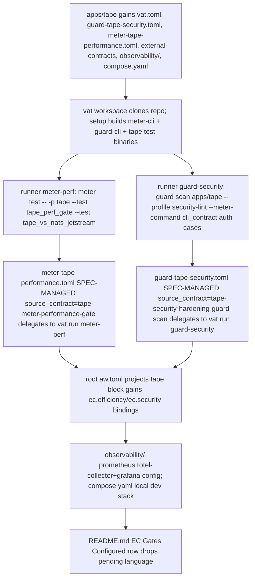

## Logic
<!-- type: logic lang: mermaid -->



## Unit Test
<!-- type: unit-test lang: mermaid -->

```mermaid
---
id: tape-vat-meter-guard-ec-gates-observability-verification
requirements:
  guard_manifest:
    id: R2
    text: "apps/tape/guard-tape-security.toml is a valid SPEC-MANAGED guard-cli native manifest bound to a source_contract in external-contracts/security-hardening."
    kind: functional
    risk: low
    verify: aw ec gen --verify apps/tape resolves tape-guard-security tool_contract
  meter_manifest:
    id: R3
    text: "apps/tape/meter-tape-performance.toml is a valid SPEC-MANAGED meter-cli native manifest bound to a source_contract in external-contracts/competitor-performance/efficiency."
    kind: functional
    risk: low
    verify: aw ec gen --verify apps/tape resolves tape-meter-performance tool_contract
  no_regression:
    id: R5
    text: "This config-only slice does not change tape's Rust source, so existing tape tests stay green."
    kind: regression
    risk: low
    verify: cargo test -p tape
  observability_config:
    id: R6
    text: "apps/tape/observability/{prometheus.yml,otel-collector-config.yaml,grafana-datasources.yaml} and apps/tape/compose.yaml are valid YAML and scrape/reference tape's real /metrics endpoint and OTLP port."
    kind: functional
    risk: low
    verify: manual review: prometheus.yml scrape_configs target matches tape's exposed port; compose.yaml service depends_on graph is acyclic
  root_aw_toml_bindings:
    id: R4
    text: "root aw.toml's [[projects]] tape block carries ec.efficiency and ec.security bindings that point at the vat runners."
    kind: functional
    risk: low
    verify: aw health --project tape --verify-ec reports both gates configured
  vat_config:
    id: R1
    text: "apps/tape/vat.toml declares a workspace + setup steps + meter-perf and guard-security runners that parse and resolve."
    kind: functional
    risk: low
    verify: aw ec gen --verify (or aw health --project tape --verify-ec) parses apps/tape/vat.toml without error
---
flowchart TD
    r1[R1 vat config] --> aw_ec_gen_verify_or_aw_health_project_tape_verify_ec_parses_apps_tape_vat_toml_without_error[aw ec gen --verify (or aw health --project tape --verify-ec) parses apps/tape/vat.toml without error]
    r2[R2 guard manifest] --> aw_ec_gen_verify_apps_tape_resolves_tape_guard_security_tool_contract[aw ec gen --verify apps/tape resolves tape-guard-security tool_contract]
    r3[R3 meter manifest] --> aw_ec_gen_verify_apps_tape_resolves_tape_meter_performance_tool_contract[aw ec gen --verify apps/tape resolves tape-meter-performance tool_contract]
    r4[R4 root aw toml bindings] --> aw_health_project_tape_verify_ec_reports_both_gates_configured[aw health --project tape --verify-ec reports both gates configured]
    r5[R5 no regression] --> cargo_test_p_tape[cargo test -p tape]
    r6[R6 observability config] --> manual_review_prometheus_yml_scrape_configs_target_matches_tape_s_exposed_port_compose_yaml_service_depends_on_graph_is_acyclic[manual review: prometheus.yml scrape_configs target matches tape's exposed port; compose.yaml service depends_on graph is acyclic]
```

## Changes
<!-- type: changes lang: yaml -->

```yaml
changes:
  - path: apps/tape/vat.toml
    action: create
    section: logic
    impl_mode: hand-written
    description: "vat workspace for tape's EC dispatch (mirrors apps/relay/vat.toml): base=../.., workdir=apps/tape, setup builds meter-cli+guard-cli plus tape_perf_gate/tape_vs_nats_jetstream/cli_contract test binaries; runners meter-perf (delegates to cargo test -p tape --test tape_perf_gate --test tape_vs_nats_jetstream) and guard-security (guard scan apps/tape --profile security-lint --meter-command attaching auth-boundary smoke evidence)."
  - path: apps/tape/guard-tape-security.toml
    action: create
    section: logic
    impl_mode: hand-written
    description: "SPEC-MANAGED guard-cli native manifest (mirrors apps/relay/guard-relay-security.toml): project=tape, source_contract=tape-security-hardening-guard-scan, delegate_command='cd apps/tape && ../../target/debug/vat run guard-security'."
  - path: apps/tape/meter-tape-performance.toml
    action: create
    section: logic
    impl_mode: hand-written
    description: "SPEC-MANAGED meter-cli native manifest (mirrors apps/relay/meter-relay-performance.toml): project=tape, source_contract=tape-meter-performance-gate, delegate_command='cd apps/tape && ../../target/debug/vat run meter-perf'."
  - path: apps/tape/external-contracts/security-hardening/security/security-evidence.md
    action: create
    section: logic
    impl_mode: hand-written
    description: "New EC markdown (e2e-test + tool-contract sections, mirrors apps/relay's security-evidence.md): gate id tape-security-hardening-guard-scan, category security, binds guard-tape-security.toml as the tool contract."
  - path: apps/tape/external-contracts/competitor-performance/efficiency/meter-gate.md
    action: create
    section: logic
    impl_mode: hand-written
    description: "New EC markdown (e2e-test + tool-contract sections, mirrors apps/relay's perf-gate.md): gate id tape-meter-performance-gate, category efficiency, binds meter-tape-performance.toml as the tool contract; distinct from tape's existing direct-cargo competitor-performance EC cases already in apps/tape/aw.toml."
  - path: apps/tape/observability/prometheus.yml
    action: create
    section: logic
    impl_mode: hand-written
    description: "Prometheus scrape config targeting tape's /metrics endpoint (mirrors projects/lumen/observability/prometheus.yml), scraping the otel-collector's Prometheus exporter port."
  - path: apps/tape/observability/otel-collector-config.yaml
    action: create
    section: logic
    impl_mode: hand-written
    description: "OTel collector config receiving OTLP gRPC from tape and re-exporting a Prometheus scrape target plus a trace exporter to Jaeger (mirrors projects/lumen/observability/otel-collector-config.yaml)."
  - path: apps/tape/observability/grafana-datasources.yaml
    action: create
    section: logic
    impl_mode: hand-written
    description: "Grafana datasource provisioning wiring Prometheus + Jaeger (mirrors projects/lumen/observability/grafana-datasources.yaml)."
  - path: apps/tape/compose.yaml
    action: create
    section: logic
    impl_mode: hand-written
    description: "Local dev compose stack: tape + otel-collector + prometheus + jaeger + grafana (mirrors projects/lumen/compose.yaml), building tape's Dockerfile and wiring the observability/ config volumes."
  - path: apps/tape/aw.toml
    action: modify
    section: logic
    impl_mode: hand-written
    description: "Add aw.ec.generated.tool_manifests entries for tape-guard-security (guard-tape-security.toml) and tape-meter-performance (meter-tape-performance.toml), mirroring apps/relay/aw.toml's tool_manifests block."
  - path: aw.toml
    action: modify
    section: logic
    impl_mode: hand-written
    description: "Root aw.toml's [[projects]] tape block gains ec.efficiency = { tool = \"meter\", meter = \"apps/tape\", command = \"cd apps/tape && ../../target/debug/vat run meter-perf\" } and ec.security = { tool = \"guard\", dir = \"apps/tape\", command = \"cd apps/tape && ../../target/debug/vat run guard-security\" }, mirroring the relay/keep [[projects]] blocks."
  - path: apps/tape/README.md
    action: modify
    section: changes
    impl_mode: hand-written
    description: "Update the 'EC Gates Configured' capability row/section to drop the pending: language for vat.toml, meter-tape-performance.toml (was meter-tape-replay*.toml in the WI title), and guard-tape-security.toml now that they exist, without touching unrelated rows."
```
