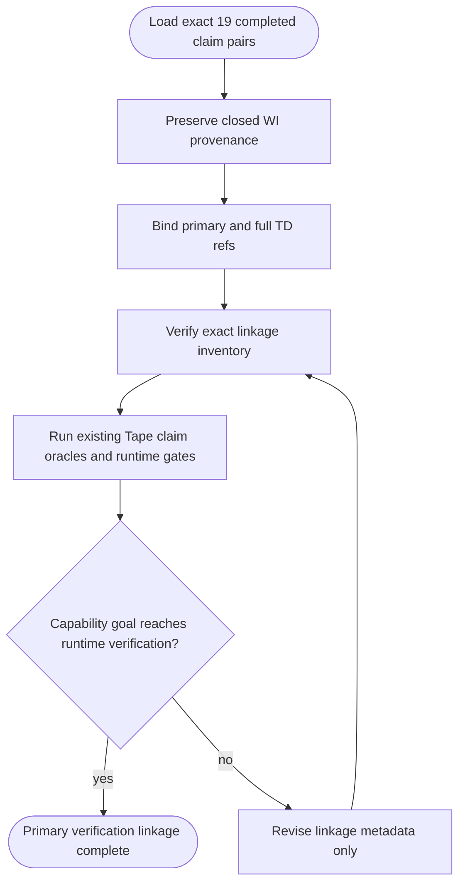

## Logic
<!-- type: logic lang: mermaid -->


## Changes
<!-- type: changes lang: yaml -->

```yaml
changes:
  - path: apps/tape/tests/capability_primary_linkage.rs
    action: create
    section: unit-test
    impl_mode: hand-written
    description: "Add a deterministic structural regression test for the exact 19 capability refs, including primary role and full coverage. generator gap: missing-generator:test:capability-td-linkage (#2157)."
```
## Unit Test

```mermaid
---
id: tape-completed-claim-primary-linkage-verification
requirements:
  capability_goal_advances:
    id: R5
    text: "The Tape capability root advances past linkage reconciliation and evaluates the existing runtime gates."
    kind: functional
    risk: high
    verify: aw goal capability --project tape --non-interactive
  exact_primary_full_refs:
    id: R1
    text: "The TD binds all 19 listed capability and claim pairs with primary role and full coverage."
    kind: functional
    risk: high
    verify: capability_primary_linkage::exact_primary_full_linkage_inventory_is_preserved
  existing_oracles_remain_authoritative:
    id: R3
    text: "Existing Tape claim oracles and configured gates remain authoritative without claim weakening or duplicate runtime behavior."
    kind: regression
    risk: high
    verify: aw capability check --project tape --skip-issue-inventory
  linkage_regression_is_deterministic:
    id: R4
    text: "A deterministic structural test fails when an expected capability id, claim id, role, coverage value, or total reference count changes."
    kind: regression
    risk: high
    verify: capability_primary_linkage::exact_primary_full_linkage_inventory_is_preserved
  preserve_historical_work:
    id: R2
    text: "The reconciliation changes only TD linkage metadata, its structural test, and the producer-owned TD lock; completed implementation work remains historical provenance."
    kind: regression
    risk: medium
    verify: capability_primary_linkage::reconciliation_scope_is_metadata_only
---
flowchart TD
    r1[R1 exact primary full refs] --> capability_primary_linkage_exact_primary_full_linkage_inventory_is_preserved[capability_primary_linkage::exact_primary_full_linkage_inventory_is_preserved]
    r4[R4 linkage regression is deterministic] --> capability_primary_linkage_exact_primary_full_linkage_inventory_is_preserved
    r2[R2 preserve historical work] --> capability_primary_linkage_reconciliation_scope_is_metadata_only[capability_primary_linkage::reconciliation_scope_is_metadata_only]
    r3[R3 existing oracles remain authoritative] --> aw_capability_check_project_tape_skip_issue_inventory[aw capability check --project tape --skip-issue-inventory]
    r5[R5 capability goal advances] --> aw_goal_capability_project_tape_non_interactive[aw goal capability --project tape --non-interactive]
```

<!-- type: unit-test lang: mermaid -->


