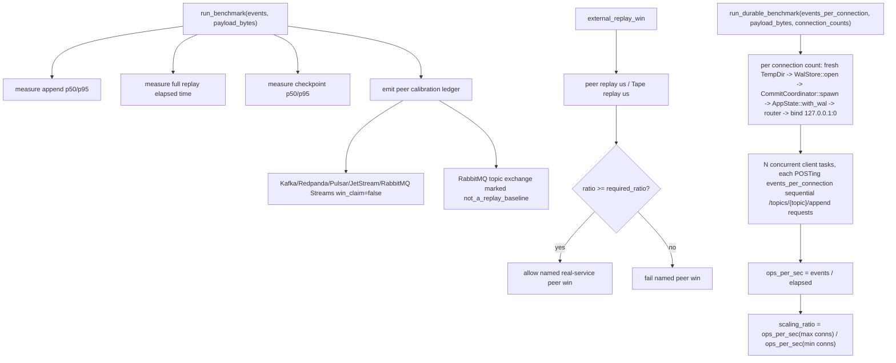
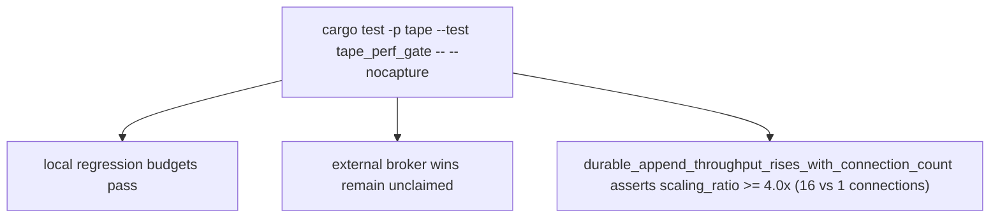

# Tape Benchmark Core

## Overview
<!-- type: overview lang: markdown -->

`apps/tape/src/bench.rs` defines the first competitive-performance evidence
surface. It measures local append, replay, and checkpoint operations and also
models named real-service replay wins such as the NATS JetStream local backlog
gate. Other replay-log peer wins stay unclaimed until their own real-service
peer runs are added.

WI #3052 AC1 adds `run_durable_benchmark`: a second, independent benchmark
entry point that drives the real `WalStore` + `CommitCoordinator` group-commit
durable path over real HTTP (a real `127.0.0.1:0` socket, not an in-memory
journal call) at varying connection counts, proving durable append throughput
rises with connection count instead of staying flat at the pre-#3052 85-89
ops/s line. It never touches or weakens `run_benchmark`'s in-memory numbers.

## Logic
<!-- type: logic lang: mermaid -->



## Unit Test
<!-- type: unit-test lang: mermaid -->



## Changes
<!-- type: changes lang: yaml -->

```yaml
changes:
  - path: apps/tape/src/bench.rs
    action: create
    section: logic
    impl_mode: hand-written
    description: "Local performance regression benchmark and external peer calibration ledger."
  - path: apps/tape/src/bench.rs
    action: modify
    section: logic
    impl_mode: hand-written
    description: "Named real-service replay win reporting for NATS JetStream and future calibrated peers."
  - path: apps/tape/src/bench.rs
    action: create
    section: unit-test
    impl_mode: hand-written
    description: "Benchmark verification is exercised through the tape_perf_gate integration test."
  - path: apps/tape/src/bench.rs
    action: modify
    section: logic
    impl_mode: hand-written
    description: "WI #3052 AC1: run_durable_benchmark drives the real WalStore/CommitCoordinator group-commit path over real HTTP at varying connection counts, reporting per-connection ops/s and the scaling ratio."
```
