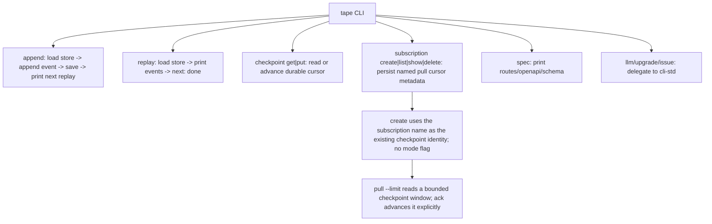
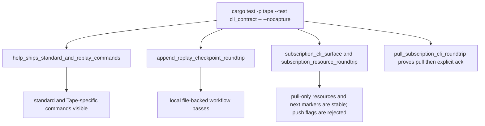

# Tape CLI Surface

## Overview
<!-- type: overview lang: markdown -->

`apps/tape/src/bin/tape.rs` is the first agent-facing Tape CLI. It wraps the
local `TapeJournal` file store and exposes standard ecosystem commands through
`cli-std`.

### Shared OTLP tracing

The `serve` command maps `TAPE_OTLP_ENDPOINT` plus its existing logging and
drain settings into `service_http::HttpConfig`, then installs tracing with a
stable Tape package identity. `service-http` owns the optional exporter,
fallback behavior, and W3C request-parent propagation; Tape retains topic,
journal, authentication, and consumer semantics.

## Logic
<!-- type: logic lang: mermaid -->



## Unit Test
<!-- type: unit-test lang: mermaid -->



## Changes
<!-- type: changes lang: yaml -->

```yaml
changes:
  - path: apps/tape/src/bin/tape.rs
    action: modify
    section: logic
    impl_mode: hand-written
    description: "Initial Tape CLI over the local replay journal and shared cli-std commands."
  - path: apps/tape/tests/cli_contract.rs
    action: modify
    section: unit-test
    impl_mode: hand-written
    description: "Binary contract tests proving the Tape CLI workflow."
  - path: apps/tape/src/bin/tape.rs
    action: modify
    section: logic
    impl_mode: hand-written
    description: "Add pull-only subscription create/list/show/delete with file-backed journal persistence and no delivery-mode flags (#1254)."
  - path: apps/tape/src/bin/tape.rs
    action: modify
    section: logic
    impl_mode: hand-written
    description: "Add bounded pull and explicit ack subcommands over the existing file-backed cursor (#1255)."
```
