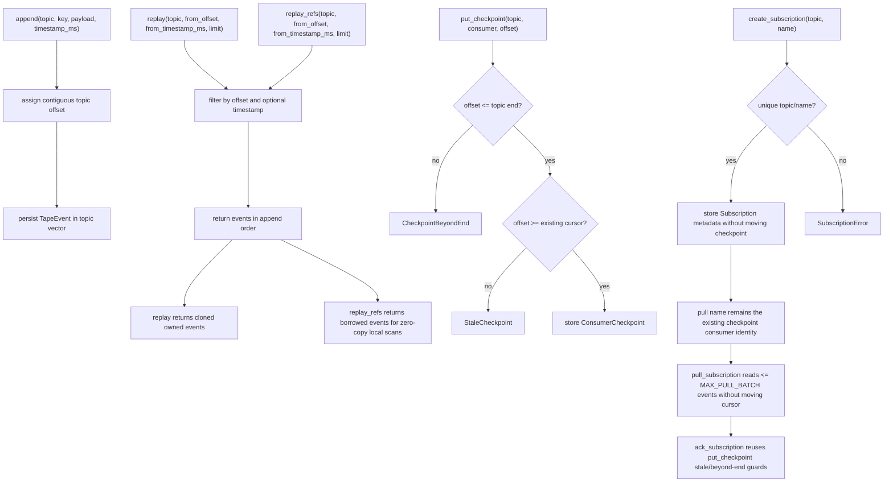
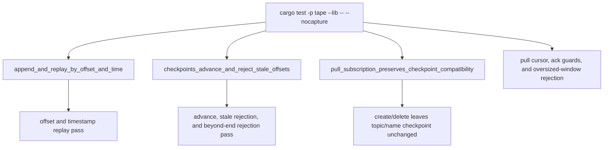

# Tape Local Journal Core

## Overview
<!-- type: overview lang: markdown -->

`apps/tape/src/lib.rs` defines the first Tape replay journal core:
`TapeJournal`, `TapeEvent`, `ConsumerCheckpoint`, and `Subscription`. It is local
and file-serializable, deliberately below the future h2c/raft/operator layers.
The core exposes owned replay for CLI/API callers and zero-copy `replay_refs`
for local backlog scan performance gates.
Pull subscriptions make the checkpoint an explicit next-offset cursor with a
bounded caller-driven read and explicit durable ack.

## Logic
<!-- type: logic lang: mermaid -->



## Unit Test
<!-- type: unit-test lang: mermaid -->



## Changes
<!-- type: changes lang: yaml -->

```yaml
changes:
  - path: apps/tape/src/lib.rs
    action: modify
    section: logic
    impl_mode: hand-written
    description: "Initial local Tape journal and checkpoint core."
  - path: apps/tape/src/lib.rs
    action: modify
    section: logic
    impl_mode: hand-written
    description: "Add zero-copy replay_refs for local backlog scan performance gates."
  - path: apps/tape/src/lib.rs
    action: modify
    section: unit-test
    impl_mode: hand-written
    description: "Inline unit tests for local replay and checkpoint behavior."
  - path: apps/tape/src/lib.rs
    action: modify
    section: logic
    impl_mode: hand-written
    description: "Add pull-only Subscription metadata and CRUD; resources preserve existing checkpoints and expose no push/lease/consumer-group mode (#1254)."
  - path: apps/tape/src/lib.rs
    action: modify
    section: logic
    impl_mode: hand-written
    description: "Add bounded pull windows and explicit checkpoint-backed ack for pull subscriptions (#1255)."
```
