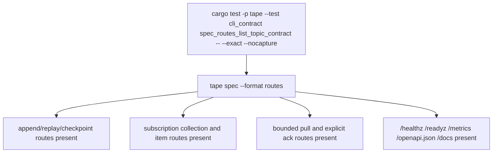

# Tape Offline Spec Surface

## Overview
<!-- type: overview lang: markdown -->

`apps/tape/src/spec.rs` is the offline machine-readable contract for the
first Tape service slice. It emits OpenAPI-shaped JSON/YAML, JSON schemas, a
route inventory, and LLM topic bodies.

## Schema
<!-- type: schema lang: yaml -->

```yaml
schemas:
  - title: AppendEventRequest
    type: object
    required: [payload]
  - title: TapeEvent
    type: object
    required: [topic, offset, timestamp_ms, payload]
  - title: ReplayResponse
    type: object
    required: [events]
  - title: SubscriptionCreateRequest
    type: object
    required: [name]
  - title: Subscription
    type: object
    required: [topic, name]
  - title: SubscriptionListResponse
    type: object
    required: [subscriptions]
  - title: PullSubscriptionRequest
    type: object
  - title: PullSubscriptionBatch
    type: object
    required: [topic, subscription, cursor, limit, next_offset, events]
  - title: PullSubscriptionAckRequest
    type: object
    required: [offset]
  - title: CheckpointRequest
    type: object
    required: [offset]
  - title: ConsumerCheckpoint
    type: object
    required: [topic, consumer, offset, updated_at_ms]
  - title: RetentionPolicy
    type: object
```

## Unit Test
<!-- type: unit-test lang: mermaid -->



## Changes
<!-- type: changes lang: yaml -->

```yaml
changes:
  - path: apps/tape/src/spec.rs
    action: modify
    section: schema
    impl_mode: hand-written
    description: "Initial offline route, OpenAPI-shaped, schema, and LLM topic contract."
  - path: apps/tape/tests/cli_contract.rs
    action: modify
    section: unit-test
    impl_mode: hand-written
    description: "Spec route inventory test through the Tape binary."
  - path: apps/tape/src/spec.rs
    action: modify
    section: schema
    impl_mode: hand-written
    description: "Declare subscription routes and pull-only delivery schemas in offline routes, OpenAPI, JSON Schema, and LLM API wording (#1254); push/lease/consumer-group modes are absent."
  - path: apps/tape/src/spec.rs
    action: modify
    section: schema
    impl_mode: hand-written
    description: "Declare bounded pull and explicit ack inventory schemas without adding live h2c delivery handlers (#1255)."
```
