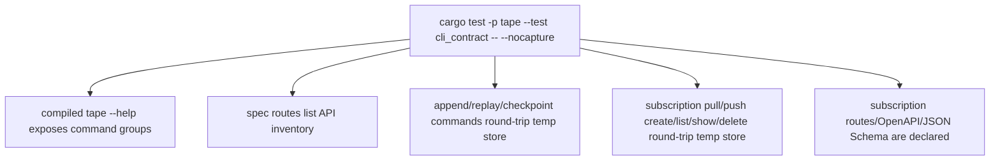

# Tape CLI Contract Test

## Overview
<!-- type: overview lang: markdown -->

`apps/tape/tests/cli_contract.rs` verifies the binary-visible contract for
the bootstrap Tape CLI and offline spec.
It also verifies the topic subscription resource slice: pull checkpoint
compatibility, push endpoint metadata only, and declared API inventory.

## Unit Test
<!-- type: unit-test lang: mermaid -->



## Changes
<!-- type: changes lang: yaml -->

```yaml
changes:
  - path: apps/tape/tests/cli_contract.rs
    action: modify
    section: unit-test
    impl_mode: hand-written
    description: "Binary smoke tests for Tape CLI and spec route inventory."
  - path: apps/tape/tests/cli_contract.rs
    action: modify
    section: unit-test
    impl_mode: hand-written
    description: "Add subscription CLI, local lifecycle, and offline contract inventory tests (#1254)."
```
