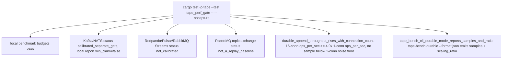

# Tape Performance Gate Test

## Overview
<!-- type: overview lang: markdown -->

`apps/tape/tests/tape_perf_gate.rs` verifies Tape's local benchmark and
calibration ledger. It proves local append/replay/checkpoint budget compliance
while refusing external broker win claims without real peer evidence.

WI #3052 AC1 adds the durable throughput scaling gate: it drives
`tape::bench::run_durable_benchmark` over real HTTP against the real
`WalStore` + `CommitCoordinator` group-commit path (`FsyncPolicy::Always`,
never weakened) at 1/4/16 connections and asserts the 16-connection sample's
`ops_per_sec` is at least `DURABLE_SCALING_MIN_RATIO` (4.0x) the
1-connection sample's, plus a `tape-bench durable` CLI smoke test. The gate is
a **ratio**, never an absolute ops/s figure, and the 4.0x threshold is fixed
by the accepted TD -- a shortfall is reported, not silently lowered.

## Unit Test
<!-- type: unit-test lang: mermaid -->



## Changes
<!-- type: changes lang: yaml -->

```yaml
changes:
  - path: apps/tape/tests/tape_perf_gate.rs
    action: create
    section: unit-test
    impl_mode: hand-written
    description: "Performance regression and calibration-status gate for Tape competitor performance."
  - path: apps/tape/tests/tape_perf_gate.rs
    action: modify
    section: unit-test
    impl_mode: hand-written
    description: "WI #3052 AC1: durable throughput scaling ratio gate (16 vs 1 connections, >= 4.0x) over the real WalStore/CommitCoordinator HTTP path, plus a tape-bench durable CLI smoke test."
```
