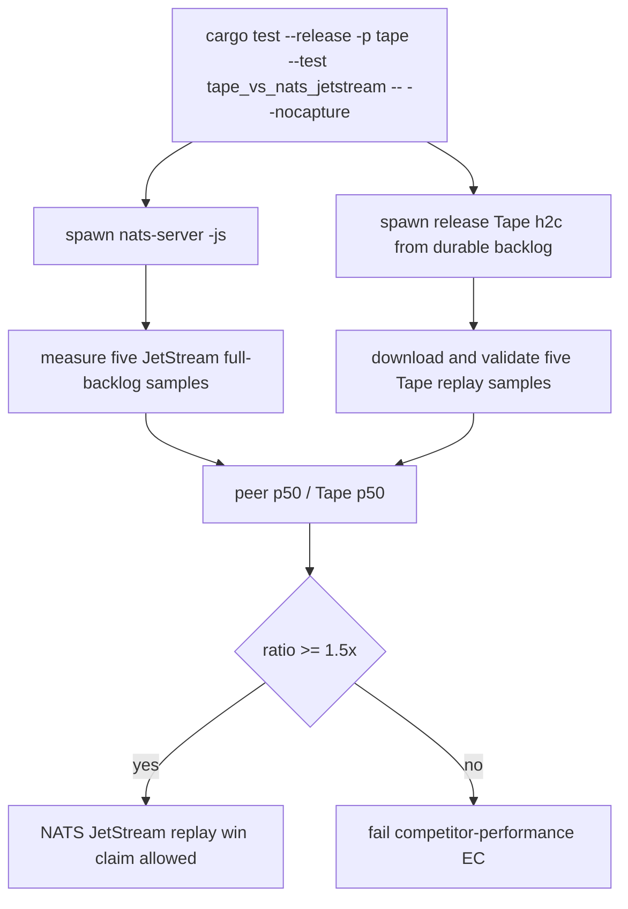

# Tape Versus NATS JetStream Replay Test

## Overview
<!-- type: overview lang: markdown -->

`apps/tape/tests/tape_vs_nats_jetstream.rs` starts real release Tape h2c and
local `nats-server -js` services, prepares the same 20,000-event,
128-byte-payload durable backlog, and validates five full replay samples across
both network clients. The p50 gate permits a claim only when Tape is at least
1.5x faster; the report also captures p95/p99, throughput, CPU/RSS, durable
bytes/amplification, and errors.

## Unit Test
<!-- type: unit-test lang: mermaid -->



## Changes
<!-- type: changes lang: yaml -->

```yaml
changes:
  - path: apps/tape/tests/tape_vs_nats_jetstream.rs
    action: create
    section: unit-test
    impl_mode: hand-written
    description: "Real NATS JetStream competitor benchmark for Tape local backlog replay performance."
```
