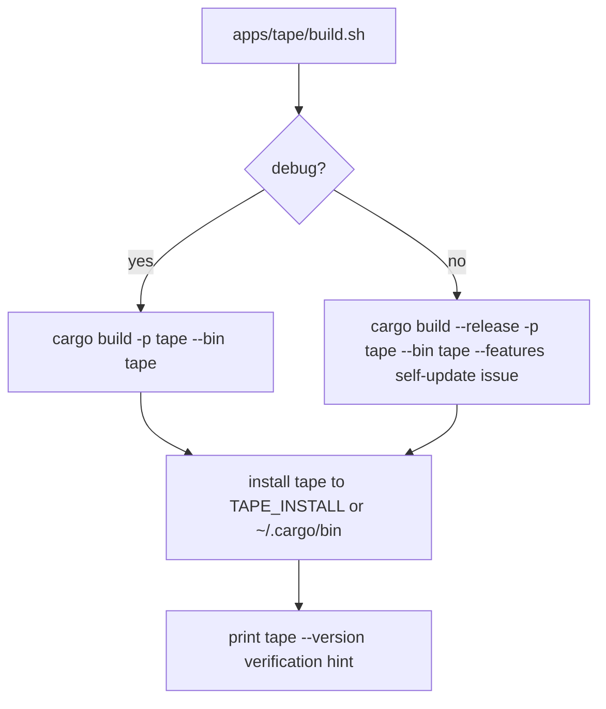

# Tape Build Script

## Overview
<!-- type: overview lang: markdown -->

`apps/tape/build.sh` provides the project-local debug/release build and
install entrypoint expected by service-shaped projects.

## Logic
<!-- type: logic lang: mermaid -->



## Changes
<!-- type: changes lang: yaml -->

```yaml
changes:
  - path: apps/tape/build.sh
    action: modify
    section: logic
    impl_mode: hand-written
    description: "Project-local build/install wrapper for Tape."
```
