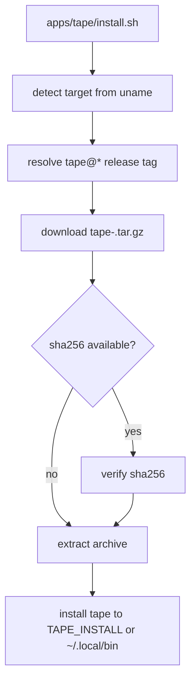

# Tape Install Script

## Overview
<!-- type: overview lang: markdown -->

`apps/tape/install.sh` downloads a `tape@*` release asset for the detected
target and installs it to `TAPE_INSTALL` or `$HOME/.local/bin`.

## Logic
<!-- type: logic lang: mermaid -->



## Changes
<!-- type: changes lang: yaml -->

```yaml
changes:
  - path: apps/tape/install.sh
    action: modify
    section: logic
    impl_mode: hand-written
    description: "Project-local installer for Tape release assets."
```
