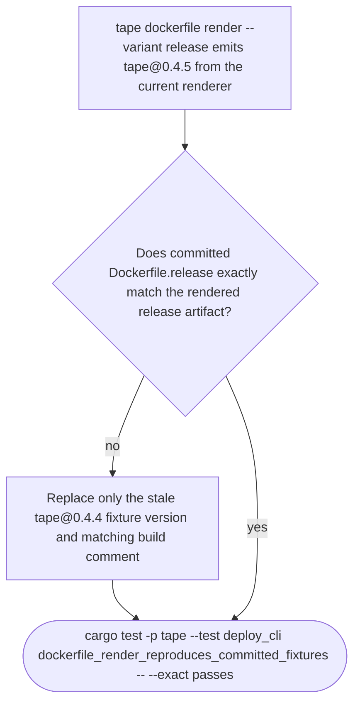

## Logic
<!-- type: logic lang: mermaid -->



## Changes
<!-- type: changes lang: yaml -->

```yaml
changes:
  - path: apps/tape/Dockerfile.release
    action: modify
    section: logic
    impl_mode: hand-written
    description: "Synchronize the committed release fixture's image-build comment and TAPE_VERSION default from tape@0.4.4 to the renderer's current tape@0.4.5 output. No Dockerfile instructions or runtime behavior change. generator gap: missing-generator:fixture:release-dockerfile-parity (#1578)."
```
