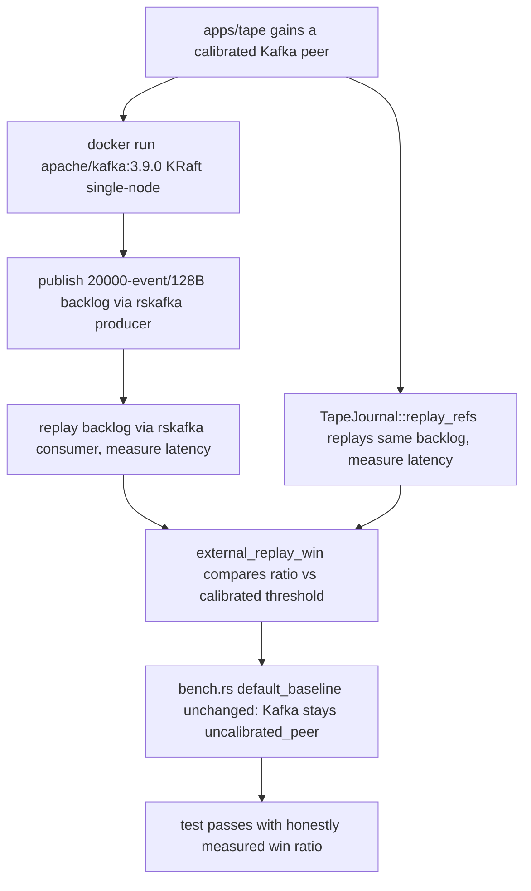

## Logic
<!-- type: logic lang: mermaid -->



## Changes
<!-- type: changes lang: yaml -->

```yaml
changes:
  - path: apps/tape/tests/tape_vs_kafka.rs
    action: create
    section: logic
    impl_mode: hand-written
    description: "New dedicated external test (mirrors apps/tape/tests/tape_vs_nats_jetstream.rs): spawns a real single-node Kafka broker in KRaft mode via `docker run apache/kafka:3.9.0` (no ZooKeeper), skips gracefully if Docker is unavailable, publishes a 20,000-event / 128-byte-payload backlog with a real pure-Rust rskafka producer, replays it from the beginning with a real rskafka consumer, and compares against Tape's TapeJournal::replay_refs zero-copy replay via tape::bench::external_replay_win / verify_external_replay_win with a required_ratio calibrated from an actual measured run."
  - path: apps/tape/Cargo.toml
    action: modify
    section: logic
    impl_mode: hand-written
    description: "Add rskafka as a [dev-dependencies] entry (pure-Rust Kafka client, no librdkafka/C-toolchain requirement, matches the workspace's existing pure-Rust dependency posture used by async-nats in the JetStream test)."
  - path: apps/tape/README.md
    action: modify
    section: logic
    impl_mode: hand-written
    description: "Competitor Performance section: Surfaces/Promise/Gate Inventory/Work Root table updated to record Kafka as a calibrated real-service win peer alongside NATS JetStream, while Redpanda, Pulsar, and RabbitMQ Streams stay explicitly unclaimed."
  - path: apps/tape/external-contracts/competitor-performance/efficiency/competitive-benchmark.md
    action: modify
    section: logic
    impl_mode: hand-written
    description: "Add a tape-competitor-performance-kafka-replay-win e2e_tests entry (mirrors the existing nats-jetstream-replay-win entry) pointing at `cargo test -p tape --test tape_vs_kafka -- --nocapture`, and update the EC summary/promise text to reflect Kafka as calibrated."
```
