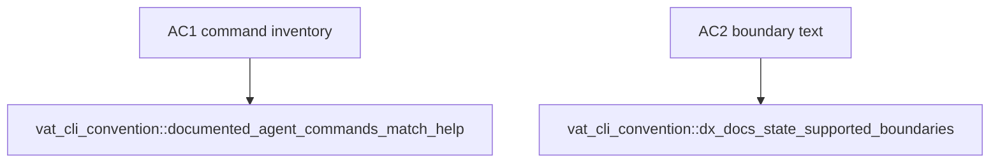

## Logic
<!-- type: logic lang: mermaid -->

```mermaid
---
id: vat-dx-readme-surface-contract
entry: cli
nodes:
  cli: { kind: start, label: "built vat --help is the command inventory authority" }
  docs: { kind: process, label: "README and llm describe the same agent-facing command surface" }
  boundaries: { kind: process, label: "state Apple Container support and Docker Engine, generic Compose, persistent K8s exclusions" }
  test: { kind: process, label: "built-binary test asserts command inventory and boundary phrases" }
  done: { kind: terminal, label: "documentation drift is a failing test" }
edges:
  - { from: cli, to: docs }
  - { from: docs, to: boundaries }
  - { from: boundaries, to: test }
  - { from: test, to: done }
---
```

The public contract is documentation-only: no command behavior changes. The README and offline `vat llm` guide enumerate `build`, `compose`, `docker`, and `k8s` as shipped agent-facing commands, state their Apple Container limits, and avoid promising Docker Engine/API emulation, general Compose compatibility, or persistent Kubernetes. The test obtains the actual binary help and fails if the documented inventory gets ahead of the executable surface.
## Changes
<!-- type: changes lang: yaml -->

```yaml
changes:
  - path: apps/vat/src/commands/llm.rs
    action: modify
    section: logic
    impl_mode: hand-written
    anchor: exec
  - path: apps/vat/tests/vat_cli_convention.rs
    action: modify
    section: unit-test
    impl_mode: hand-written
    anchor: cli_convention_help_lists_all_three
```
## Unit Test
<!-- type: unit-test lang: mermaid -->


