## Logic
<!-- type: logic lang: mermaid -->

```mermaid
---
id: vat-build-phase2-exec-logic
entry: start
nodes:
  start: { kind: start, label: "vat build --file --context --tag --build-arg K=V --json invoked" }
  resolve_paths: { kind: process, label: "resolve file default Dockerfile and context default current directory to absolute paths" }
  dockerfile_check: { kind: decision, label: "dockerfile path exists on disk" }
  err_missing_dockerfile: { kind: terminal, label: "hard Err dockerfile not found before any container CLI invocation AC3 no subprocess spawned" }
  avail_check: { kind: decision, label: "ensure_microvm_available container binary on PATH via microvm available and system responsive via microvm system_up or bounded microvm ensure_system_started poll mirrors run.rs ensure_docker_available" }
  err_unavailable: { kind: terminal, label: "hard Err container CLI not installed or system not running install it and run container system start" }
  argv_build: { kind: process, label: "container_build_command builds argv container build -f dockerfile -t tag --build-arg K=V repeated context exact order per R2" }
  mode_check: { kind: decision, label: "json flag on Args" }
  human_run: { kind: process, label: "exec spawns the container_build_command argv directly with inherited stdio so live BuildKit layer progress streams to the terminal in real time" }
  human_result: { kind: decision, label: "child process exit status success" }
  human_err: { kind: terminal, label: "failure already visible in the streamed output exec returns a non-zero ExitCode no BuildReport constructed" }
  human_ok: { kind: terminal, label: "print a one-line tag and elapsed-time summary exec returns ExitCode SUCCESS" }
  json_run: { kind: process, label: "exec calls build_image the reusable in-process entry point Phase 3 compose will call directly which spawns container_build_command argv with captured stdout and stderr internally" }
  json_result: { kind: decision, label: "build_image result" }
  json_err: { kind: terminal, label: "propagate the Err as a structured json error object exec returns a non-zero ExitCode" }
  json_ok: { kind: terminal, label: "print only the structured BuildReport as json the captured build log is never echoed exec returns ExitCode SUCCESS" }
edges:
  - { from: start, to: resolve_paths }
  - { from: resolve_paths, to: dockerfile_check }
  - { from: dockerfile_check, to: err_missing_dockerfile, label: "missing" }
  - { from: dockerfile_check, to: avail_check, label: "present" }
  - { from: avail_check, to: err_unavailable, label: "unavailable" }
  - { from: avail_check, to: argv_build, label: "available" }
  - { from: argv_build, to: mode_check }
  - { from: mode_check, to: human_run, label: "human" }
  - { from: mode_check, to: json_run, label: "json" }
  - { from: human_run, to: human_result }
  - { from: human_result, to: human_err, label: "nonzero" }
  - { from: human_result, to: human_ok, label: "zero" }
  - { from: json_run, to: json_result }
  - { from: json_result, to: json_err, label: "err" }
  - { from: json_result, to: json_ok, label: "ok" }
---
```
## Schema
<!-- type: schema lang: yaml -->

```yaml
$schema: "https://json-schema.org/draft/2020-12/schema"
$id: "vat-build-phase2.schema.json"
title: "vat build Phase 2: data model additions"
type: object
properties:
  build_args_struct:
    type: object
    description: "New apps/vat/src/commands/build.rs struct Args: file: Option<PathBuf> (defaults to `Dockerfile` inside the resolved context dir), context: Option<PathBuf> (defaults to the current directory), tag: Option<String> (defaults to `<context-dir-basename>:latest`, sanitized to a valid OCI reference — lowercased, non [a-z0-9._-] runs collapsed to `-` — resolved once in exec() before any subprocess is spawned; build_image() itself never guesses a tag, it always receives a concrete &str), build_args: Vec<(String,String)> (one pair per repeated --build-arg K=V flag, parsed via split_once('='), CLI-supplied order preserved — no BTreeMap reordering needed here since the input is already a deterministic Vec, unlike Phase 1's EnvSpec.env map), json: bool."
  build_report_struct:
    type: object
    description: "New apps/vat/src/commands/build.rs struct BuildReport (derives serde::Serialize): tag: String, dockerfile: String (resolved absolute path), context: String (resolved absolute path), build_args: BTreeMap<String,String> (sorted for deterministic JSON field ordering in the report, independent of the argv-ordering rule above), duration_ms: u64. Constructed only on a successful build — build_image()'s Result<BuildReport> Err variant covers every failure path (missing Dockerfile, container CLI/system unavailable, nonzero container build exit); there is no success:false variant."
  container_build_command_fn:
    type: object
    description: "New apps/vat/src/commands/build.rs fn container_build_command(dockerfile: &Path, tag: &str, build_args: &[(String,String)], context: &Path) -> Vec<String>. Pure, deterministic argv builder (no subprocess, no I/O) producing exactly: [\"container\", \"build\", \"-f\", <dockerfile>, \"-t\", <tag>, \"--build-arg\", \"K=V\", ... one --build-arg pair per entry in the given slice order ..., <context>] (R2), matching the real invocation Phase 0 verified (`container build -f \"$WORKDIR/Dockerfile\" -t vat-spike-test:latest \"$WORKDIR\"`). Unlike sandbox/microvm.rs's resolve() (which returns a (program, argv) tuple), this fn returns the program name (\"container\") as argv[0] itself."
  build_image_fn:
    type: object
    description: "New apps/vat/src/commands/build.rs fn build_image(context: &Path, dockerfile: &Path, tag: &str, build_args: &[(String,String)]) -> Result<BuildReport> — the in-process entry point Phase 3's `vat compose` will call directly for compose `build:` keys (not a shell-out to the vat binary). Validates the dockerfile path exists (AC3, no subprocess on failure), calls ensure_microvm_available(), builds argv via container_build_command(), spawns `container` with captured stdout/stderr (never inherited — the always-captured behavior a reusable in-process caller like compose needs), waits for exit, and returns Err on a nonzero exit or Ok(BuildReport) on success."
  ensure_microvm_available_fn:
    type: object
    description: "New apps/vat/src/commands/build.rs fn ensure_microvm_available() -> Result<()>, mirroring run.rs's ensure_docker_available: requires sandbox::microvm::available() (container binary on PATH); if sandbox::microvm::system_up() is not immediately true, waits via sandbox::microvm::ensure_system_started(<bounded timeout>) before failing. Fail-closed and clean — never auto-installs the container CLI, never silently proceeds without a responsive system."
  microvm_system_up_fn:
    type: object
    description: "New additive apps/vat/src/sandbox/microvm.rs fn: pub fn system_up() -> bool. Bounded-timeout `container system status` probe (spawn with stdout/stderr to null, short internal timeout, return status.success()), mirroring run.rs's docker_daemon_up(). Additive only — no change to MicroVmBackend, resolve(), or available() (Phase 1, untouched)."
  microvm_ensure_system_started_fn:
    type: object
    description: "New additive apps/vat/src/sandbox/microvm.rs fn: pub fn ensure_system_started(timeout: Duration) -> Result<(), String>. Poll+timeout loop (Instant::now() deadline, short sleep between polls of system_up()) mirroring cluster.rs's run_capture() poll pattern; returns Err naming the elapsed timeout when the container system never reports up within the bound. Additive only, same non-interference guarantee as system_up() above."
  cargo_serde_yaml_promotion:
    type: object
    description: "apps/vat/Cargo.toml: serde_yaml (version 0.9, unchanged) loses `optional = true` and becomes an unconditional dependency; removed from the `emulator` feature's `dep:serde_yaml` list. Zero new crate, needed unconditionally ahead of Phase 3's compose YAML parsing (not used by this WI's own code)."
additionalProperties: true
```
## Config
<!-- type: config lang: yaml -->

```yaml
files:
  - path: apps/vat/Cargo.toml
    changes:
      - "serde_yaml dependency (version 0.9, unchanged) loses `optional = true` and becomes an unconditional dependency of the vat crate."
      - "serde_yaml is removed from the `emulator` feature's `dep:` list (it stops being feature-gated); the emulator feature retains its other deps unchanged."
    rationale: >
      R5: Phase 3's `vat compose` will parse a compose YAML file unconditionally
      (not behind the emulator feature), and this WI is the point in the
      rollout where that dependency shift is made — ahead of Phase 3 actually
      using it. Zero new crate: serde_yaml is already vendored/locked at 0.9
      from the emulator feature today, so this is a Cargo.toml-only edit with
      no Cargo.lock churn beyond the feature-unification.
    verification: >
      AC6: `cargo build -p vat` (default features) and
      `cargo build -p vat --no-default-features` both succeed after the
      promotion — the lean, no-default-features build must still compile
      cleanly now that serde_yaml is unconditional.
no_new_config_keys: true
notes: >
  vat build introduces no new vat.toml configuration key and no new
  environment variable. All new behavior is CLI-flag-driven
  (--file/--context/--tag/--build-arg/--json on `vat build`, see the CLI
  section) plus the two additive sandbox/microvm.rs probe functions, which
  take their bounded timeout as a plain Duration argument from the caller
  (ensure_microvm_available in commands/build.rs), not from a config file.
```
## CLI
<!-- type: cli lang: yaml -->

```yaml
commands:
  - name: vat build
    usage: "vat build [--file <path>] [--context <dir>] [--tag <ref>] [--build-arg K=V]... [--json]"
    new_cmd_variant: "Cmd::Build { file: Option<PathBuf>, context: Option<PathBuf>, tag: Option<String>, build_arg: Vec<String>, json: bool }"
    dispatch: "cli.rs routes Cmd::Build to commands::build::exec(Args { .. })"
    behavior:
      - "--file defaults to `Dockerfile` inside the resolved --context directory when omitted."
      - "--context defaults to the current working directory when omitted; both --file and --context are resolved to absolute paths before any other step."
      - "--tag defaults to `<context-dir-basename>:latest` (sanitized to a valid OCI reference: lowercased, non [a-z0-9._-] runs collapsed to `-`) when omitted; this default is resolved once in exec() — build_image() itself always receives a concrete tag: &str and never guesses."
      - "--build-arg K=V may be repeated; each occurrence parses into a (String,String) pair via split_once('='); CLI-supplied order is preserved into the argv builder (no reordering)."
      - "exec() calls ensure_microvm_available() before anything else (fail-closed, mirrors run.rs's ensure_docker_available for `vat run`): requires the `container` binary on PATH and a responsive system (system_up(), or a bounded ensure_system_started() wait)."
      - "Human mode (json=false): exec() spawns the container_build_command() argv directly with inherited stdio, so live BuildKit layer/cache progress streams to the terminal in real time (R3); on success prints a one-line tag + elapsed-time summary."
      - "JSON mode (json=true): exec() calls build_image() (captured stdout/stderr, never echoed) and prints only the structured BuildReport as JSON on success; this is an intentional divergence from gc.rs's compute-then-report pattern because build progress has real value and no other vat command proxies a long-running streamed subprocess today (R3)."
      - "AC5: vat build never edits, lints, or otherwise mutates the Dockerfile it is given — it only reads the path and passes it to `container build -f`; works unmodified against any existing repo Dockerfile."
      - "vat build is container-only: it does not touch Docker-backed ServiceRuntime::Docker, and it does not alter Isolation::MicroVm's resolve() argv shape or pick()'s fail-closed branch (Phase 1, merged, untouched)."
      - "Out of scope for this command: compose YAML parsing / `vat compose` (Phase 3, will call build_image() in-process), and registry push/pull (not part of this rollout)."
  - name: "vat run / vat capabilities / vat doctor (unaffected)"
    usage: "(no change)"
    behavior:
      - "Not modified by this WI: no changes to Isolation::MicroVm's resolve() argv shape, pick()'s fail-closed branch, capabilities.rs, or doctor.rs. `container build` reuses the same `container` CLI presence check family (sandbox::microvm::available()) but is otherwise independent of the `vat run` code path."
```

## Unit Test

```mermaid
---
id: vat-microvm-phase-2-vat-build-dockerfile-build-via-container-cli-verification
requirements:
  argv_exact_shape:
    id: R2
    text: "container_build_command builds the exact argv order: [\"container\",\"build\",\"-f\",<dockerfile>,\"-t\",<tag>,\"--build-arg\",\"K=V\",... (one pair per repeated --build-arg flag, in CLI-supplied order), <context>] — matching the real invocation Phase 0 verified (AC2)."
    kind: functional
    risk: high
    verify: commands::build::tests::container_build_command_shape
  missing_dockerfile_clean_error:
    id: AC3
    text: "build_image (via exec) fails cleanly with a clear error and no subprocess spawned when the Dockerfile path does not exist; runs unconditionally with no container CLI required."
    kind: functional
    risk: high
    verify: vat_build::build_fails_missing_dockerfile
  system_started_bounded_timeout:
    id: R4
    text: "sandbox::microvm::ensure_system_started(timeout) returns Err once the bounded timeout elapses when the container system never reports up — deterministic on every host (including ones without the container CLI installed, since system_up() simply returns false), never hangs indefinitely."
    kind: regression
    risk: medium
    verify: sandbox::microvm::tests::ensure_system_started_times_out_when_unavailable
---
flowchart TD
    r2[R2 argv exact shape] --> commands_build_tests_container_build_command_shape[commands::build::tests::container_build_command_shape]
    ac3[AC3 missing dockerfile clean error] --> vat_build_build_fails_missing_dockerfile[vat_build::build_fails_missing_dockerfile]
    r4[R4 system started bounded timeout] --> sandbox_microvm_tests_ensure_system_started_times_out_when_unavailable[sandbox::microvm::tests::ensure_system_started_times_out_when_unavailable]
```

<!-- type: unit-test lang: mermaid -->



## E2E Test
<!-- type: e2e-test lang: yaml -->

```yaml
e2e_tests:
  - id: vat-build-container-gated-smoke
    name: "container-gated: vat build produces a tagged local OCI image visible in container image list"
    capability_id: agent-native-gpu-native-dev-containers
    claim_id: vat-build-dockerfile-build-via-container-cli
    contract_id: local-agent-test-runner-protocol
    category: behavior
    command: "cargo test -p vat --test vat_build -- --nocapture"
    assertions:
      - "AC4: build_produces_tagged_image_visible_in_container_image_list (gated on the container_available() skip helper, mirroring vat_cluster.rs's Docker-gated pattern and vat_sandbox_microvm.rs's container-gated tests) writes a minimal, valid Dockerfile to a tempdir, runs vat build against it, and asserts both a successful BuildReport and that `container image list` (singular noun — confirmed correct over the incorrect plural `container images` by the Phase 0 spike #1472) shows the tag."
      - "AC5: the fixture Dockerfile used by this test is a plain, unmodified Dockerfile — vat build never edits, lints, or rewrites the Dockerfile it is given; the same command also succeeds manually against a real, already-existing repo Dockerfile without requiring any edit to it."
      - "Registered in apps/vat/tests/aw-ec.toml (R7) alongside the container_available() skip helper so `aw ec gen --verify` / `aw health --verify-tests` pick this up as a configured EC-gated test command for the agent-native-gpu-native-dev-containers capability."
  - id: vat-build-lean-and-default-compile
    name: "default and lean (--no-default-features) build compile after the serde_yaml promotion"
    capability_id: agent-native-gpu-native-dev-containers
    claim_id: vat-build-dockerfile-build-via-container-cli
    contract_id: local-agent-test-runner-protocol
    category: behavior
    command: "cargo build -p vat --no-default-features"
    assertions:
      - "AC1: `cargo build -p vat` succeeds with commands/build.rs, Cmd::Build, and the two new sandbox/microvm.rs functions (system_up, ensure_system_started) present in the default build."
      - "AC6: apps/vat/Cargo.toml's serde_yaml dependency has no `optional = true` and is absent from the `emulator` feature's dep: list; `cargo build -p vat --no-default-features` still succeeds now that serde_yaml is unconditional (same version 0.9, zero new crate)."
```

## Changes
<!-- type: changes lang: yaml -->

```yaml
changes:
  - path: apps/vat/src/commands/build.rs
    action: create
    section: logic
    impl_mode: hand-written
    reason: "R1-R4: new `Args`/`BuildReport` structs, `exec()`, `build_image()`, `container_build_command()`, and `ensure_microvm_available()`. `container_build_command()` is a mechanical argv builder mirroring `sandbox/microvm.rs`'s `resolve()` (itself codegen-owned), and `ensure_microvm_available()` structurally mirrors `run.rs`'s `ensure_docker_available`; but `exec()`'s R3 divergence — streaming build output live (inherited stdio) in human mode vs. capturing output and returning only the structured `BuildReport` in JSON mode — is a genuinely new pattern (no other vat command proxies a long-running streamed subprocess today), so the whole file is hand-authored this WI (missing-generator:cli:streamed-subprocess-dual-mode, tracker #1479)."
  - path: apps/vat/src/commands/mod.rs
    action: modify
    section: cli
    impl_mode: codegen
    reason: "R1: add `pub mod build;` — mechanical module registration, no logic, consistent with this file's existing codegen ownership."
  - path: apps/vat/src/cli.rs
    action: modify
    section: cli
    impl_mode: codegen
    reason: "R6: add `Cmd::Build { file, context, tag, build_arg, json }` and dispatch to `commands::build::exec`; mechanical clap variant + dispatch addition, consistent with this file's existing codegen ownership (mirrors Phase 1's `--microvm-image` flag addition)."
  - path: apps/vat/src/sandbox/microvm.rs
    action: modify
    section: schema
    impl_mode: codegen
    reason: "R4: additive `pub fn system_up() -> bool` (mirrors `run.rs`'s `docker_daemon_up()`, a simple bounded-timeout subprocess-status probe) and `pub fn ensure_system_started(timeout: Duration) -> Result<(), String>` (mirrors `cluster.rs`'s poll+timeout loop) — both structural mirrors of already codegen-produced functions; no change to `MicroVmBackend`, `resolve()`, or `available()` (Phase 1, merged, untouched)."
  - path: apps/vat/Cargo.toml
    action: modify
    section: config
    impl_mode: codegen
    reason: "R5: promote `serde_yaml` from `optional = true` to an unconditional dependency and drop it from the `emulator` feature's dep: list — same version (0.9), zero new crate; mechanical Cargo.toml edit."
  - path: apps/vat/tests/vat_build.rs
    action: create
    section: e2e-test
    impl_mode: hand-written
    reason: "R7/AC3/AC4/AC5: `container_available()` skip helper (mirrors `vat_cluster.rs`'s Docker-gated pattern and `vat_sandbox_microvm.rs`'s container-gated tests) plus `build_fails_missing_dockerfile` (no subprocess, always runs) and the container-gated `build_produces_tagged_image_visible_in_container_image_list` test asserting both a successful `BuildReport` and that singular-noun `container image list` (not the plural `container images`, per the Phase 0 spike's R7 finding) shows the built tag."
  - path: apps/vat/tests/aw-ec.toml
    action: modify
    section: e2e-test
    impl_mode: hand-written
    reason: "R7: register `vat_build.rs`'s EC-gated test command(s) as configured test commands for the agent-native-gpu-native-dev-containers capability, so `aw ec gen --verify` / `aw health --verify-tests` pick them up."
```
