## Logic
<!-- type: logic lang: mermaid -->


## Changes
<!-- type: changes lang: yaml -->

```yaml
changes:
  - path: apps/vat/src/lib.rs
    action: modify
    section: changes
    impl_mode: hand-written
    anchor: VERSION
    gap: vat-versioned-native-lumen-preset
    tracker: "#1813"
    reason: Register the dedicated Lumen release resolver module.
  - path: apps/vat/src/lumen_release.rs
    action: create
    section: changes
    impl_mode: hand-written
    gap: vat-versioned-native-lumen-release-cache
    tracker: "#1813"
    reason: Own target release discovery, verified caching, and executable resolution.
  - path: apps/vat/src/config.rs
    action: modify
    section: changes
    impl_mode: hand-written
    anchor: ServicePreset
    gap: vat-versioned-native-lumen-preset-config
    tracker: "#1813"
    reason: Extend the preset and validation schema.
  - path: apps/vat/src/commands/run.rs
    action: modify
    section: changes
    impl_mode: hand-written
    anchor: prepare_preset_service
    gap: vat-versioned-native-lumen-preset-runtime
    tracker: "#1813"
    reason: Build native Lumen service plans and fail closed for container runtimes.
  - path: apps/vat/src/commands/doctor.rs
    action: modify
    section: changes
    impl_mode: hand-written
    anchor: check_preset
    gap: vat-versioned-native-lumen-preset-doctor
    tracker: "#1813"
    reason: Surface cache/download readiness and remediation.
  - path: apps/vat/tests/vat_lumen_preset.rs
    action: create
    section: unit-test
    impl_mode: hand-written
    gap: vat-versioned-native-lumen-preset-tests
    tracker: "#1813"
    reason: Verify selector, cache, process, environment, and failure contracts.
```
## Unit Test

```mermaid
---
id: vat-versioned-native-lumen-preset-contract-verification
requirements:
  cache_contract:
    id: R2
    text: "Target-native Lumen archives are selected by release tag, SHA-256 verified when published, atomically cached under VAT ownership, and never installed globally."
    kind: regression
    risk: high
    verify: lumen_release_cache_tests
  real_process_contract:
    id: R5
    text: "An opt-in real release-binary gate proves readyz visibility, runner LUMEN_URL delivery, and teardown without modifying a global lumen installation."
    kind: e2e
    risk: high
    verify: lumen_preset_real_binary_e2e
  selector_contract:
    id: R1
    text: "The public lumen preset accepts no version for latest or an exact lumen@X.Y.Z tag and rejects all other selectors and container runtimes before execution."
    kind: functional
    risk: high
    verify: config_lumen_preset_validation
  service_contract:
    id: R3
    text: "VAT starts cached lumen serve on loopback, gates on readyz by default, sends LUMEN_URL to the runner, records service evidence, and cleans up the child."
    kind: integration
    risk: high
    verify: lumen_preset_plan_tests
  unavailable_contract:
    id: R4
    text: "Malformed metadata, network/archive/checksum failure, missing executable cache, and unsupported runtime report actionable errors without a Docker or MicroVM fallback."
    kind: negative
    risk: high
    verify: lumen_preset_failure_tests
---
flowchart TD
    r1[R1 selector contract] --> config_lumen_preset_validation[config_lumen_preset_validation]
    r2[R2 cache contract] --> lumen_release_cache_tests[lumen_release_cache_tests]
    r3[R3 service contract] --> lumen_preset_plan_tests[lumen_preset_plan_tests]
    r4[R4 unavailable contract] --> lumen_preset_failure_tests[lumen_preset_failure_tests]
    r5[R5 real process contract] --> lumen_preset_real_binary_e2e[lumen_preset_real_binary_e2e]
```

<!-- type: unit-test lang: mermaid -->


