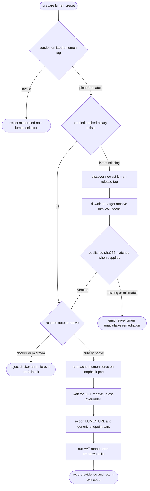

## Logic
<!-- type: logic lang: mermaid -->



## Changes
<!-- type: changes lang: yaml -->

```yaml
changes:
  - path: apps/vat/tech-design/logic/add-versioned-native-lumen-service-preset.md
    action: modify
    section: logic
    impl_mode: hand-written
    reason: Define the versioned native Lumen preset lifecycle and public contract.
  - path: apps/vat/Cargo.toml
    action: modify
    section: changes
    impl_mode: codegen
    reason: Declare only the archive and checksum dependencies required by the VAT-owned Lumen release cache.
  - path: apps/vat/src/lib.rs
    action: modify
    section: changes
    impl_mode: codegen
    reason: Expose the dedicated Lumen release resolver module.
  - path: apps/vat/src/lumen_release.rs
    action: create
    section: changes
    impl_mode: codegen
    reason: Isolate release-tag normalization, latest discovery, target archive download, checksum verification, atomic cache materialization, and cached binary lookup.
  - path: apps/vat/src/config.rs
    action: modify
    section: changes
    impl_mode: codegen
    reason: Add the lumen preset token and native-only runtime/version validation.
  - path: apps/vat/src/commands/run.rs
    action: modify
    section: changes
    impl_mode: codegen
    reason: Resolve the cached Lumen binary, construct loopback serve command, readiness, exports, and teardown evidence without image fallback.
  - path: apps/vat/src/commands/doctor.rs
    action: modify
    section: changes
    impl_mode: codegen
    reason: Report versioned native Lumen cache/download readiness and remediation.
  - path: apps/vat/tests/vat_lumen_preset.rs
    action: create
    section: unit-test
    impl_mode: codegen
    reason: Cover deterministic resolver/cache/runtime behavior and an opt-in real Lumen process contract.
  - path: apps/vat/README.md
    action: modify
    section: changes
    impl_mode: hand-written
    reason: Document version pinning, latest selection, native-only execution, LUMEN_URL, and the no-persistent-data boundary.
```
