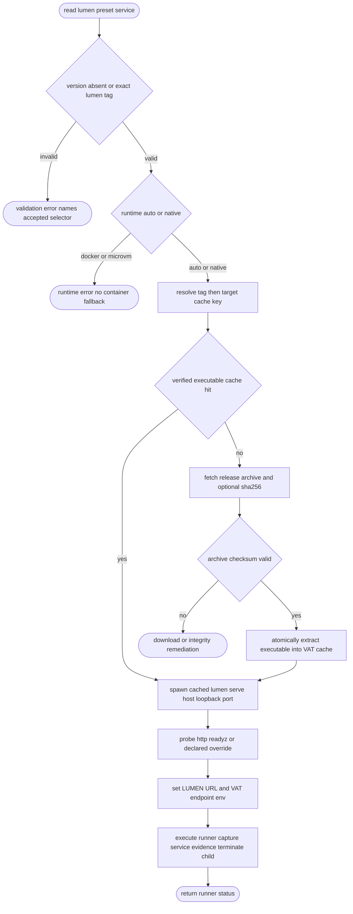

## Logic
<!-- type: logic lang: mermaid -->


## Changes
<!-- type: changes lang: yaml -->

```yaml
changes:
  - path: apps/vat/tech-design/logic/add-versioned-native-lumen-service-preset.md
    action: modify
    section: logic
    impl_mode: hand-written
    reason: Contract the versioned native Lumen preset lifecycle.
  - path: apps/vat/Cargo.toml
    action: modify
    section: changes
    impl_mode: codegen
    reason: Add deterministic archive and checksum dependencies.
  - path: apps/vat/src/lib.rs
    action: modify
    section: changes
    impl_mode: codegen
    reason: Register the Lumen release resolver.
  - path: apps/vat/src/lumen_release.rs
    action: create
    section: changes
    impl_mode: codegen
    reason: Own target release discovery, verified caching, and executable resolution.
  - path: apps/vat/src/config.rs
    action: modify
    section: changes
    impl_mode: codegen
    reason: Extend the preset and validation schema.
  - path: apps/vat/src/commands/run.rs
    action: modify
    section: changes
    impl_mode: codegen
    reason: Build native Lumen service plans and fail closed for container runtimes.
  - path: apps/vat/src/commands/doctor.rs
    action: modify
    section: changes
    impl_mode: codegen
    reason: Surface cache/download readiness and remediation.
  - path: apps/vat/tests/vat_lumen_preset.rs
    action: create
    section: unit-test
    impl_mode: codegen
    reason: Verify selector, cache, process, environment, and failure contracts.
  - path: apps/vat/README.md
    action: modify
    section: changes
    impl_mode: hand-written
    reason: Publish the configuration and lifecycle boundary to agents.
```
## Unit Test

```mermaid
---
id: vat-versioned-native-lumen-preset-verification
requirements:
  lumen_fail_closed:
    id: R4
    text: "Docker and MicroVM runtime requests, bad cache/download/checksum states, and absent native resolution emit actionable failures without Docker/image fallback."
    kind: negative
    risk: high
    verify: lumen_preset_failure_tests
  lumen_preset_config:
    id: R1
    text: "ServicePreset deserializes lumen and validation accepts only an omitted version or a lumen@X.Y.Z release selector with auto/native runtime."
    kind: functional
    risk: medium
    verify: config_lumen_preset_validation
  lumen_real_binary:
    id: R5
    text: "An opt-in real Lumen gate starts a cached or installed release binary, observes readyz and LUMEN_URL from the runner, and confirms VAT teardown."
    kind: integration
    risk: high
    verify: lumen_preset_real_binary_e2e
  lumen_release_cache:
    id: R2
    text: "The resolver selects the latest lumen tag or exact pinned tag, rejects malformed selectors, validates supplied SHA-256, and atomically reuses VAT-owned cached binaries without calling global upgrade."
    kind: regression
    risk: high
    verify: lumen_release_cache_tests
  lumen_runtime_contract:
    id: R3
    text: "A prepared Lumen service runs cached lumen serve on loopback, waits on readyz by default, and exports LUMEN_URL plus generic service endpoint variables."
    kind: functional
    risk: high
    verify: lumen_preset_plan_tests
---
flowchart TD
    r1[R1 lumen preset config] --> config_lumen_preset_validation[config_lumen_preset_validation]
    r2[R2 lumen release cache] --> lumen_release_cache_tests[lumen_release_cache_tests]
    r3[R3 lumen runtime contract] --> lumen_preset_plan_tests[lumen_preset_plan_tests]
    r4[R4 lumen fail closed] --> lumen_preset_failure_tests[lumen_preset_failure_tests]
    r5[R5 lumen real binary] --> lumen_preset_real_binary_e2e[lumen_preset_real_binary_e2e]
```

<!-- type: unit-test lang: mermaid -->


