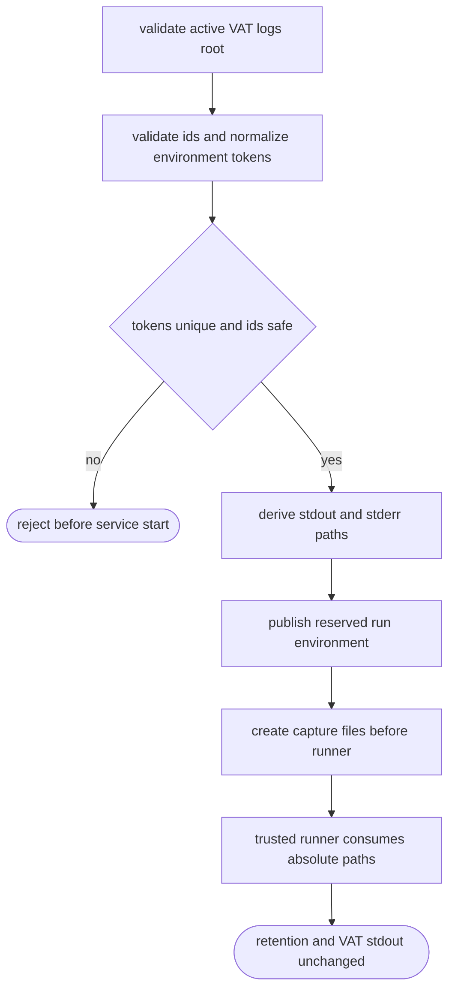

## Logic
<!-- type: logic lang: mermaid -->


## Changes
<!-- type: changes lang: yaml -->

```yaml
changes:
  - path: apps/vat/src/commands/run.rs
    action: modify
    section: logic
    impl_mode: hand-written
    anchor: run_configured
  - path: apps/vat/tests/active_run_service_log_paths.rs
    action: create
    section: unit-test
    impl_mode: hand-written
```
## Unit Test

```mermaid
---
id: vat-active-run-service-log-path-handoff-verification
requirements:
  capture_before_runner:
    id: R3
    text: "VAT creates service capture files before the dependent runner starts."
    kind: functional
    risk: high
    verify: runner_follows_live_service_through_advertised_log_paths
  logs_directory:
    id: R1
    text: "The runner receives VAT_LOGS_DIR for the active run."
    kind: functional
    risk: medium
    verify: runner_follows_live_service_through_advertised_log_paths
  service_paths:
    id: R2
    text: "Each required service receives normalized stdout and stderr path variables that remain inside VAT_LOGS_DIR."
    kind: security
    risk: high
    verify: runner_follows_live_service_through_advertised_log_paths
  stdout_protocol:
    id: R4
    text: "The additive handoff does not replay captured child bytes into VAT JSONL stdout or alter retention."
    kind: regression
    risk: medium
    verify: runner_follows_live_service_through_advertised_log_paths
  unsafe_ids:
    id: R5
    text: "Unsafe ids and normalized environment-token collisions fail before service or runner start."
    kind: security
    risk: high
    verify: unsafe_or_colliding_service_log_environment_ids_are_rejected
---
flowchart TD
    r1[R1 logs directory] --> runner_follows_live_service_through_advertised_log_paths[runner_follows_live_service_through_advertised_log_paths]
    r2[R2 service paths] --> runner_follows_live_service_through_advertised_log_paths
    r3[R3 capture before runner] --> runner_follows_live_service_through_advertised_log_paths
    r4[R4 stdout protocol] --> runner_follows_live_service_through_advertised_log_paths
    r5[R5 unsafe ids] --> unsafe_or_colliding_service_log_environment_ids_are_rejected[unsafe_or_colliding_service_log_environment_ids_are_rejected]
```

<!-- type: unit-test lang: mermaid -->


