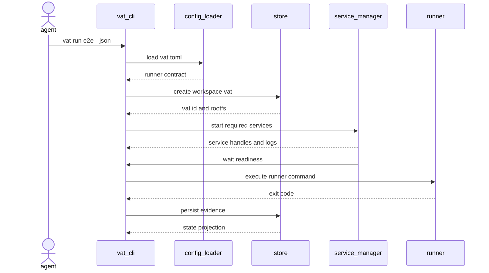
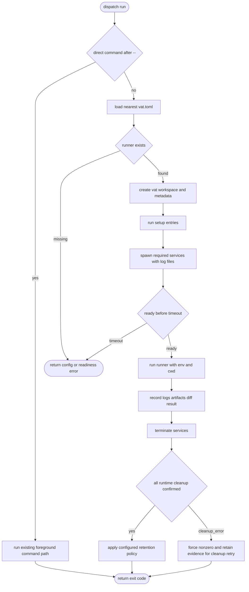
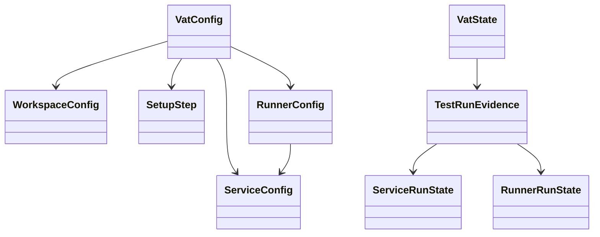
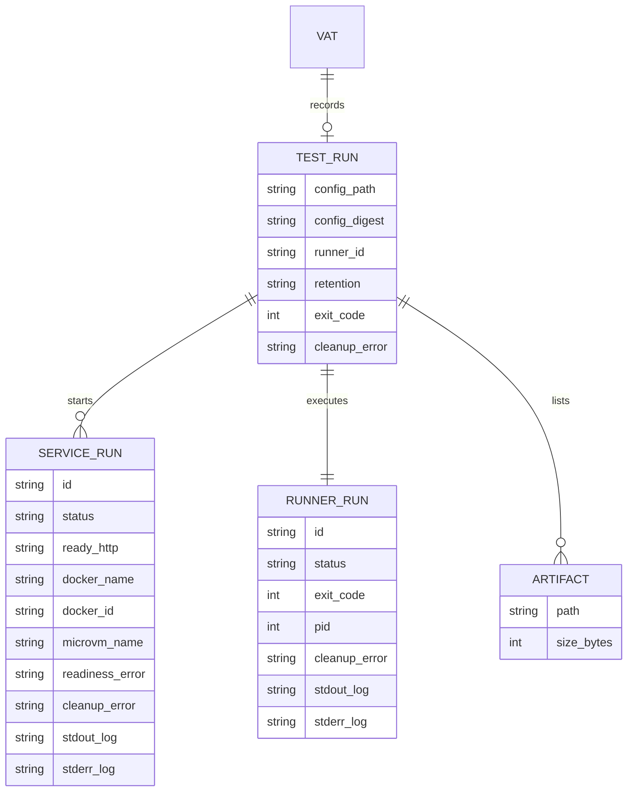
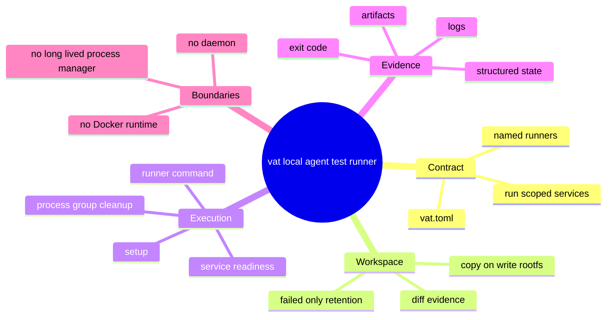

# Vat Local Agent Test Runner Protocol

## Scenarios
<!-- type: scenarios lang: yaml -->

```yaml
id: vat-local-agent-test-runner-protocol-scenarios
scenarios:
  - id: config_runner_success_cleans_up
    given:
      - "a project contains vat.toml with one runner that requires one local service"
      - "the service reaches its configured HTTP readiness endpoint"
    when:
      - "an agent runs `vat run e2e --json`"
    then:
      - "vat creates a copy-on-write workspace for the run"
      - "vat starts the required service only for the duration of the run"
      - "vat executes the selected runner command"
      - "vat emits structured JSON with runner, service, log, artifact, diff, and cleanup metadata"
      - "successful runs use the default failed-only retention policy and remove retained workspace state after emitting the result"
      - "each Vat::save atomically replaces meta.json through a unique sibling temporary file, write, sync_all, and rename, so a concurrent compose reconciler can observe only a complete metadata revision"
  - id: failed_runner_keeps_evidence
    given:
      - "a vat.toml runner exits non-zero"
    when:
      - "the agent runs the named runner"
    then:
      - "vat forwards the runner exit code"
      - "vat keeps the vat directory, logs, artifact list, and diff evidence"
      - "`vat state <id>`, `vat logs <id> runner`, and `vat diff <id>` remain useful for diagnosis"
  - id: service_readiness_timeout_terminates_run
    given:
      - "a runner requires a service with ready_http"
      - "the service never becomes ready before timeout_s"
    when:
      - "vat waits for service readiness"
    then:
      - "the run fails with a readiness timeout"
      - "vat terminates all service process groups"
      - "failure evidence is retained according to the failed-only policy"
  - id: occupied_owned_native_endpoint_fails_closed
    given:
      - "a command-backed native service declares a literal 127.0.0.1 endpoint already served by an unrelated listener"
    when:
      - "vat prepares the owned service and waits for readiness"
    then:
      - "vat rejects the exact service and endpoint before spawning the owned child"
      - "vat does not start dependent runners or kill the unrelated listener"
      - "only an explicit external service may attach to an existing listener"
      - "localhost, IPv6 loopback, and other non-literal loopback readiness hosts are rejected because they cannot share the exact 127.0.0.1 reservation proof"
      - "auto ports remain reserved for the run through preparation and are released immediately at the owned-child spawn boundary"
      - "after spawn, readiness requires the endpoint to transition from unavailable to reachable while the owned child remains live"
  - id: unconfirmed_runtime_cleanup_forces_retention
    given:
      - "a runner or scenario has a VAT-owned Docker or MicroVM service"
      - "the final docker rm -f or container rm -f teardown fails or times out and cannot be proven absent by a bounded authoritative query"
      - "workspace.keep is never or failed"
    when:
      - "the runner or scenario lifecycle reaches finalization"
    then:
      - "vat emits owned_cleanup_unconfirmed and returns a nonzero lifecycle result (plus the deprecated microvm_cleanup_unconfirmed alias for Docker/MicroVM compatibility)"
      - "vat retains its state, logs, artifacts, diff evidence, persisted runtime name, immutable Docker full ID, and cleanup_error despite the normal keep policy"
      - "Docker cleanup requires both the recorded sanitized name and lowercase 64-hex full ID; legacy name-only evidence fails closed, and a same-name replacement ID is never signalled or removed"
      - "one absolute 15-second deadline covers the strict anchored `docker container ls --all --no-trunc --filter name=^/<escaped-name>$ --format ID/name/state` query, at most one immutable-ID kill, state verification, at most one immutable-ID remove, helper process-group cleanup, and final absence proof; no helper resets the deadline"
      - "a Created same-ID object skips kill and receives only the short remove slice; a proven terminal same-ID object may receive the terminal remove slice. Query error, timeout, malformed/ambiguous output, replacement identity, or a live object remains unconfirmed"
      - "MicroVM uses one absolute three-second cleanup deadline: removal receives at most two seconds, and the exact container list --all --format json absence proof receives at most the remaining one second. The remove client, its owned process-group finalization, and the final proof all consume that same deadline; even successful rm requires no matching id. Query error, timeout, malformed JSON, or a live resource remains unconfirmed"
      - "a runner result already observed as Exited with exit code 0 remains immutable when later service cleanup, diagnostic evidence, or lifecycle persistence fails; the service cleanup_error and overall nonzero lifecycle result carry the later failure without rewriting the target command's history"
      - "a later compose down retries only the recorded Docker or MicroVM resource; Kubernetes cluster deletion remains deferred to its own phase"
  - id: docker_create_persists_identity_before_start
    given:
      - "a run-scoped service selects the Docker runtime"
    when:
      - "vat starts the service and waits for its endpoint"
    then:
      - "vat runs bounded `docker create --rm --name ...`, accepts exactly one lowercase 64-hex stdout ID, and atomically persists status Created plus docker_name and docker_id before any start command"
      - "vat then spawns foreground `docker start --attach <full-id>` and keeps the durable checkpoint at Created until a strict name/full-ID/state query reports that exact object running while the attach child remains live"
      - "only that acknowledgement permits status Running; endpoint readiness additionally requires two successful observations at least 100ms apart while the attach child stays live"
      - "spawn, start, acknowledgement, or early-child failure uses the same exact-ID cleanup path and preserves Failed evidence; no successful handoff is emitted"
  - id: detached_starting_handoff_is_definitive_and_stoppable
    given:
      - "vat compose up --detach has token-published a VAT id but a service remains in startup/readiness and no runner PID exists yet"
    when:
      - "the original ten-second handoff deadline expires or an agent runs vat compose down"
    then:
      - "up returns an evidence-unavailable error instead of treating Starting as success, and retains the starting registry binding plus VAT id"
      - "down accepts only a VAT id published by the current token handoff protocol; a pending token or legacy/unbound id remains fail-closed"
      - "down writes the VAT-owned stop-request instead of signalling any persisted PID; setup, service preparation, Docker running acknowledgement, or readiness consumes it and converges through normal exact cleanup and durable terminal state"
      - "only confirmed terminal cleanup resets the registry to imported with no VAT id"
  - id: direct_command_mode_stays_compatible
    given:
      - "an existing caller uses `vat run -- <cmd>`"
    when:
      - "the caller runs a direct command"
    then:
      - "vat does not require vat.toml"
      - "vat preserves current foreground stdio behavior"
      - "vat forwards the child command exit code"
  - id: signal_interrupt_finalizes_owned_groups
    given:
      - "a direct or configured vat run owns TERM-resistant runner/service leaders and descendants in private process groups"
      - "an explicit external service or unrelated listener remains outside VAT ownership"
    when:
      - "VAT receives SIGINT or SIGTERM followed by any later signal"
    then:
      - "the first signal remains authoritative and the signal handler only records/wakes"
      - "the run thread finalizes runners first and VAT-owned services in reverse start order"
      - "each owned group receives TERM, bounded grace, KILL when necessary, leader reap, and PGID-absence proof exactly once"
      - "VAT persists terminal interrupted state with exact signal/reason and no live child PID only after cleanup"
      - "VAT exits 130 for SIGINT or 143 for SIGTERM and retains the evidence regardless of keep policy"
      - "external services and unrelated listeners are never signalled"
```

## State Machine

```mermaid
---
id: vat-local-agent-test-runner-protocol-state
initial: start
nodes:
  start: { kind: initial, label: "start runner invocation" }
  load_config: { kind: normal, label: "load vat.toml" }
  create_workspace: { kind: normal, label: "create COW workspace" }
  run_setup: { kind: normal, label: "run setup commands" }
  start_services: { kind: normal, label: "start required services" }
  wait_ready: { kind: choice, label: "services ready" }
  run_runner: { kind: normal, label: "run selected runner" }
  collect_evidence: { kind: normal, label: "collect logs artifacts diff state" }
  cleanup_services: { kind: normal, label: "terminate service processes; Docker uses one 15s identity deadline and MicroVM uses one 3s remove/finalize/exact-proof deadline" }
  cleanup_confirmed: { kind: choice, label: "same immutable runtime identity is proven absent" }
  retain: { kind: choice, label: "apply configured retention policy" }
  forced_retain: { kind: normal, label: "force nonzero result and retain VAT evidence for cleanup retry" }
  done: { kind: terminal, label: "return runner or scenario exit code" }
  timeout: { kind: terminal, label: "readiness timeout" }
edges:
  - { from: start, to: load_config, event: "vat run <runner-id>" }
  - { from: load_config, to: create_workspace, event: "runner found" }
  - { from: create_workspace, to: run_setup, event: "workspace ready" }
  - { from: run_setup, to: start_services, event: "setup complete" }
  - { from: start_services, to: wait_ready, event: "services spawned" }
  - { from: wait_ready, to: run_runner, event: "ready" }
  - { from: wait_ready, to: timeout, event: "timeout" }
  - { from: run_runner, to: collect_evidence, event: "runner exited" }
  - { from: collect_evidence, to: cleanup_services, event: "evidence recorded" }
  - { from: cleanup_services, to: cleanup_confirmed, event: "teardown recorded" }
  - { from: cleanup_confirmed, to: retain, event: "yes" }
  - { from: cleanup_confirmed, to: forced_retain, event: "cleanup_error present" }
  - { from: retain, to: done, event: "policy applied" }
  - { from: forced_retain, to: done, event: "retained nonzero" }
---
stateDiagram-v2
    [*] --> load_config
    load_config --> create_workspace: runner found
    create_workspace --> run_setup: workspace ready
    run_setup --> start_services: setup complete
    start_services --> wait_ready: services spawned
    wait_ready --> run_runner: ready
    wait_ready --> timeout: timeout
    run_runner --> collect_evidence: runner exited
    collect_evidence --> cleanup_services: evidence recorded
    cleanup_services --> cleanup_confirmed: teardown recorded
    cleanup_confirmed --> retain: yes
    cleanup_confirmed --> forced_retain: cleanup_error present
    retain --> done: policy applied
    forced_retain --> done: retained nonzero
```

<!-- type: state-machine lang: mermaid -->



## Interaction
<!-- type: interaction lang: mermaid -->



## Logic
<!-- type: logic lang: mermaid -->



## Dependency
<!-- type: dependency lang: mermaid -->



## Data Model
<!-- type: db-model lang: mermaid -->



## Schema
<!-- type: schema lang: yaml -->

```yaml
$schema: "https://json-schema.org/draft/2020-12/schema"
$id: "vat-test-run-evidence.schema.json"
title: "Vat test run evidence"
type: object
required: [config_path, runner_id, retention, services, runner, runners, artifacts]
properties:
  config_path:
    type: string
  config_digest:
    type: string
  runner_id:
    type: string
  retention:
    type: string
    enum: [failed, always, never]
  cleanup_error:
    type: [string, "null"]
    description: Unconfirmed cleanup for a VAT-owned auxiliary process such as a setup command. This forces evidence retention and blocks GC even with include-failed.
  services:
    type: array
    items:
      type: object
      required: [id, status, stdout_log, stderr_log]
      properties:
        id: { type: string }
        status: { type: string, enum: [created, running, ready, interrupted, exited, failed, timeout] }
        exit_code: { type: [integer, "null"] }
        ready_http: { type: [string, "null"] }
        docker_name:
          type: [string, "null"]
          description: Sanitized VAT-owned Docker container name retained for strict anchored lookup; a name alone is never signal or deletion authority.
        docker_id:
          type: [string, "null"]
          pattern: "^[0-9a-f]{64}$"
          description: Immutable full Docker ID captured from bounded docker create stdout and atomically persisted with status Created before docker start --attach. Docker cleanup requires this ID plus docker_name and fails closed for legacy name-only evidence.
        microvm_name:
          type: [string, "null"]
          description: VAT-owned Apple container resource for a MicroVM-backed service.
        readiness_error:
          type: [string, "null"]
          description: Last terminal readiness observation, including published host-endpoint diagnostics.
        cleanup_error:
          type: [string, "null"]
          description: Unconfirmed VAT-owned service cleanup, including a native process group or Docker/MicroVM runtime resource. Docker query, kill, one remove, helper cleanup, and final exact-ID absence proof consume one absolute 15-second deadline; a same-name replacement is untouched. MicroVM removal, owned-helper finalization, and exact JSON absence proof consume one absolute three-second deadline, and successful rm alone is not absence. Any cleanup obligation forces a nonzero result and compose retention; a successful interrupt may be published only after cleanup is proven.
        stdout_log: { type: string }
        stderr_log: { type: string }
      additionalProperties: false
  runner:
    type: object
    required: [id, status, command, stdout_log, stderr_log]
    properties:
      id: { type: string }
      status: { type: string, enum: [created, running, interrupted, exited, failed, timeout] }
      command:
        type: array
        items: { type: string }
      exit_code: { type: [integer, "null"] }
      duration_ms: { type: [integer, "null"] }
      pid:
        type: [integer, "null"]
        description: Live runner PID while the VAT parent owns the child; readiness/reconciliation evidence only, never a compose-down signal target.
      cleanup_error:
        type: [string, "null"]
        description: VAT could not prove the owned runner process group absent. Compose retains ownership; on a signal VAT records the signal context but fails closed instead of publishing Interrupted/130/143 success. A later service, diagnostic, or lifecycle failure never rewrites an already observed terminal runner status and exit code.
      stdout_log: { type: string }
      stderr_log: { type: string }
    additionalProperties: false
  runners:
    type: array
    items:
      type: object
      required: [id, status, command, stdout_log, stderr_log]
      properties:
        id: { type: string }
        status: { type: string, enum: [created, running, interrupted, exited, failed, timeout] }
        command:
          type: array
          items: { type: string }
        exit_code: { type: [integer, "null"] }
        duration_ms: { type: [integer, "null"] }
        pid: { type: [integer, "null"] }
        cleanup_error:
          type: [string, "null"]
          description: Per-runner owned process-group cleanup obligation; terminal evidence must not retain a PID without blocking compose reuse.
        stdout_log: { type: string }
        stderr_log: { type: string }
      additionalProperties: false
  artifacts:
    type: array
    items:
      type: object
      required: [path]
      properties:
        path: { type: string }
        size_bytes: { type: [integer, "null"] }
      additionalProperties: false
additionalProperties: false
```

## REST API
<!-- type: rest-api lang: yaml -->

```yaml
openapi: 3.1.0
info:
  title: "No REST API change"
  version: "0.0.0"
paths: {}
components:
  schemas: {}
x-aw-contract:
  surface: none
  reason: "Vat remains a local CLI tool for this slice."
```

## RPC API
<!-- type: rpc-api lang: yaml -->

```yaml
openrpc: 1.3.2
info:
  title: "No JSON-RPC API change"
  version: "0.0.0"
methods: []
x-aw-contract:
  surface: none
  reason: "No RPC surface is introduced."
```

## Async API
<!-- type: async-api lang: yaml -->

```yaml
asyncapi: 2.6.0
info:
  title: "No async API change"
  version: "0.0.0"
channels: {}
x-aw-contract:
  surface: none
  reason: "No pub-sub or streaming protocol is introduced."
```

## CLI
<!-- type: cli lang: yaml -->

```yaml
commands:
  - name: vat run
    forms:
      - usage: "vat run -- <command>"
        behavior:
          - "Preserves existing direct foreground command mode."
          - "Does not require vat.toml."
      - usage: "vat run <runner-id> [--json]"
        behavior:
          - "Loads vat.toml from the current directory or an ancestor."
          - "Executes the named runner with its setup and required services."
          - "Returns the runner exit code."
          - "If any runner/service cleanup remains unconfirmed, emits owned_cleanup_unconfirmed, returns nonzero, and retains the VAT. Docker/MicroVM callers additionally receive the deprecated microvm_cleanup_unconfirmed compatibility alias. A signal is preserved in failure evidence but Interrupted/130/143 is published only after cleanup proof."
  - name: vat logs
    usage: "vat logs <vat-id> [service-id|runner]"
    behavior:
      - "Prints captured stdout and stderr evidence for the selected source."
      - "Defaults to all captured logs for the vat run."
  - name: vat compose up/down
    forms:
      - usage: "vat compose up --project <project> --detach"
        behavior:
          - "Publishes a VAT id only through the one-shot token handoff and reports success only after definitive service readiness plus a live runner; reaching the handoff deadline while still Starting is an error that retains the binding."
      - usage: "vat compose down <project>"
        behavior:
          - "For Ready or token-published Starting VATs, writes an owner stop-request and waits for durable terminal cleanup before resetting the registry; it never signals a persisted PID directly."
          - "A pending/unpublished handoff remains fail-closed, and cleanup uncertainty retains the binding."
```

## Wireframe
<!-- type: wireframe lang: yaml -->

```yaml
layout:
  id: vat-local-agent-test-runner-wireframe
  surfaces: []
  note: "No UI surface is added."
```

## Component
<!-- type: component lang: yaml -->

```yaml
schemaVersion: "1.0.0"
readme: "No web component contract is changed."
modules: []
```

## Design Token
<!-- type: design-token lang: yaml -->

```yaml
$schema: "https://design-tokens.github.io/community-group/format/"
tokens: {}
metadata:
  reason: "No visual design token is introduced."
```

## Config
<!-- type: config lang: yaml -->

```yaml
$schema: "https://json-schema.org/draft/2020-12/schema"
$id: "vat-config.schema.json"
title: "vat.toml"
type: object
required: [version, runners]
properties:
  version:
    type: integer
    const: 1
  name:
    type: string
  workspace:
    type: object
    properties:
      base: { type: string, default: "." }
      workdir: { type: string, default: "." }
      keep: { type: string, enum: [failed, always, never], default: failed }
    additionalProperties: false
  env:
    type: object
    additionalProperties: { type: string }
  setup:
    type: array
    items:
      type: object
      required: [id, cmd]
      properties:
        id: { type: string }
        cmd:
          type: array
          items: { type: string }
          minItems: 1
        when: { type: string }
      additionalProperties: false
  services:
    type: array
    items:
      type: object
      required: [id]
      description: >
        A run-scoped dependency service. It is backed by exactly one of: cmd
        (an explicit native command), preset (a built-in service whose runtime
        decides native-binary, Docker, or explicit Apple Container MicroVM), or
        image (an OCI service such as AlloyDB, which requires container_port).
        `micro_vm` is explicit: it never silently falls back to Docker and its
        declared OCI route must pass bounded Apple image inspect/pull/verify
        preflight. The runner that requires the service is always a host process
        — only the service may be a container, so the host GPU story is
        unaffected.
      properties:
        id: { type: string }
        requires:
          type: array
          items: { type: string }
        cmd:
          type: array
          items: { type: string }
          minItems: 1
        preset: { type: string, enum: [postgres, redis, nats, rabbitmq, mysql, mongo] }
        image: { type: string }
        container_port: { type: integer }
        image_env:
          type: object
          additionalProperties: { type: string }
        runtime: { type: string, enum: [auto, native, docker, micro_vm], default: auto }
        version: { type: string }
        port:
          oneOf:
            - { type: string, const: auto }
            - { type: integer }
        seed:
          type: array
          items: { type: string }
        export:
          type: object
          additionalProperties: { type: string }
        ready_http: { type: string }
        timeout_s: { type: integer, default: 60 }
      additionalProperties: false
  runners:
    type: array
    items:
      type: object
      required: [id, cmd]
      properties:
        id: { type: string }
        requires:
          type: array
          items: { type: string }
        cmd:
          type: array
          items: { type: string }
          minItems: 1
        timeout_s: { type: integer }
        artifacts:
          type: array
          items: { type: string }
      additionalProperties: false
additionalProperties: false
```

## Manifest
<!-- type: manifest lang: yaml -->

```yaml
manifests:
  - path: apps/vat/Cargo.toml
    changes:
      - "Add TOML parsing dependency for vat.toml."
      - "Use libc as a normal dependency for process cleanup on Unix hosts."
```

## Runtime Image
<!-- type: runtime-image lang: yaml -->

```yaml
images: []
build_contexts: []
x-aw-contract:
  surface: none
  reason: >
    Vat ships no image and builds none. It may run a run-scoped dependency
    service through bounded `docker create`, durable Created/name/full-ID
    persistence, and foreground `docker start --attach`, or through explicit
    Apple `container run` (a preset/image with the selected runtime), but it is
    not an image registry/builder and the runner is always a host process.
```

## Deployment
<!-- type: deployment lang: yaml -->

```yaml
deployments: []
operations:
  - id: local-vat-cli
    action: "build and run the local vat binary"
    verification:
      - "cargo test -p vat"
      - "aw health vat --verify-traceability --verify-cb --verify-cold --verify-tests --verify-ec"
```

## Unit Test
<!-- type: unit-test lang: mermaid -->

```mermaid
---
id: vat-local-agent-test-runner-unit-tests
---
requirementDiagram
    requirement parse_config {
      id: UT1
      text: "Vat parses valid vat.toml and rejects duplicate runner or service ids."
      risk: high
      verifymethod: test
    }
    requirement resolve_paths {
      id: UT2
      text: "Relative workspace and artifact paths resolve from the vat.toml directory."
      risk: medium
      verifymethod: test
    }
    requirement keep_direct_run {
      id: UT3
      text: "Direct command mode still forwards child exit codes."
      risk: high
      verifymethod: test
    }
    requirement own_native_endpoint {
      id: UT4
      text: "Concurrent native auto-port allocations are unique, fixed occupied 127.0.0.1 endpoints fail closed, unsupported loopback spellings are rejected, and every failed or finished plan releases its reservation."
      risk: high
      verifymethod: test
    }
    requirement bind_readiness_to_child {
      id: UT5
      text: "An owned network service is Ready only after its reserved endpoint transitions to reachable and its child stays live before and after the configured probe."
      risk: high
      verifymethod: test
    }
    requirement finalize_interrupted_groups_once {
      id: UT6
      text: "The first SIGINT/SIGTERM is recorded without cleanup in the handler; one idempotent finalizer performs TERM, bounded grace, KILL, reap, and PGID-absence proof before Interrupted metadata is persisted."
      risk: high
      verifymethod: test
    }
    requirement preserve_terminal_runner_outcome {
      id: UT7
      text: "Failure recording creates missing runner evidence or terminalizes only Running records; it never rewrites an already observed Exited/0 target when a later service cleanup, diagnostic, or persistence step fails."
      risk: high
      verifymethod: test
    }
    test config_parse_tests {
      type: functional
      verifies: parse_config
    }
    test direct_run_regression {
      type: functional
      verifies: keep_direct_run
    }
    test native_endpoint_ownership_regression {
      type: functional
      verifies: own_native_endpoint
    }
    test owned_child_readiness_regression {
      type: functional
      verifies: bind_readiness_to_child
    }
    test interrupted_group_finalizer_regression {
      type: functional
      verifies: finalize_interrupted_groups_once
    }
    test completed_runner_outcome_regression {
      type: functional
      verifies: preserve_terminal_runner_outcome
    }
```

## E2E Test
<!-- type: e2e-test lang: yaml -->

```yaml
e2e_tests:
  - id: vat-toml-runner-local-service-smoke
    name: "vat.toml runner local service smoke"
    capability_id: agent-native-gpu-native-dev-containers
    claim_id: local-agent-test-runner-protocol
    contract_id: local-agent-test-runner-protocol
    category: behavior
    command: "cargo test -p vat --test vat_toml_runner -- --nocapture"
    assertions:
      - "vat run <runner-id> starts a local readiness service, runs the runner, captures logs, records artifacts, and returns JSON evidence."
      - "failed runner evidence remains inspectable."
      - "Any unconfirmed runner/service cleanup forces a nonzero result and keeps VAT evidence regardless of the normal keep policy."
      - "A target that completed Exited/0 remains recorded as Exited/0 when later VAT-owned service cleanup fails; the service and lifecycle carry the cleanup failure separately."
      - "An occupied command-backed native endpoint fails before service or runner spawn, reports the exact service/endpoint, and leaves the unrelated listener reachable."
      - "A child that exits before its reserved endpoint becomes ready is terminal and no dependent runner starts."
      - "Explicit external services retain attach-and-probe behavior without VAT lifecycle ownership."
      - "direct vat run -- <cmd> compatibility is preserved."
  - id: vat-signal-owned-process-group-cleanup
    name: "SIGINT/SIGTERM owned process-group cleanup"
    capability_id: agent-native-gpu-native-dev-containers
    claim_id: interrupt-safe-process-group-cleanup
    contract_id: interrupt-safe-process-group-cleanup
    category: behavior
    command: "cargo test -p vat --test vat_signal_cleanup -- --test-threads=1"
    assertions:
      - "Real configured SIGINT and SIGTERM stop TERM-resistant runner and native-service leaders plus descendants before VAT exits 130/143."
      - "The owned service port immediately rebinds while an explicit external listener remains reachable and unowned."
      - "Terminal state is interrupted with the first signal/reason and no runner/service PID; a second cleanup is a no-op."
      - "Direct vat run -- <cmd> has the same real SIGINT/SIGTERM terminal-state and owned-descendant cleanup contract."
      - "vat gc --execute without --include-failed classifies interrupted evidence as retained and does not delete it."
  - id: vat-compose-docker-identity-and-definitive-handoff
    name: "Compose immutable Docker identity and definitive detached handoff"
    capability_id: agent-native-gpu-native-dev-containers
    claim_id: local-agent-test-runner-protocol
    contract_id: local-agent-test-runner-protocol
    category: behavior
    command: "VAT_COMPOSE_REAL_DOCKER_E2E_REQUIRED=1 cargo test -p vat --test vat_compose -- --test-threads=1 --nocapture"
    assertions:
      - "Fake-runtime cases prove Created/name/full-ID persistence precedes start, only exact running acknowledgement advances state, and start failure performs one exact-ID cleanup without signalling a same-name replacement."
      - "Cleanup query/kill/remove/final-proof helpers remain bounded by one lifecycle deadline and retain durable retry evidence on timeout, error, ambiguity, or replacement. Docker uses 15 seconds; MicroVM removal, helper finalization, and exact JSON absence share three seconds and require final absence even after successful rm."
      - "A slow detached startup cannot return false success; its token-bound Starting registry can be stopped immediately through the VAT-owned request, leaving terminal service evidence, no PID/container ownership, and an imported unbound registry."
      - "The required real-Docker full cycle proves create/start/readiness/logs/down behavior against Docker Desktop rather than only a fake command."
```

## Changes
<!-- type: changes lang: yaml -->

```yaml
changes:
  - path: apps/vat/tech-design/logic/local-agent-test-runner-protocol.md
    action: create
    section: changes
    impl_mode: hand-written
    reason: "Define the local agent test runner protocol TD."
  - path: apps/vat/tech-design/logic/local-agent-test-runner-protocol.md
    action: validate
    section: scenarios
    impl_mode: hand-written
    reason: "Record success, failure retention, readiness timeout, and direct-run compatibility scenarios."
  - path: apps/vat/tech-design/logic/local-agent-test-runner-protocol.md
    action: validate
    section: mindmap
    impl_mode: hand-written
    reason: "Record protocol, workspace, execution, evidence, and boundary concepts."
  - path: apps/vat/tech-design/logic/local-agent-test-runner-protocol.md
    action: validate
    section: state-machine
    impl_mode: hand-written
    reason: "Record the ephemeral runner lifecycle."
  - path: apps/vat/tech-design/logic/local-agent-test-runner-protocol.md
    action: validate
    section: interaction
    impl_mode: hand-written
    reason: "Record the agent, CLI, config, store, service, and runner interaction."
  - path: apps/vat/tech-design/logic/local-agent-test-runner-protocol.md
    action: validate
    section: dependency
    impl_mode: hand-written
    reason: "Record the config and evidence type relationships."
  - path: apps/vat/tech-design/logic/local-agent-test-runner-protocol.md
    action: validate
    section: db-model
    impl_mode: hand-written
    reason: "Record the persisted vat, test run, service run, runner run, and artifact relationships."
  - path: apps/vat/tech-design/logic/local-agent-test-runner-protocol.md
    action: validate
    section: rest-api
    impl_mode: hand-written
    reason: "Record non-applicability because this slice adds no REST API."
  - path: apps/vat/tech-design/logic/local-agent-test-runner-protocol.md
    action: validate
    section: rpc-api
    impl_mode: hand-written
    reason: "Record non-applicability because this slice adds no RPC API."
  - path: apps/vat/tech-design/logic/local-agent-test-runner-protocol.md
    action: validate
    section: async-api
    impl_mode: hand-written
    reason: "Record non-applicability because this slice adds no async API."
  - path: apps/vat/tech-design/logic/local-agent-test-runner-protocol.md
    action: validate
    section: wireframe
    impl_mode: hand-written
    reason: "Record non-applicability because this slice adds no UI surface."
  - path: apps/vat/tech-design/logic/local-agent-test-runner-protocol.md
    action: validate
    section: component
    impl_mode: hand-written
    reason: "Record non-applicability because this slice adds no component contract."
  - path: apps/vat/tech-design/logic/local-agent-test-runner-protocol.md
    action: validate
    section: design-token
    impl_mode: hand-written
    reason: "Record non-applicability because this slice adds no design tokens."
  - path: apps/vat/tech-design/logic/local-agent-test-runner-protocol.md
    action: validate
    section: runtime-image
    impl_mode: hand-written
    reason: "Record non-applicability because vat does not add Docker or OCI runtime behavior."
  - path: apps/vat/tech-design/logic/local-agent-test-runner-protocol.md
    action: validate
    section: deployment
    impl_mode: hand-written
    reason: "Record local CLI verification as the deployment impact."
  - path: apps/vat/src/config.rs
    action: add
    section: config
    impl_mode: hand-written
    refs:
      - "apps/vat/tech-design/logic/local-agent-test-runner-protocol.md#config"
      - "apps/vat/tech-design/logic/local-agent-test-runner-protocol.md#schema"
    summary: "Load, validate, and resolve vat.toml runner contracts."
  - path: apps/vat/src/commands/run.rs
    action: modify
    section: logic
    impl_mode: hand-written
    refs:
      - "apps/vat/tech-design/logic/local-agent-test-runner-protocol.md#logic"
      - "apps/vat/tech-design/logic/local-agent-test-runner-protocol.md#cli"
    summary: "Dispatch vat run <runner-id> through setup, services, readiness, runner execution, evidence, and cleanup."
  - path: apps/vat/src/state.rs
    action: modify
    section: schema
    impl_mode: hand-written
    refs:
      - "apps/vat/tech-design/logic/local-agent-test-runner-protocol.md#schema"
    summary: "Persist and project runner evidence metadata."
  - path: apps/vat/src/store.rs
    action: modify
    section: logic
    impl_mode: hand-written
    refs:
      - "apps/vat/tech-design/logic/local-agent-test-runner-protocol.md#logic"
    summary: "Atomically replace VAT metadata with a unique sibling temporary file, write, sync_all, and rename so concurrent compose reconciliation never observes a truncate/write interval."
  - path: apps/vat/src/commands/logs.rs
    action: add
    section: cli
    impl_mode: hand-written
    refs:
      - "apps/vat/tech-design/logic/local-agent-test-runner-protocol.md#cli"
    summary: "Expose captured per-run logs."
  - path: apps/vat/README.md
    action: modify
    section: scenarios
    impl_mode: hand-written
    refs:
      - "apps/vat/tech-design/logic/local-agent-test-runner-protocol.md#scenarios"
    summary: "Document vat as an ephemeral local agent test runner protocol."
  - path: apps/vat/tests
    action: modify
    section: unit-test
    impl_mode: hand-written
    refs:
      - "apps/vat/tech-design/logic/local-agent-test-runner-protocol.md#unit-test"
      - "apps/vat/tech-design/logic/local-agent-test-runner-protocol.md#e2e-test"
    summary: "Add parser and runner smoke coverage."
  - path: apps/vat/tests
    action: modify
    section: e2e-test
    impl_mode: hand-written
    refs:
      - "apps/vat/tech-design/logic/local-agent-test-runner-protocol.md#e2e-test"
    summary: "Add vat.toml local service runner smoke coverage."
  - path: apps/vat/tests/vat_signal_cleanup.rs
    action: add
    section: e2e-test
    impl_mode: codegen
    refs:
      - "apps/vat/tech-design/logic/local-agent-test-runner-protocol.md#scenarios"
      - "apps/vat/tech-design/logic/local-agent-test-runner-protocol.md#e2e-test"
      - "apps/vat/tech-design/semantic/source/projects-vat-tests-vat_signal_cleanup-rs.md#source"
    summary: "Generate real SIGINT/SIGTERM direct/configured coverage that proves bounded owned-group cleanup, PGID absence, terminal state, port release, external survival, retention, and idempotency; the existing whole run.rs source mirror remains scheduled for atomic refresh in #2396."
  - path: apps/vat/Cargo.toml
    action: modify
    section: manifest
    impl_mode: hand-written
    refs:
      - "apps/vat/tech-design/logic/local-agent-test-runner-protocol.md#manifest"
    summary: "Add TOML parsing and process cleanup dependencies."
```

## Mindmap
<!-- type: mindmap lang: mermaid -->



# Reviews

### Review 1
**Verdict:** approved

- [scenarios] The TD captures the intended ephemeral agent test runner lifecycle, including success cleanup, failed evidence retention, service readiness timeout, and direct-run compatibility.
- [config] The `vat.toml` schema is intentionally small and project-local, with `workspace`, `env`, `setup`, `services`, and `runners` only.
- [logic] The orchestration flow keeps services run-scoped and explicitly avoids daemon or long-lived process management.
- [changes] The implementation scope is bounded to vat config loading, run orchestration, state evidence, logs, README, manifest, and tests.
