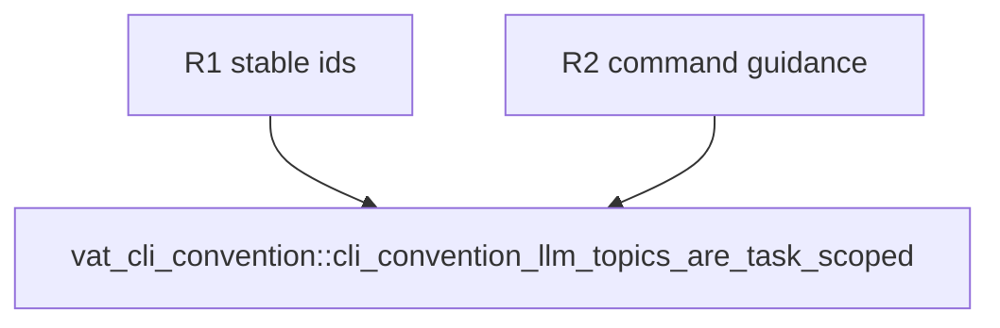

## Logic
<!-- type: logic lang: mermaid -->

```mermaid
---
id: vat-llm-task-topics-contract
entry: outline
nodes:
  outline: { kind: start, label: "outline is the default offline entrypoint" }
  topics: { kind: process, label: "core services container and k8s have stable registry IDs" }
  legacy: { kind: process, label: "guide remains an explicit complete compatibility topic" }
  terminal: { kind: terminal, label: "unknown topics return the shared actionable error" }
edges:
  - { from: outline, to: topics }
  - { from: topics, to: legacy }
  - { from: legacy, to: terminal }
---
```

The public offline contract has five stable IDs: `core`, `services`, `container`, `k8s`, and `guide`. `outline` is the default and must list those IDs with concise summaries. `guide` retains the previous complete text; no existing caller loses access to it. Topic bodies are command-oriented: core names run/plan/doctor/state, services names vat.toml and service inspection, container names build/compose/docker and their non-Engine boundary, and k8s names ephemeral/session operations plus the non-persistent boundary.
## Changes
<!-- type: changes lang: yaml -->

```yaml
changes:
  - path: apps/vat/src/commands/llm.rs
    action: modify
    section: logic
    impl_mode: hand-written
    anchor: exec
  - path: apps/vat/tests/vat_cli_convention.rs
    action: modify
    section: unit-test
    impl_mode: hand-written
    anchor: cli_convention_llm_flags
```
## Unit Test
<!-- type: unit-test lang: mermaid -->


