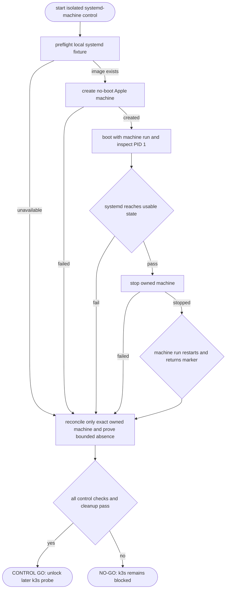

## Logic
<!-- type: logic lang: mermaid -->



## E2E Test
<!-- type: e2e-test lang: yaml -->

```yaml
e2e_tests:
  - id: vat-local-k8s-phase0-real-host
    name: "Apple Container systemd-machine control gates the Phase 0 k3s probe"
    capability_id: agent-native-gpu-native-dev-containers
    claim_id: local-kubernetes-cluster-service-and-vat-cluster
    contract_id: local-agent-test-runner-protocol
    category: stability
    required_for_production: false
    command: "VAT_LOCAL_K8S_E2E=1 cargo test -p vat --test vat_local_k8s_phase0 apple_machine_exec_control_is_usable_before_k3s -- --ignored --nocapture"
    assertions:
      - "The ignored, explicit opt-in test preflights `local/vat-k8s-systemd:phase0` (or `VAT_LOCAL_K8S_MACHINE_IMAGE`) and skips cleanly when the Apple Container CLI is absent. It never builds or publishes an image itself."
      - "Using the source-controlled systemd fixture, the test creates one unique no-boot machine with no home mount, 2 CPUs, and 4G memory. It requires PID 1 to be `systemd`, waits for systemd, stops the machine, and requires `container machine run` to restart it and return the control marker."
      - "The test records exact argv, output, inspect/logs, bounded exact-name cleanup attempts, and a `go` or `no-go` verdict in a JSON report under `VAT_LOCAL_K8S_EVIDENCE_DIR` (default `/private/tmp`). It never deletes an ambient machine: after a failed or timed-out create it continues exact-name reconciliation through a stabilization window and requires a structured exact-name absence result; Drop is panic-only fallback."
      - "Recorded durability evidence: Apple Container 1.1.0 on macOS 26.5.1 boots the systemd fixture, but `container machine run` returns `Operation not supported by device` after a restart retry. A separate host-API probe also saw `machine create` report a bootMachine XPC timeout while its uniquely named machine was running, so failed create is treated as delayed allocation rather than proof of absence. `container exec` can diagnose an already-running backing container only; it cannot restart a stopped machine and is not a substitute for this control. The verdict remains NO-GO."
      - "This test does not treat a disposable `container exec` session as a durable pass. The durable failure blocks host kubeconfig, local image loading, networking, storage, stop/start reconciliation, and Phase 1 backend implementation."
  - id: vat-local-k8s-phase0-disposable-k3s
    name: "Apple Container one-boot guest runs a bounded k3s Node Ready and Job journey"
    capability_id: agent-native-gpu-native-dev-containers
    claim_id: local-kubernetes-cluster-service-and-vat-cluster
    contract_id: local-agent-test-runner-protocol
    category: behavior
    command: "VAT_LOCAL_K8S_DISPOSABLE_E2E=1 cargo test -p vat --test vat_local_k8s_phase0 apple_machine_bootstraps_disposable_k3s_via_backing_container_exec -- --ignored --nocapture"
    assertions:
      - "The explicit opt-in probe creates one auto-booted source-fixture machine, parses only that machine's inspect-returned running `containerId`, and never searches for or touches an ambient container."
      - "It requires PID 1 to be systemd and root command execution, installs pinned k3s v1.36.2+k3s1 with a guest-only 0600 admin kubeconfig, waits for `Node Ready`, then creates, waits for, logs, and deletes a BusyBox Job whose marker is `vat-k8s-phase0-workload-ok`."
      - "The probe captures node/pod state and k3s journal output in a JSON report, explicitly deletes the Job, then reconciles and proves bounded absence of only its owned machine; Drop cleanup is panic-only fallback. The observed host result is `ephemeral-go`."
      - "Without the separate host-API opt-in, this evidence proves a one-machine, one-boot guest substrate only. It does not prove default-add-on readiness, host API access, port exposure, local OCI image delivery, persistent volumes, multi-node networking, or stop/run durability."
  - id: vat-local-k8s-phase0-disposable-host-api
    name: "macOS reads the disposable guest API through an isolated kubeconfig"
    capability_id: agent-native-gpu-native-dev-containers
    claim_id: local-kubernetes-cluster-service-and-vat-cluster
    contract_id: local-agent-test-runner-protocol
    category: behavior
    command: "VAT_LOCAL_K8S_DISPOSABLE_E2E=1 VAT_LOCAL_K8S_HOST_API_E2E=1 cargo test -p vat --test vat_local_k8s_phase0 apple_machine_bootstraps_disposable_k3s_via_backing_container_exec -- --ignored --nocapture"
    assertions:
      - "The second explicit opt-in re-inspects the exact owned running machine and requires its backing container ID and IP address to be unchanged before it exports any credential. It installs k3s with that inspected IP as a TLS SAN."
      - "It copies the guest admin kubeconfig only into a private 0700 temporary directory, rewrites exactly one loopback server endpoint to the inspected IP, restricts the copied file to 0600, removes ambient KUBECONFIG and proxy environment variables, and makes kubectl use a private discovery cache inside the same owned directory. No credential contents are emitted in JSON evidence."
      - "The host command is `kubectl --kubeconfig <owned-path> --cache-dir <owned-path>/kubectl-cache --request-timeout=20s get nodes -o json`; the observed result is `ephemeral-host-api-go`, then the credential directory and exact owned machine are both confirmed absent."
      - "This is a one-boot reachability diagnostic only. It does not export a durable user kubeconfig or unlock a persistent microvm-k3s backend, port publication, local image delivery, storage, multi-node networking, or stop/run durability."
```

## Changes
<!-- type: changes lang: yaml -->

```yaml
changes:
  - path: apps/vat/tests/vat_local_k8s_phase0.rs
    action: create
    section: e2e-test
    impl_mode: hand-written
    reason: "Add opt-in Apple-container Phase 0 probes. The durable control preflights a locally built fixture image, owns one unique no-boot machine, proves PID 1/systemd and stop-to-run re-execution, writes structured evidence, and reconciles only that exact name through bounded inspect/delete/absence checks; failed create is treated as delayed allocation and Drop is panic-only fallback. The disposable diagnostic auto-boots an owned machine, uses only its inspect-returned backing container ID, proves root/systemd plus Node Ready and a completed Job, and records an `ephemeral-go`. Its separate host-API opt-in re-inspects that exact backing ID/IP, uses a 0600 temporary kubeconfig plus owned cache, proves macOS `kubectl get nodes`, and removes the credential directory before machine cleanup; it records `ephemeral-host-api-go` without relaxing the durable NO-GO. Normal cargo test and unsupported hosts do not mutate the container runtime."
  - path: apps/vat/tests/fixtures/local-k8s-phase0-machine/Dockerfile
    action: create
    section: e2e-test
    impl_mode: hand-written
    reason: "Provide the source-controlled Ubuntu 24.04 systemd fixture required by the control. Apple Container machines boot their image init process, so this fixture is a reproducible k3s-substrate control rather than a minimal application container. It is built explicitly into the local Apple Container image store as `local/vat-k8s-systemd:phase0` or supplied through VAT_LOCAL_K8S_MACHINE_IMAGE."
  - path: apps/vat/aw.toml
    action: modify
    section: e2e-test
    impl_mode: hand-written
    reason: "Register the separate explicit durable-control, disposable-k3s, and disposable-host-API commands under the existing local-Kubernetes claim without running any real-host gate in ordinary unit-test CI."
```
