## Logic
<!-- type: logic lang: mermaid -->

```mermaid
---
id: vat-microvm-host-endpoint-contract
entry: start
nodes:
  start: { kind: start, label: "VAT starts an image-backed service or enters a compose lifecycle operation" }
  route: { kind: decision, label: "MicroVm service path, unchanged runtime, or compose lifecycle" }
  unchanged: { kind: process, label: "Auto, Docker, and Native retain docker_ready_probe and existing lifecycle behavior" }
  prepare: { kind: process, label: "prepare_microvm_service creates a VAT-owned container name, loopback mapping, and a MicroVm-specific readiness probe" }
  probe_kind: { kind: decision, label: "explicit ready_http present" }
  http: { kind: process, label: "substitute the allocated host port and require an HTTP 2xx or 3xx round trip through 127.0.0.1:published-port" }
  tcp_usable: { kind: process, label: "require a MicroVm-only TCP usability probe: connect, then distinguish immediate EOF or ECONNRESET from an open idle protocol connection" }
  start_service: { kind: process, label: "start_service persists Running evidence, including owned microvm_name, host, port, and log paths; if that ownership persistence fails after launch, it removes the launched VAT-owned resource before returning the error" }
  wait: { kind: decision, label: "wait_for_services probe outcome before timeout" }
  ready: { kind: process, label: "persist ProcessStatus::Ready and ready duration only after the host endpoint contract succeeds" }
  observe_failure: { kind: process, label: "persist Failed or Timeout; retain the last readiness error and collect best-effort container --version and container inspect evidence" }
  cleanup: { kind: process, label: "stop_services attempts bounded removal of exactly the persisted VAT-owned Docker or MicroVM resource name and persists terminal service evidence; an already-reaped VAT-owned child is Exited, while a removal failure is durable cleanup_error unless a successful exact-name bounded list query proves absence" }
  cleanup_confirmed: { kind: decision, label: "VAT-owned runtime cleanup confirmed by rm success or successful exact-name list absence proof" }
  error: { kind: terminal, label: "return nonzero microvm_published_endpoint_unusable with service id, host endpoint, known guest endpoint or unavailable, runtime evidence, and a runnable inspect/logs remediation; cleanup_error adds retry remediation and forces runner or scenario retention" }
  registry_claim: { kind: process, label: "every compose registry read-modify-write holds StartupClaim on persistent startup.lock and publishes project.json by unique temp write, sync, and rename; current records carry durable handoff_protocol 1 through publish and reset" }
  compose_handoff: { kind: process, label: "both foreground and detached compose up construct ComposeHandoff project plus token and persist a handoff_protocol 1 marker with the token while holding the claim; foreground passes it directly to in-process run, while detached reconstructs it through VAT_COMPOSE_PROJECT and VAT_COMPOSE_STARTUP_TOKEN" }
  handoff_register: { kind: process, label: "the token owner takes the same claim with a bounded ten-second internal handoff wait, token-matches and records its own PID, or exits before VAT creation when a newer lifecycle owns the record; external up/down/ps remains non-blocking" }
  handoff_publish: { kind: process, label: "immediately after durable VAT creation and before service startup, the token owner takes the bounded internal claim again, token-matches, synchronously publishes vat_id, clears transient PID/token/start time, and retains handoff_protocol 1; mismatch hard-fails the run" }
  registry_reread: { kind: process, label: "a detached parent may reread only the token-owned project.json for quick feedback; it never polls global VAT-store name/time evidence or writes a discovered vat_id" }
  handoff_expired: { kind: process, label: "a token-backed record with neither VAT evidence nor launcher PID is terminal after the two-second grace window; a no-token record with no VAT id remains conservatively starting, and protocol provenance rather than token absence controls later missing-metadata recovery" }
  reconcile: { kind: decision, label: "load persisted vat test_run service and synthesized-runner states" }
  still_starting: { kind: terminal, label: "emit status starting until a vat id, every Ready service record, and a live synthesized-runner pid are available" }
  compose_ready: { kind: terminal, label: "persist and emit status ready only when every compose service is Ready and the synthesized runner is live" }
  stopping: { kind: process, label: "runner-exited or terminal-service evidence while VAT remains Status::Running is stopping, not terminal; retain the registry until VAT exit, terminal services, and cleanup confirmation" }
  compose_failed: { kind: process, label: "reset the compose registry to imported only after Status::Exited, every tracked service is terminal, and cleanup_error is absent, except the compatibility-only protocol-absent record whose metadata stat proves NotFound; preserve project metadata and VAT logs/state for diagnosis" }
  cleanup_unconfirmed: { kind: process, label: "retain vat_id and compose binding when persisted cleanup_error says a VAT-owned Docker or MicroVM may still exist; any list query error, timeout, malformed output, or matching object remains unconfirmed, and runner/scenario lifecycles report failure/nonzero even keep=never or keep=failed" }
  legacy_metadata_absence: { kind: decision, label: "load failed: historic protocol-absent record and a separate metadata(meta.json) stat returns NotFound" }
  evidence_unavailable: { kind: process, label: "current handoff_protocol 1 metadata load/read/malformed/missing error is EvidenceUnavailable, never terminal evidence: retain the compose binding and return retry remediation rather than reset" }
  down_request: { kind: process, label: "compose down holds the claim, writes the VAT directory .compose-stop-request, and never directly signals a persisted PID" }
  down_acknowledge: { kind: decision, label: "VAT parent consumes request, tears down its own runner/services, and reaches Status::Exited only when every compose service is terminal and cleanup_error is absent" }
  down_retry_cleanup: { kind: process, label: "for CleanupUnconfirmed, down reloads VAT and retries only the persisted Docker or MicroVM removal by its recorded name; a nonzero rm -f clears cleanup_error only after successful exact-name list proof: Docker anchored container ls output has no exact name line, or MicroVM JSON container list has no matching id" }
  down_reset: { kind: process, label: "only after acknowledgement or successful cleanup retry clear vat_id/startup_pid/startup_token/startup_started_at while retaining handoff_protocol 1 and imported project metadata" }
  compose_error: { kind: terminal, label: "return nonzero terminal startup failure rather than a false ready state" }
  success: { kind: terminal, label: "continue runner or compose lifecycle with verified service evidence" }
edges:
  - { from: start, to: route }
  - { from: route, to: unchanged, label: "not MicroVm" }
  - { from: route, to: prepare, label: "MicroVm" }
  - { from: route, to: registry_claim, label: "compose up/down/ps" }
  - { from: unchanged, to: success }
  - { from: prepare, to: probe_kind }
  - { from: probe_kind, to: http, label: "yes" }
  - { from: probe_kind, to: tcp_usable, label: "no" }
  - { from: http, to: start_service }
  - { from: tcp_usable, to: start_service }
  - { from: start_service, to: wait }
  - { from: wait, to: ready, label: "success" }
  - { from: wait, to: observe_failure, label: "reset, EOF, timeout, or bad response" }
  - { from: ready, to: success }
  - { from: observe_failure, to: cleanup }
  - { from: cleanup, to: cleanup_confirmed }
  - { from: cleanup_confirmed, to: error, label: "yes" }
  - { from: cleanup_confirmed, to: cleanup_unconfirmed, label: "no" }
  - { from: cleanup_unconfirmed, to: error, label: "readiness failure" }
  - { from: registry_claim, to: compose_handoff }
  - { from: compose_handoff, to: handoff_register, label: "token owner enters run" }
  - { from: compose_handoff, to: handoff_expired, label: "no child PID after 2s" }
  - { from: handoff_register, to: handoff_publish, label: "token matches" }
  - { from: handoff_register, to: compose_error, label: "stale token" }
  - { from: handoff_publish, to: registry_reread }
  - { from: registry_reread, to: reconcile }
  - { from: handoff_expired, to: compose_failed }
  - { from: reconcile, to: still_starting, label: "pending" }
  - { from: reconcile, to: compose_ready, label: "all Ready" }
  - { from: reconcile, to: stopping, label: "VAT running with terminal runner or service" }
  - { from: reconcile, to: legacy_metadata_absence, label: "VAT load/read failed" }
  - { from: legacy_metadata_absence, to: compose_failed, label: "yes: historic protocol absent plus metadata NotFound" }
  - { from: legacy_metadata_absence, to: evidence_unavailable, label: "no: current marker, malformed, unreadable, or other error" }
  - { from: reconcile, to: compose_failed, label: "terminal failure" }
  - { from: reconcile, to: cleanup_unconfirmed, label: "cleanup_error" }
  - { from: reconcile, to: down_request, label: "ready down" }
  - { from: compose_failed, to: compose_error }
  - { from: cleanup_unconfirmed, to: down_retry_cleanup, label: "retry down" }
  - { from: down_retry_cleanup, to: down_reset, label: "cleanup confirmed" }
  - { from: down_retry_cleanup, to: cleanup_unconfirmed, label: "cleanup still unconfirmed" }
  - { from: down_request, to: down_acknowledge }
  - { from: down_acknowledge, to: down_reset, label: "acknowledged" }
  - { from: down_acknowledge, to: cleanup_unconfirmed, label: "cleanup_error" }
  - { from: down_acknowledge, to: stopping, label: "VAT or service teardown pending" }
  - { from: stopping, to: down_acknowledge, label: "wait for terminal evidence" }
  - { from: evidence_unavailable, to: reconcile, label: "retry read" }
  - { from: down_reset, to: success }
---
```

## Unit Test

```mermaid
---
id: vat-microvm-published-endpoint-verification
requirements:
  reset_is_not_ready:
    id: R1
    text: "A listener that accepts the TCP handshake then immediately closes or resets is not a usable MicroVM published endpoint."
    kind: regression
    risk: high
    verify: vat_microvm_published_port
  configured_http_is_end_to_end:
    id: R2
    text: "A configured ready_http contract reaches the allocated loopback published port and accepts only HTTP 2xx or 3xx success."
    kind: functional
    risk: high
    verify: vat_microvm_published_port
  failure_persists_evidence_and_cleans_up:
    id: R3
    text: "A MicroVM readiness failure persists terminal service evidence and reports an actionable endpoint diagnostic. It removes only the VAT-owned resource name; a nonzero rm -f is benign only after a successful bounded exact-name list proves absence. Docker uses anchored container-ls exact lines and MicroVM parses container-list JSON with no matching id. Otherwise cleanup_error retains the compose binding for retry rather than releasing its published port."
    kind: regression
    risk: high
    verify: vat_microvm_published_port
  compose_handoff_reconciles_real_service_state:
    id: R4
    text: "Foreground and detached compose serialize registry mutations with StartupClaim and share ComposeHandoff { project, token }. Only the token owner registers and synchronously publishes vat_id after durable VAT creation; parents only reread the token-owned registry and never discover VATs by global store name/time. Current records retain handoff_protocol: 1 after transient PID/token clearing, while internal parent/child claim reacquisition waits at most ten seconds and external lifecycle commands remain non-blocking. Ready still requires every service Ready and a live synthesized runner."
    kind: functional
    risk: high
    verify: apps/vat/tests/vat_compose.rs::test_compose_detached_up_uses_atomic_claim_and_creates_one_run
  detached_handoff_expires_without_pid:
    id: R6
    text: "A detached token with no launcher PID becomes terminal after the two-second grace window, so a parent crash before spawn cannot wedge later compose operations."
    kind: regression
    risk: high
    verify: apps/vat/tests/vat_compose.rs::test_compose_up_reclaims_expired_token_without_launcher_pid
  down_is_parent_acknowledged:
    id: R7
    text: "compose down writes a stop request for the VAT parent and holds its registry claim until Status::Exited, terminal service cleanup, and no cleanup_error are persisted; runner-exited evidence while VAT is Running is stopping, and a current handoff_protocol: 1 VAT load/read/malformed/missing error is EvidenceUnavailable, neither resettable terminal state. Only protocol-absent historic JSON plus a separate metadata NotFound may use legacy recovery. No persisted runner PID is a direct signal target."
    kind: regression
    risk: high
    verify: apps/vat/tests/vat_compose.rs::test_compose_up_is_rejected_while_down_holds_lifecycle_claim
  cleanup_unconfirmed_blocks_reuse:
    id: R8
    text: "Any persisted runtime cleanup_error yields CleanupUnconfirmed, retaining the VAT id and compose binding until retry removes the recorded Docker or MicroVM resource name. A nonzero retry clears evidence only after a successful bounded exact-name list proves absence; query error, timeout, malformed output, or a match retains it. Runner and scenario lifecycle results are failure/nonzero and retain the VAT even with keep=never or keep=failed."
    kind: regression
    risk: high
    verify: commands::compose::tests::cleanup_unconfirmed_blocks_compose_reuse_until_retry_succeeds
  already_reaped_owned_service_is_terminal:
    id: R9
    text: "When a VAT-owned service previously recorded Ready has already exited by down acknowledgement, stop_services clears its PID and persists Exited rather than leaving compose to wait forever for a stale Ready state."
    kind: regression
    risk: high
    verify: apps/vat/tests/vat_compose.rs::test_compose_down_marks_already_exited_ready_service_terminal
  stopping_requires_full_terminal_evidence:
    id: R10
    text: "When a runner has exited or a tracked service is terminal while VAT remains Status::Running, compose projects stopping and keeps the registry. Reset is allowed only after Status::Exited, every tracked service terminal, and cleanup_error absent."
    kind: regression
    risk: high
    verify: apps/vat/tests/vat_compose.rs
  unavailable_evidence_never_resets:
    id: R11
    text: "P1 safety rationale: startup PID and token are intentionally transient and cleared after publish, so current records retain handoff_protocol: 1 as durable provenance. Any current-record metadata load, read, malformed, or missing-path error yields EvidenceUnavailable and retains the binding. Only a historic protocol-absent record may recover, and only after a separate metadata(meta.json) stat returns NotFound; permission, parse, and every other I/O failure remain fail-closed."
    kind: regression
    risk: high
    verify: apps/vat/tests/vat_compose.rs
  non_microvm_regression:
    id: R5
    text: "Docker and native readiness retain their existing probe selection and lifecycle behavior."
    kind: regression
    risk: medium
    verify: vat_compose
---
flowchart TD
    r1[R1 reset is not ready] --> vat_microvm_published_port[vat_microvm_published_port]
    r2[R2 configured http is end to end] --> vat_microvm_published_port
    r3[R3 failure persists evidence and cleans up] --> vat_microvm_published_port
    r4[R4 unified compose handoff reconciles real service state] --> vat_compose[vat_compose]
    r6[R6 detached handoff expires without pid] --> vat_compose_expiry[apps/vat/tests/vat_compose.rs::test_compose_up_reclaims_expired_token_without_launcher_pid]
    r7[R7 down is parent acknowledged] --> vat_compose_down_claim[apps/vat/tests/vat_compose.rs::test_compose_up_is_rejected_while_down_holds_lifecycle_claim]
    r8[R8 cleanup unconfirmed blocks reuse] --> compose_cleanup_unconfirmed[commands::compose::tests::cleanup_unconfirmed_blocks_compose_reuse_until_retry_succeeds]
    r9[R9 already reaped owned service terminal] --> vat_compose_reaped_service[apps/vat/tests/vat_compose.rs::test_compose_down_marks_already_exited_ready_service_terminal]
    r10[R10 stopping requires full terminal evidence] --> vat_compose_stopping[apps/vat/tests/vat_compose.rs]
    r11[R11 unavailable evidence never resets] --> vat_compose_evidence_unavailable[apps/vat/tests/vat_compose.rs]
    r5[R5 non microvm regression] --> vat_compose
```

<!-- type: unit-test lang: mermaid -->



## E2E Test
<!-- type: e2e-test lang: yaml -->

```yaml
e2e_tests:
  - id: vat-microvm-published-port-real-host
    name: "Apple container published endpoint either completes its host contract or fails closed"
    capability_id: agent-native-gpu-native-dev-containers
    claim_id: microvm-sandbox-backend-for-vat-run
    contract_id: local-agent-test-runner-protocol
    category: behavior
    command: "VAT_MICROVM_E2E_REQUIRED=1 cargo test -p vat --test vat_microvm_published_port -- --ignored --nocapture"
    assertions:
      - "On an explicit opt-in host with Apple's container CLI, a VAT-owned nginx MicroVM has its guest and published host endpoint checked separately."
      - "A host endpoint that resets or cannot complete the configured HTTP contract fails nonzero with service, endpoint, runtime, inspect, and logs remediation rather than Ready."
      - "The test removes only its uniquely named VAT-owned MicroVM and records the observed Apple container evidence for tracker review. A nonzero rm -f is accepted only when the successful bounded JSON list has no matching id; query failure, timeout, malformed JSON, or a matching id leaves durable cleanup_error, keeps the VAT and compose binding unavailable for reuse until retry, and returns nonzero."
  - id: vat-compose-detached-ownership-and-cleanup
    name: "Compose handoff and down are registry-linearizable and parent acknowledged"
    capability_id: agent-native-gpu-native-dev-containers
    claim_id: microvm-sandbox-backend-for-vat-run
    contract_id: local-agent-test-runner-protocol
    category: behavior
    command: "cargo test -p vat --test vat_compose -- --nocapture"
    assertions:
      - "Foreground and detached paths use the same project/token handoff. Only the token owner creates and synchronously publishes the durable VAT id; the parent only rereads the token-owned registry and never polls global VAT-store name/time evidence. handoff_protocol: 1 survives transient PID/token clearing; internal parent/child claim reacquisition waits at most ten seconds while external lifecycle commands remain non-blocking."
      - "A token without a launcher PID expires after its bounded grace period; a stale child cannot overwrite a newer project binding."
      - "down writes the VAT-owned stop request, projects stopping while VAT remains Running with runner/service teardown pending, and treats every current handoff_protocol: 1 metadata load/read/malformed/missing error as EvidenceUnavailable rather than terminal reset. Only a protocol-absent historic record with a separately confirmed metadata NotFound may recover. It waits for Status::Exited plus terminal runner/service state and rejects a concurrent up until cleanup acknowledgement completes."
      - "A persisted cleanup_error retains the VAT, binding, and published-port ownership; retrying down removes the recorded Docker or MicroVM resource and releases only after rm success or successful exact-name list absence proof. The runner or scenario result is nonzero even when keep is never or failed."
```

## Changes
<!-- type: changes lang: yaml -->

```yaml
changes:
  - path: apps/vat/src/commands/run.rs
    action: modify
    section: logic
    impl_mode: hand-written
    anchor: readiness_ready
    gap: vat-microvm-published-endpoint-readiness
    tracker: "#1526"
    reason: "Route MicroVM service probes through an endpoint-usability check that distinguishes an immediate EOF or reset from an idle but open protocol connection, while retaining explicit HTTP round trips."
    refs:
      - "apps/vat/tech-design/logic/vat-microvm-fail-closed-when-published-host-ports-are-unusable.md#logic"
  - path: apps/vat/src/commands/run.rs
    action: modify
    section: logic
    impl_mode: hand-written
    anchor: wait_for_services
    gap: vat-microvm-published-endpoint-failure-evidence
    tracker: "#1526"
    reason: "Persist terminal MicroVM readiness evidence, collect best-effort runtime and inspect diagnostics, and attempt bounded removal of only the VAT-owned resource. A nonzero Docker or MicroVM removal is confirmed only when a successful bounded exact-name list proves absence: Docker uses anchored container-ls output and MicroVM parses list JSON with no matching id. Otherwise cleanup_error is durable rather than a readiness error, and runner/scenario finalization force failure/nonzero retention even when keep is never or failed."
    refs:
      - "apps/vat/tech-design/logic/vat-microvm-fail-closed-when-published-host-ports-are-unusable.md#logic"
  - path: apps/vat/src/commands/run.rs
    action: modify
    section: logic
    impl_mode: hand-written
    anchor: exec
    gap: vat-compose-parent-owned-stop-and-cleanup-retry
    tracker: "#1526"
    reason: "At explicit or environment-reconstructed ComposeHandoff vat run entry, wait at most ten seconds only for the internal parent/child claim transition while external lifecycle commands remain non-blocking; token-register before VAT creation; synchronously publish only after durable creation; retain handoff_protocol: 1 after transient PID/token clearing so missing metadata cannot misclassify a current binding as legacy; consume the parent-written stop request in the VAT parent; mark already-reaped owned children terminal; and expose runtime-generic cleanup retry for persisted cleanup_error."
    refs:
      - "apps/vat/tech-design/logic/vat-microvm-fail-closed-when-published-host-ports-are-unusable.md#logic"
  - path: apps/vat/src/commands/compose.rs
    action: modify
    section: logic
    impl_mode: hand-written
    anchor: up_cmd
    gap: vat-compose-detached-readiness-reconciliation
    tracker: "#1526"
    reason: "Serialize every ComposeRecord transition with a persistent advisory claim and atomic temp-write/sync/rename, then give foreground and detached startup one token- and timestamp-backed ComposeHandoff. Only its token owner registers and synchronously publishes; the detached parent only rereads the token-owned registry, and a no-PID token expires after two seconds."
    refs:
      - "apps/vat/tech-design/logic/vat-microvm-fail-closed-when-published-host-ports-are-unusable.md#logic"
  - path: apps/vat/src/commands/compose.rs
    action: modify
    section: logic
    impl_mode: hand-written
    anchor: down_cmd
    gap: vat-compose-parent-owned-stop-and-cleanup-retry
    tracker: "#1526"
    reason: "Hold the registry claim through a VAT-parent stop request, stopping/EvidenceUnavailable/terminal acknowledgement, cleanup confirmation, and reset. Current handoff_protocol: 1 load failures remain retained; only a protocol-absent historic record plus metadata NotFound takes the compatibility recovery path. CleanupUnconfirmed keeps the binding and retries persisted Docker or MicroVM removals by their recorded names; a nonzero rm needs successful exact-name list absence proof before release, and no compose path directly signals a persisted OS PID."
    refs:
      - "apps/vat/tech-design/logic/vat-microvm-fail-closed-when-published-host-ports-are-unusable.md#logic"
  - path: apps/vat/src/commands/compose.rs
    action: modify
    section: logic
    impl_mode: hand-written
    anchor: ps_cmd
    gap: vat-compose-detached-readiness-projection
    tracker: "#1526"
    reason: "Project compose state from durable VAT evidence: a child-published VAT id alone is not ready; runner/service terminal evidence while VAT is Running is stopping; current handoff_protocol: 1 VAT load/read/malformed/missing failure is retained EvidenceUnavailable; only a protocol-absent historic record with metadata NotFound may recover; normal reset needs Status::Exited, terminal services, and confirmed cleanup; cleanup_error is surfaced as retained CleanupUnconfirmed remediation."
    refs:
      - "apps/vat/tech-design/logic/vat-microvm-fail-closed-when-published-host-ports-are-unusable.md#logic"
  - path: apps/vat/src/state.rs
    action: modify
    section: schema
    impl_mode: codegen
    tracker: "#1526"
    reason: "Persist VAT-owned Docker and MicroVM resource names, last terminal readiness diagnostic, and optional cleanup_error as backward-compatible service evidence. cleanup_error is distinct from readiness failure because it governs whether runner/scenario retention and a compose binding can be released."
    refs:
      - "apps/vat/tech-design/logic/vat-microvm-fail-closed-when-published-host-ports-are-unusable.md#logic"
  - path: apps/vat/tests/vat_microvm_published_port.rs
    action: create
    section: unit-test
    impl_mode: hand-written
    gap: vat-microvm-published-port-regression
    tracker: "#1526"
    reason: "Add deterministic TCP reset, HTTP round-trip, failure-evidence, cleanup, and opt-in real Apple-container published-endpoint coverage."
    refs:
      - "apps/vat/tech-design/logic/vat-microvm-fail-closed-when-published-host-ports-are-unusable.md#unit-test"
      - "apps/vat/tech-design/logic/vat-microvm-fail-closed-when-published-host-ports-are-unusable.md#e2e-test"
  - path: apps/vat/tests/vat_compose.rs
    action: modify
    section: unit-test
    impl_mode: hand-written
    anchor: test_compose_full_cycle_up_down
    gap: vat-compose-detached-status-regression
    tracker: "#1526"
    reason: "Lock atomic foreground/detached claim-token handoff with a bounded ten-second internal claim wait, two-second no-PID reclamation, token-owner VAT publication without parent store polling, durable handoff_protocol: 1 provenance after transient handoff fields clear, current-record EvidenceUnavailable before full terminal evidence, the protocol-absent plus metadata-NotFound compatibility recovery, parent-owned stop acknowledgement, already-reaped child terminalization, and binding retention through Docker or MicroVM cleanup retry with exact-name list proof without changing normal Docker behavior."
    refs:
      - "apps/vat/tech-design/logic/vat-microvm-fail-closed-when-published-host-ports-are-unusable.md#unit-test"
  - path: apps/vat/tests/aw-ec.toml
    action: modify
    section: e2e-test
    impl_mode: hand-written
    tracker: "#1526"
    reason: "Register the explicit opt-in real-host MicroVM published-endpoint contract gate."
    refs:
      - "apps/vat/tech-design/logic/vat-microvm-fail-closed-when-published-host-ports-are-unusable.md#e2e-test"
```
