## Logic
<!-- type: logic lang: mermaid -->

```mermaid
---
id: vat-microvm-host-endpoint-contract
entry: start
nodes:
  start: { kind: start, label: "prepare_service receives an image-backed service" }
  route: { kind: decision, label: "ServiceRuntime" }
  unchanged: { kind: process, label: "Auto, Docker, and Native retain docker_ready_probe and existing lifecycle behavior" }
  prepare: { kind: process, label: "prepare_microvm_service creates a VAT-owned container name, loopback mapping, and a MicroVm-specific readiness probe" }
  probe_kind: { kind: decision, label: "explicit ready_http present" }
  http: { kind: process, label: "substitute the allocated host port and require an HTTP 2xx or 3xx round trip through 127.0.0.1:published-port" }
  tcp_usable: { kind: process, label: "require a MicroVm-only TCP usability probe: connect, then distinguish immediate EOF or ECONNRESET from an open idle protocol connection" }
  start_service: { kind: process, label: "start_service persists Running evidence, including owned microvm_name, host, port, and log paths" }
  wait: { kind: decision, label: "wait_for_services probe outcome before timeout" }
  ready: { kind: process, label: "persist ProcessStatus::Ready and ready duration only after the host endpoint contract succeeds" }
  observe_failure: { kind: process, label: "persist Failed or Timeout; retain the last readiness error and collect best-effort container --version and container inspect evidence" }
  cleanup: { kind: process, label: "stop_services force-removes exactly service.microvm_name and persists the terminal service evidence" }
  error: { kind: terminal, label: "return nonzero microvm_published_endpoint_unusable with service id, host endpoint, known guest endpoint or unavailable, runtime evidence, and a runnable inspect/logs remediation" }
  detach_start: { kind: process, label: "compose up --detach writes status starting, spawns vat run, and records vat_id when it appears" }
  reconcile: { kind: decision, label: "load persisted vat test_run service states" }
  still_starting: { kind: terminal, label: "emit status starting when vat id or every Ready record is not yet available" }
  compose_ready: { kind: terminal, label: "persist and emit status ready only when every compose service is Ready" }
  compose_failed: { kind: process, label: "remove the compose registry running record after a terminal startup failure while preserving vat logs/state for diagnosis" }
  compose_error: { kind: terminal, label: "return nonzero terminal startup failure rather than status started" }
  success: { kind: terminal, label: "continue runner or compose lifecycle with verified service evidence" }
edges:
  - { from: start, to: route }
  - { from: route, to: unchanged, label: "not MicroVm" }
  - { from: route, to: prepare, label: "MicroVm" }
  - { from: unchanged, to: success }
  - { from: prepare, to: probe_kind }
  - { from: probe_kind, to: http, label: "yes" }
  - { from: probe_kind, to: tcp_usable, label: "no" }
  - { from: http, to: start_service }
  - { from: tcp_usable, to: start_service }
  - { from: start_service, to: wait }
  - { from: wait, to: ready, label: "success" }
  - { from: wait, to: observe_failure, label: "reset, EOF, timeout, or bad response" }
  - { from: ready, to: success }
  - { from: observe_failure, to: cleanup }
  - { from: cleanup, to: error }
  - { from: detach_start, to: reconcile }
  - { from: reconcile, to: still_starting, label: "pending" }
  - { from: reconcile, to: compose_ready, label: "all Ready" }
  - { from: reconcile, to: compose_failed, label: "terminal failure" }
  - { from: compose_failed, to: compose_error }
---
```

## Unit Test

```mermaid
---
id: vat-microvm-published-endpoint-verification
requirements:
  reset_is_not_ready:
    id: R1
    text: "A listener that accepts the TCP handshake then immediately closes or resets is not a usable MicroVM published endpoint."
    kind: regression
    risk: high
    verify: vat_microvm_published_port
  configured_http_is_end_to_end:
    id: R2
    text: "A configured ready_http contract reaches the allocated loopback published port and accepts only HTTP 2xx or 3xx success."
    kind: functional
    risk: high
    verify: vat_microvm_published_port
  failure_persists_evidence_and_cleans_up:
    id: R3
    text: "A MicroVM readiness failure persists terminal service evidence, reports an actionable endpoint diagnostic, and removes only the VAT-owned MicroVM name."
    kind: regression
    risk: high
    verify: vat_microvm_published_port
  detach_reconciles_real_service_state:
    id: R4
    text: "Detached compose reports starting while service evidence is pending, ready only after every service is Ready, and a nonzero terminal failure after cleanup."
    kind: functional
    risk: high
    verify: vat_compose
  non_microvm_regression:
    id: R5
    text: "Docker and native readiness retain their existing probe selection and lifecycle behavior."
    kind: regression
    risk: medium
    verify: vat_compose
---
flowchart TD
    r1[R1 reset is not ready] --> vat_microvm_published_port[vat_microvm_published_port]
    r2[R2 configured http is end to end] --> vat_microvm_published_port
    r3[R3 failure persists evidence and cleans up] --> vat_microvm_published_port
    r4[R4 detach reconciles real service state] --> vat_compose[vat_compose]
    r5[R5 non microvm regression] --> vat_compose
```

<!-- type: unit-test lang: mermaid -->



## E2E Test
<!-- type: e2e-test lang: yaml -->

```yaml
e2e_tests:
  - id: vat-microvm-published-port-real-host
    name: "Apple container published endpoint either completes its host contract or fails closed"
    capability_id: agent-native-gpu-native-dev-containers
    claim_id: microvm-sandbox-service-lifecycle
    contract_id: local-agent-test-runner-protocol
    category: behavior
    command: "VAT_MICROVM_E2E_REQUIRED=1 cargo test -p vat --test vat_microvm_published_port -- --ignored --nocapture"
    assertions:
      - "On an explicit opt-in host with Apple's container CLI, a VAT-owned nginx MicroVM has its guest and published host endpoint checked separately."
      - "A host endpoint that resets or cannot complete the configured HTTP contract fails nonzero with service, endpoint, runtime, inspect, and logs remediation rather than Ready."
      - "The test removes only its uniquely named VAT-owned MicroVM and records the observed Apple container evidence for tracker review."
```

## Changes
<!-- type: changes lang: yaml -->

```yaml
changes:
  - path: apps/vat/src/commands/run.rs
    action: modify
    section: logic
    impl_mode: hand-written
    anchor: readiness_ready
    gap: vat-microvm-published-endpoint-readiness
    tracker: "#1526"
    reason: "Route MicroVM service probes through an endpoint-usability check that distinguishes an immediate EOF or reset from an idle but open protocol connection, while retaining explicit HTTP round trips."
    refs:
      - "apps/vat/tech-design/logic/vat-microvm-fail-closed-when-published-host-ports-are-unusable.md#logic"
  - path: apps/vat/src/commands/run.rs
    action: modify
    section: logic
    impl_mode: hand-written
    anchor: wait_for_services
    gap: vat-microvm-published-endpoint-failure-evidence
    tracker: "#1526"
    reason: "Persist terminal MicroVM readiness evidence, collect best-effort runtime and inspect diagnostics, and leave no VAT-owned MicroVM after an unusable published endpoint."
    refs:
      - "apps/vat/tech-design/logic/vat-microvm-fail-closed-when-published-host-ports-are-unusable.md#logic"
  - path: apps/vat/src/commands/compose.rs
    action: modify
    section: logic
    impl_mode: hand-written
    anchor: up_cmd
    gap: vat-compose-detached-readiness-reconciliation
    tracker: "#1526"
    reason: "Reconcile persisted VAT service records for detached compose so starting, ready, and terminal startup failure are truthful and diagnosable."
    refs:
      - "apps/vat/tech-design/logic/vat-microvm-fail-closed-when-published-host-ports-are-unusable.md#logic"
  - path: apps/vat/src/commands/compose.rs
    action: modify
    section: logic
    impl_mode: hand-written
    anchor: ps_cmd
    gap: vat-compose-detached-readiness-projection
    tracker: "#1526"
    reason: "Project reconciled detached compose state instead of treating a discovered VAT id as a successful startup."
    refs:
      - "apps/vat/tech-design/logic/vat-microvm-fail-closed-when-published-host-ports-are-unusable.md#logic"
  - path: apps/vat/tests/vat_microvm_published_port.rs
    action: create
    section: unit-test
    impl_mode: hand-written
    gap: vat-microvm-published-port-regression
    tracker: "#1526"
    reason: "Add deterministic TCP reset, HTTP round-trip, failure-evidence, cleanup, and opt-in real Apple-container published-endpoint coverage."
    refs:
      - "apps/vat/tech-design/logic/vat-microvm-fail-closed-when-published-host-ports-are-unusable.md#unit-test"
      - "apps/vat/tech-design/logic/vat-microvm-fail-closed-when-published-host-ports-are-unusable.md#e2e-test"
  - path: apps/vat/tests/vat_compose.rs
    action: modify
    section: unit-test
    impl_mode: hand-written
    anchor: test_compose_full_cycle_up_down
    gap: vat-compose-detached-status-regression
    tracker: "#1526"
    reason: "Update full-cycle compose assertions for evidence-based starting and ready semantics without changing Docker runtime behavior."
    refs:
      - "apps/vat/tech-design/logic/vat-microvm-fail-closed-when-published-host-ports-are-unusable.md#unit-test"
  - path: apps/vat/tests/aw-ec.toml
    action: modify
    section: e2e-test
    impl_mode: hand-written
    tracker: "#1526"
    reason: "Register the explicit opt-in real-host MicroVM published-endpoint contract gate."
    refs:
      - "apps/vat/tech-design/logic/vat-microvm-fail-closed-when-published-host-ports-are-unusable.md#e2e-test"
```
