# vat MicroVm Phase 1: Isolation::MicroVm sandbox backend for vat run

## Logic
<!-- type: logic lang: mermaid -->

```mermaid
---
id: vat-microvm-phase1-pick-logic
entry: start
nodes:
  start: { kind: start, label: "vat run resolves EnvSpec isolation gpu egress microvm_image for the run" }
  preflight: { kind: decision, label: "gpu_satisfied gpu isolation info checked at the three run.rs GpuRequest Required call sites before any workspace clone begins" }
  preflight_err: { kind: terminal, label: "hard Err isolation micro_vm can never satisfy gpu required no workspace clone begins AC4 first fail-closed layer" }
  isolation_kind: { kind: decision, label: "sandbox pick spec isolation branch" }
  legacy_pick: { kind: process, label: "Isolation None or Seatbelt unchanged fail-closed egress handling per issue 1300" }
  legacy_effect: { kind: terminal, label: "process or seatbelt backend runs per existing 1300 fail-closed contract unaffected by this WI" }
  micro_gpu: { kind: decision, label: "gpu request required checked again inside pick second independent layer" }
  err_gpu_pick: { kind: terminal, label: "pick returns hard Err gpu categorically unreachable in a microvm second fail-closed layer alongside the run.rs preflight" }
  image_check: { kind: decision, label: "spec microvm_image is set" }
  err_no_image: { kind: terminal, label: "pick returns hard Err isolation micro_vm requires an OCI base image via microvm-image vat never guesses one" }
  avail_check: { kind: decision, label: "microvm available container CLI on PATH" }
  err_unavailable: { kind: terminal, label: "pick returns hard Err container CLI not installed install it and rerun vat doctor" }
  egress_kind: { kind: decision, label: "spec egress policy" }
  err_localhost: { kind: terminal, label: "pick returns hard Err localhost-only not enforceable guest 127.0.0.1 never reaches the host only a per-network container VM gateway IP is reachable and ordinary applications do not know to target it confirmed by the Phase 0 spike 1472" }
  construct: { kind: process, label: "construct MicroVmBackend from egress env workdir and image" }
  effect: { kind: terminal, label: "container run resolved argv exec'd rootfs bind-mounted workdir set egress enforced via network none or left open" }
edges:
  - { from: start, to: preflight }
  - { from: preflight, to: preflight_err, label: "gpu required and isolation micro_vm" }
  - { from: preflight, to: isolation_kind, label: "satisfied" }
  - { from: isolation_kind, to: legacy_pick, label: "none or seatbelt" }
  - { from: legacy_pick, to: legacy_effect }
  - { from: isolation_kind, to: micro_gpu, label: "micro_vm" }
  - { from: micro_gpu, to: err_gpu_pick, label: "required" }
  - { from: micro_gpu, to: image_check, label: "auto or none" }
  - { from: image_check, to: err_no_image, label: "none" }
  - { from: image_check, to: avail_check, label: "some image" }
  - { from: avail_check, to: err_unavailable, label: "container not on PATH" }
  - { from: avail_check, to: egress_kind, label: "available" }
  - { from: egress_kind, to: construct, label: "open or deny" }
  - { from: egress_kind, to: err_localhost, label: "localhost-only" }
  - { from: construct, to: effect }
---
```
## Schema
<!-- type: schema lang: yaml -->

```yaml
$schema: "https://json-schema.org/draft/2020-12/schema"
$id: "vat-microvm-phase1.schema.json"
title: "MicroVm sandbox backend Phase 1: data model additions"
type: object
properties:
  isolation_variant:
    type: object
    description: "New unit variant on the existing Isolation enum in spec.rs (currently None | Seatbelt, derives clap::ValueEnum). Additive only \u2014 no existing variant renamed or removed."
    properties:
      enum: { type: string, const: "Isolation" }
      new_variant: { type: string, const: "MicroVm" }
      cli_token: { type: string, const: "micro_vm", description: "clap::ValueEnum rename maps MicroVm to the --isolation micro_vm token, consistent with existing snake_case tokens." }
  env_spec_field:
    type: object
    description: "New optional field on the existing EnvSpec struct in spec.rs, alongside base/workdir/env/setup/isolation/egress/gpu/limits."
    properties:
      name: { type: string, const: "microvm_image" }
      rust_type: { type: string, const: "Option<String>" }
      default: { type: string, const: "None", description: "No default image is ever guessed; None + Isolation::MicroVm is a hard pick() rejection (R3)." }
      serde: { type: string, description: "skip_serializing_if = Option::is_none, consistent with EnvSpec's existing optional-field convention." }
  microvm_backend_struct:
    type: object
    description: "New apps/vat/src/sandbox/microvm.rs struct implementing the existing Sandbox trait (same trait seatbelt::SeatbeltBackend and process::ProcessBackend already implement)."
    properties:
      name: { type: string, const: "MicroVmBackend" }
      fields:
        type: array
        items: { type: string }
        description: "egress: EgressPolicy, env: BTreeMap<String,String>, workdir: Option<String>, image: String \u2014 BTreeMap (not HashMap) so resolve()'s -e ordering is deterministic (AC2)."
      resolve_contract:
        type: string
        description: "resolve(rootfs, cmd) -> (\"container\", argv: Vec<String>) shaped: run --rm -v <rootfs>:/workspace -w /workspace/<workdir> -e K=V... [--network none if egress==Deny, omitted if Open] <image> <program> <args...>."
      available_fn:
        type: string
        const: "pub fn available() -> bool"
        description: "Checks the `container` binary is resolvable on PATH (mirrors seatbelt::available()'s sandbox-exec check); no real container invocation, no image pull."
additionalProperties: true
```
## Config
<!-- type: config lang: yaml -->

```yaml
$schema: "https://json-schema.org/draft/2020-12/schema"
$id: "vat-microvm-phase1-config.schema.json"
title: "MicroVm sandbox backend Phase 1: config surface"
type: object
properties:
  note:
    type: string
    description: "No new vat.toml key. Isolation::MicroVm is selected the same way Isolation::Seatbelt already is \u2014 via the --isolation flag (Isolation already derives clap::ValueEnum) \u2014 plus the one new --microvm-image flag documented in the CLI section. [network].egress in vat.toml is reused unchanged: EgressPolicy::Open/Deny are enforceable under MicroVm, EgressPolicy::LocalhostOnly is a hard pick() rejection (R3), never a silent downgrade."
  microvm_image_source:
    type: string
    description: "spec.microvm_image is set exclusively from the new --microvm-image CLI flag (R7); there is no vat.toml [runner]/[service] equivalent in Phase 1 \u2014 out of scope per the WI (vat build/vat compose config surface is Phase 2/Phase 3)."
additionalProperties: true
```

## CLI
<!-- type: cli lang: yaml -->

```yaml
commands:
  - name: vat run
    behavior:
      - "New flag `--microvm-image <ref>` on Cmd::Run, threaded into the three `EnvSpec { ... }` construction sites in run.rs (~163/334/518) as `microvm_image` (R7). `--isolation micro_vm` is already accepted (Isolation derives clap::ValueEnum); this flag is the only new one."
      - "`sandbox::pick(spec)` gains a fail-closed `Isolation::MicroVm` branch (R3): `GpuRequest::Required` is rejected outright; a missing `microvm_image` is rejected (vat never guesses a base image); `microvm::available()` (container CLI on PATH) is required; `EgressPolicy::Open`/`Deny` are enforced, `EgressPolicy::LocalhostOnly` is rejected with the Phase-0-confirmed gateway-IP reasoning, not a generic 'no bridge' message."
      - "GPU preflight bug fix (R4): the three existing `GpuRequest::Required` checks in run.rs (~163/334/518) now call a shared `gpu_satisfied(gpu, isolation, info)` helper that also factors in isolation mode, so `--isolation micro_vm --gpu required` is rejected before any workspace clone begins \u2014 a second, independent fail-closed layer alongside `pick()`'s own rejection (dual-defense pattern per #1300 precedent)."
      - "`--isolation none`/`--isolation seatbelt` behavior is unchanged (out of scope)."
  - name: vat capabilities --json
    behavior:
      - "The `vm` row (R5) reports real probing instead of a hardcoded stub: `implemented: true`, `available: sandbox::microvm::available()`, `gpu_native: false` (GPU passthrough is categorically impossible in an Apple Silicon microVM), `network_egress` mirrors `available` (Open/Deny enforceable, LocalhostOnly not), with a reason string naming the LocalhostOnly gap explicitly."
  - name: vat doctor
    behavior:
      - "`check_network_isolation()` adds `\"vm\"` to its existing OR condition (R6), so a MicroVm-isolated run is recognized as network-isolation-capable on hosts where the `container` CLI is available, consistent with how `seatbelt` is already recognized."
```

## Unit Test

```mermaid
---
id: vat-microvm-phase-1-isolation-microvm-sandbox-backend-for-vat-ru-verification
requirements:
  argv_deny_egress_network_none:
    id: R4
    text: "EgressPolicy::Deny produces argv containing `--network none`, blocking all outbound network from the microVM (AC2)."
    kind: functional
    risk: high
    verify: sandbox::microvm::tests::resolve_deny_egress_sets_network_none
  argv_env_deterministic_ordering:
    id: R2
    text: "resolve()'s `-e K=V` flags are emitted in deterministic BTreeMap key order (not HashMap iteration order), so the same EnvSpec.env always produces byte-identical argv across runs (AC2)."
    kind: functional
    risk: high
    verify: sandbox::microvm::tests::resolve_env_flags_are_btreemap_ordered
  argv_open_egress_no_network_flag:
    id: R3
    text: "EgressPolicy::Open produces argv with no `--network` flag at all (container's default network, unrestricted) (AC2)."
    kind: functional
    risk: medium
    verify: sandbox::microvm::tests::resolve_open_egress_omits_network_flag
  argv_rootfs_workdir_shape:
    id: R1
    text: "MicroVmBackend::resolve(rootfs, cmd) builds argv beginning `run --rm -v <rootfs>:/workspace -w /workspace/<workdir>` — rootfs bind-mounted at /workspace, working directory nested under it exactly as configured (AC2)."
    kind: functional
    risk: high
    verify: sandbox::microvm::tests::resolve_builds_rootfs_mount_and_workdir
  argv_tail_ordering:
    id: R5
    text: "argv's tail is ordered image, then program, then args — `... <image> <program> <args...>` — exactly once, after all `run`/mount/workdir/env/network flags (AC2)."
    kind: functional
    risk: medium
    verify: sandbox::microvm::tests::resolve_argv_tail_is_image_then_program_then_args
  pick_rejects_container_unavailable:
    id: R9
    text: "sandbox::pick(spec) returns a hard Err when isolation=MicroVm and microvm::available() is false (container CLI not on PATH) (R3/AC3)."
    kind: functional
    risk: medium
    verify: vat_sandbox_microvm_fail_closed::container_unavailable_rejected
  pick_rejects_gpu_required:
    id: R6
    text: "sandbox::pick(spec) returns a hard Err (not a Box<dyn Sandbox>) when isolation=MicroVm and gpu=GpuRequest::Required — GPU passthrough is categorically impossible in an Apple Silicon microVM (R3/AC3)."
    kind: functional
    risk: high
    verify: vat_sandbox_microvm_fail_closed::gpu_required_rejected
  pick_rejects_localhost_only_with_gateway_reasoning:
    id: R8
    text: "sandbox::pick(spec) returns a hard Err when isolation=MicroVm and egress=EgressPolicy::LocalhostOnly, and the error text states guest 127.0.0.1 never reaches the host and the host is only reachable via a per-network container VM gateway IP that ordinary applications do not know to target — confirmed by the Phase 0 spike #1472, not a generic 'no bridge exists' message (R3/AC3)."
    kind: regression
    risk: high
    verify: vat_sandbox_microvm_fail_closed::localhost_only_rejected_with_gateway_reasoning
  pick_rejects_missing_image:
    id: R7
    text: "sandbox::pick(spec) returns a hard Err when isolation=MicroVm and spec.microvm_image is None — vat never guesses a base image (R3/AC3)."
    kind: functional
    risk: high
    verify: vat_sandbox_microvm_fail_closed::missing_image_rejected
  run_preflight_rejects_microvm_gpu_required_before_clone:
    id: R10
    text: "The shared gpu_satisfied(gpu, isolation, info) helper in run.rs rejects `--isolation micro_vm --gpu required` at all three GpuRequest::Required call sites BEFORE any workspace clone begins — this is a second, independent fail-closed layer alongside pick()'s own rejection (R6), not a substitute for it (R4/AC4, dual-defense per #1300 precedent)."
    kind: regression
    risk: high
    verify: commands::run::tests::gpu_satisfied_rejects_microvm_required_before_workspace_clone
---
flowchart TD
    r1[R1 argv rootfs workdir shape] --> sandbox_microvm_tests_resolve_builds_rootfs_mount_and_workdir[sandbox::microvm::tests::resolve_builds_rootfs_mount_and_workdir]
    r2[R2 argv env deterministic ordering] --> sandbox_microvm_tests_resolve_env_flags_are_btreemap_ordered[sandbox::microvm::tests::resolve_env_flags_are_btreemap_ordered]
    r3[R3 argv open egress no network flag] --> sandbox_microvm_tests_resolve_open_egress_omits_network_flag[sandbox::microvm::tests::resolve_open_egress_omits_network_flag]
    r4[R4 argv deny egress network none] --> sandbox_microvm_tests_resolve_deny_egress_sets_network_none[sandbox::microvm::tests::resolve_deny_egress_sets_network_none]
    r5[R5 argv tail ordering] --> sandbox_microvm_tests_resolve_argv_tail_is_image_then_program_then_args[sandbox::microvm::tests::resolve_argv_tail_is_image_then_program_then_args]
    r6[R6 pick rejects gpu required] --> vat_sandbox_microvm_fail_closed_gpu_required_rejected[vat_sandbox_microvm_fail_closed::gpu_required_rejected]
    r7[R7 pick rejects missing image] --> vat_sandbox_microvm_fail_closed_missing_image_rejected[vat_sandbox_microvm_fail_closed::missing_image_rejected]
    r8[R8 pick rejects localhost only with gateway reasoning] --> vat_sandbox_microvm_fail_closed_localhost_only_rejected_with_gateway_reasoning[vat_sandbox_microvm_fail_closed::localhost_only_rejected_with_gateway_reasoning]
    r9[R9 pick rejects container unavailable] --> vat_sandbox_microvm_fail_closed_container_unavailable_rejected[vat_sandbox_microvm_fail_closed::container_unavailable_rejected]
    r10[R10 run preflight rejects microvm gpu required before clone] --> commands_run_tests_gpu_satisfied_rejects_microvm_required_before_workspace_clone[commands::run::tests::gpu_satisfied_rejects_microvm_required_before_workspace_clone]
```

<!-- type: unit-test lang: mermaid -->



## E2E Test
<!-- type: e2e-test lang: yaml -->

```yaml
e2e_tests:
  - id: vat-microvm-fail-closed
    name: "Isolation::MicroVm rejects every combination it cannot enforce: GPU required, missing image, LocalhostOnly egress, container unavailable"
    capability_id: agent-native-gpu-native-dev-containers
    claim_id: microvm-sandbox-backend-for-vat-run
    contract_id: local-agent-test-runner-protocol
    category: behavior
    command: "cargo test -p vat --test vat_sandbox_microvm_fail_closed -- --nocapture"
    assertions:
      - "AC3: `sandbox::pick(spec)` returns a hard Err (never a silently-degraded backend) for isolation=MicroVm when gpu=GpuRequest::Required, when spec.microvm_image is None, when egress=EgressPolicy::LocalhostOnly, and when microvm::available() is false; the LocalhostOnly error text carries the Phase-0-confirmed gateway-IP reasoning, not a generic 'no bridge exists' message."
      - "AC4: a dedicated case exercises the run.rs `gpu_satisfied()` preflight helper directly (not just pick()) rejecting `--isolation micro_vm --gpu required` before any workspace clone begins \u2014 proving the dual fail-closed layers are both wired, independently."
  - id: vat-microvm-smoke
    name: "container-gated smoke test: a real `container run` executes inside Isolation::MicroVm end to end"
    capability_id: agent-native-gpu-native-dev-containers
    claim_id: microvm-sandbox-backend-for-vat-run
    contract_id: local-agent-test-runner-protocol
    category: behavior
    command: "cargo test -p vat --test vat_sandbox_microvm -- --nocapture"
    assertions:
      - "AC1/R2: `vat run --isolation micro_vm --microvm-image <ref> -- <cmd>` resolves and executes a real `container run` invocation, rootfs bind-mounted at /workspace, workdir honored, env vars visible inside the guest, and `--network none` enforced under EgressPolicy::Deny. Skips cleanly (does not fail) when the `container` CLI is not installed \u2014 mirrors the existing Docker-gated test pattern."
      - "Registered in `apps/vat/tests/aw-ec.toml` alongside the fail-closed integration test so `aw ec gen --verify` / `aw health --verify-tests` pick both up as configured EC-gated test commands for this capability."
  - id: vat-microvm-build
    name: "default + lean build compile"
    capability_id: agent-native-gpu-native-dev-containers
    claim_id: microvm-sandbox-backend-for-vat-run
    contract_id: local-agent-test-runner-protocol
    category: behavior
    command: "cargo build -p vat"
    assertions:
      - "AC1: vat compiles cleanly with the new Isolation::MicroVm variant, EnvSpec.microvm_image field, and sandbox/microvm.rs module."
```

## Changes
<!-- type: changes lang: yaml -->

```yaml
changes:
  - path: apps/vat/src/spec.rs
    action: modify
    section: schema
    impl_mode: codegen
    reason: "R1: add the `MicroVm` unit variant to the `Isolation` enum (additive, keeps deriving clap::ValueEnum) and `microvm_image: Option<String>` to `EnvSpec` (skip_serializing_if = Option::is_none, consistent with existing optional fields). Pure data-model addition, no control flow."
  - path: apps/vat/src/sandbox/microvm.rs
    action: create
    section: schema
    impl_mode: codegen
    reason: "R2: new `MicroVmBackend` struct (egress, env: BTreeMap<String,String>, workdir, image) implementing the existing `Sandbox` trait; `resolve()` builds the `container run --rm -v <rootfs>:/workspace -w /workspace/<workdir> -e K=V... [--network none] <image> <program> <args...>` argv; `pub fn available() -> bool` checks `container` is on PATH. Mirrors `sandbox/seatbelt.rs`'s structure (struct + trait impl + embedded `#[cfg(test)]` argv-builder unit tests), which is itself codegen-owned end to end."
  - path: apps/vat/src/sandbox/mod.rs
    action: modify
    section: logic
    impl_mode: hand-written
    reason: "R3/AC6: add `pub mod microvm;` and a fail-closed `Isolation::MicroVm` branch inside `pick()`, extending the existing HANDWRITE gap (missing-generator:logic:pick-fail-closed, established by #1300) with the same Result<Box<dyn Sandbox>, String> fail-closed contract: reject GpuRequest::Required, reject a missing microvm_image, reject when microvm::available() is false, reject EgressPolicy::LocalhostOnly with the Phase-0-confirmed gateway-IP reasoning (not a generic 'no bridge' message), otherwise construct MicroVmBackend. Also corrects the stale semantic/source TD doc for this file (see the dedicated entry below) so it reflects the current fail-closed pick(), not the pre-#1300 warn-and-fallback version."
  - path: apps/vat/src/commands/run.rs
    action: modify
    section: logic
    impl_mode: hand-written
    reason: "R4/R7: introduce a shared `fn gpu_satisfied(gpu: GpuRequest, isolation: Isolation, info: &GpuInfo) -> bool` helper and call it at all three existing GpuRequest::Required preflight checks (~163/334/518), fixing the isolation-blind bug where `--isolation micro_vm --gpu required` silently passed preflight on a host with a real GPU \u2014 this is a second, independent fail-closed layer alongside pick()'s own rejection (R3), not a replacement for it (dual-defense per #1300 precedent). Also threads the new `--microvm-image` value into the three `EnvSpec { ... }` construction sites as `microvm_image`."
  - path: apps/vat/src/commands/capabilities.rs
    action: modify
    section: cli
    impl_mode: hand-written
    reason: "R5: replace the hardcoded `vm` row stub with real probing: `implemented: true`, `available: sandbox::microvm::available()`, `gpu_native: false`, `network_egress` mirroring `available`, and a reason string naming that Open/Deny are enforceable but LocalhostOnly is not yet."
  - path: apps/vat/src/commands/doctor.rs
    action: modify
    section: cli
    impl_mode: hand-written
    reason: "R6: add `\"vm\"` to the existing OR condition in `check_network_isolation()` so a MicroVm-isolated run is recognized as network-isolation-capable wherever `container` is available, matching how `seatbelt` is already recognized."
  - path: apps/vat/src/cli.rs
    action: modify
    section: cli
    impl_mode: codegen
    reason: "R7: add a `--microvm-image <ref>` flag (`Option<String>`) to `Cmd::Run`; mechanical clap field addition, consistent with this file's existing codegen ownership."
  - path: apps/vat/src/gpu.rs
    action: modify
    section: cli
    impl_mode: codegen
    reason: "One doc-comment sentence noting the opt-in MicroVm backend exists; no logic change, consistent with this file's existing codegen ownership."
  - path: apps/vat/tests/vat_sandbox_microvm_fail_closed.rs
    action: create
    section: e2e-test
    impl_mode: hand-written
    reason: "AC3/AC4: new fail-closed integration test file covering GpuRequest::Required, missing microvm_image, EgressPolicy::LocalhostOnly, and container-unavailable pick() rejections, plus the dedicated run.rs gpu_satisfied() preflight rejection case proving the second independent fail-closed layer (R4)."
  - path: apps/vat/tests/vat_sandbox_microvm.rs
    action: create
    section: e2e-test
    impl_mode: hand-written
    reason: "AC1: new container-gated smoke test exercising a real `container run` end to end through Isolation::MicroVm; skips cleanly when the `container` CLI is not installed, mirroring the existing Docker-gated test pattern."
  - path: apps/vat/tests/aw-ec.toml
    action: modify
    section: e2e-test
    impl_mode: hand-written
    reason: "Register vat_sandbox_microvm_fail_closed and vat_sandbox_microvm as configured EC-gated test commands for the agent-native-gpu-native-dev-containers capability, so `aw ec gen --verify` / `aw health --verify-tests` pick them up."
  - path: apps/vat/tech-design/semantic/source/projects-vat-src-sandbox-mod-rs.md
    action: modify
    section: changes
    impl_mode: hand-written
    reason: "AC6: this stale TD doc still describes the pre-#1300 warn-and-fallback pick() (unconditional Box<dyn Sandbox> return, eprintln!-and-continue on an unenforceable egress policy) instead of the current fail-closed version (Result<Box<dyn Sandbox>, String>, hard Err on non-Open egress it cannot enforce). Corrected in the same change that adds the pub mod microvm; declaration and the new Isolation::MicroVm branch, so the doc never drifts further from apps/vat/src/sandbox/mod.rs."
```
