# Semantic TD: vat/tests

## Schema
<!-- type: schema lang: yaml -->

```yaml
semantic_domain:
  key: "vat/tests"
  source_group: "apps/vat/tests"
  coverage_kind: semantic
  evidence:
    source_units:
      - path: "apps/vat/tests/vat_emulator_storage.rs"
        language: "rust"
        ownership_state: "codegen"
        generator_primitives: ["data_model", "service_method", "test_case"]
        symbols:
          - name: "vat_bin"
            kind: "function"
            public: false
          - name: "free_port"
            kind: "function"
            public: false
          - name: "wait_for_port"
            kind: "function"
            public: false
          - name: "Killed"
            kind: "struct"
            public: false
          - name: "drop"
            kind: "function"
            public: false
          - name: "enc"
            kind: "function"
            public: false
          - name: "cloud_storage_emulator_roundtrips"
            kind: "function"
            public: false
        source_evidence_node:
          layer: "backend"
          ecosystem: "rust"
          role: "test"
          section_type: "unit-test"
          domain: "apps/vat/tests"
      - path: "apps/vat/tests/vat_emulator_auth.rs"
        language: "rust"
        ownership_state: "codegen"
        generator_primitives: ["data_model", "service_method", "test_case"]
        symbols:
          - name: "vat_bin"
            kind: "function"
            public: false
          - name: "free_port"
            kind: "function"
            public: false
          - name: "wait_for_port"
            kind: "function"
            public: false
          - name: "post"
            kind: "function"
            public: false
          - name: "Killed"
            kind: "struct"
            public: false
          - name: "drop"
            kind: "function"
            public: false
          - name: "firebase_auth_emulator_signup_signin_lookup"
            kind: "function"
            public: false
        source_evidence_node:
          layer: "backend"
          ecosystem: "rust"
          role: "test"
          section_type: "unit-test"
          domain: "apps/vat/tests"
      - path: "apps/vat/tests/vat_emulator_grpc_mitm_routing.rs"
        language: "rust"
        ownership_state: "handwrite"
        generator_primitives: ["data_model", "service_method", "test_case"]
        symbols:
          - name: "vat_bin"
            kind: "function"
            public: false
          - name: "free_port"
            kind: "function"
            public: false
          - name: "wait_for_port"
            kind: "function"
            public: false
          - name: "Killed"
            kind: "struct"
            public: false
          - name: "drop"
            kind: "function"
            public: false
          - name: "spawn_sink"
            kind: "function"
            public: false
          - name: "connect_tunnel"
            kind: "function"
            public: false
          - name: "grpc_frame"
            kind: "function"
            public: false
          - name: "grpc_routed_through_mitm_reaches_emulator"
            kind: "function"
            public: false
        source_evidence_node:
          layer: "backend"
          ecosystem: "rust"
          role: "test"
          section_type: "unit-test"
          domain: "apps/vat/tests"
      - path: "apps/vat/tests/vat_emulator_tasks_grpc.rs"
        language: "rust"
        ownership_state: "handwrite"
        generator_primitives: ["data_model", "service_method", "test_case"]
        symbols:
          - name: "vat_bin"
            kind: "function"
            public: false
          - name: "free_port"
            kind: "function"
            public: false
          - name: "wait_for_port"
            kind: "function"
            public: false
          - name: "Killed"
            kind: "struct"
            public: false
          - name: "drop"
            kind: "function"
            public: false
          - name: "spawn_sink"
            kind: "function"
            public: false
          - name: "cloud_tasks_grpc_dispatches_task_and_rest_coexists"
            kind: "function"
            public: false
        source_evidence_node:
          layer: "backend"
          ecosystem: "rust"
          role: "test"
          section_type: "unit-test"
          domain: "apps/vat/tests"
      - path: "apps/vat/tests/vat_toml_runner.rs"
        language: "rust"
        ownership_state: "codegen"
        generator_primitives: ["service_method", "test_case"]
        symbols:
          - name: "vat_bin"
            kind: "function"
            public: false
          - name: "python3_available"
            kind: "function"
            public: false
          - name: "free_port"
            kind: "function"
            public: false
          - name: "jsonl"
            kind: "function"
            public: false
          - name: "result_event"
            kind: "function"
            public: false
          - name: "vat_toml_runner_starts_service_and_returns_json_evidence"
            kind: "function"
            public: false
          - name: "failed_vat_toml_runner_keeps_logs_for_inspection"
            kind: "function"
            public: false
          - name: "ambiguous_vat_run_requires_default_runner"
            kind: "function"
            public: false
          - name: "missing_preset_binary_reports_jsonl_error"
            kind: "function"
            public: false
          - name: "auto_runtime_without_native_or_docker_reports_unavailable"
            kind: "function"
            public: false
          - name: "direct_run_mode_still_forwards_exit_code"
            kind: "function"
            public: false
          - name: "llm_guide_mentions_core_agent_contract"
            kind: "function"
            public: false
        source_evidence_node:
          layer: "backend"
          ecosystem: "rust"
          role: "test"
          section_type: "unit-test"
          domain: "apps/vat/tests"
      - path: "apps/vat/tests/behavior_vat_copy_on_write_lifecycle.rs"
        language: "rust"
        ownership_state: "codegen"
        generator_primitives: ["service_method", "test_case"]
        symbols:
          - name: "vat_copy_on_write_lifecycle"
            kind: "function"
            public: false
        source_evidence_node:
          layer: "backend"
          ecosystem: "rust"
          role: "test"
          section_type: "unit-test"
          domain: "apps/vat/tests"
      - path: "apps/vat/tests/behavior_vat_agent_state_and_diff_surface.rs"
        language: "rust"
        ownership_state: "codegen"
        generator_primitives: ["service_method", "test_case"]
        symbols:
          - name: "vat_agent_state_and_diff_surface"
            kind: "function"
            public: false
        source_evidence_node:
          layer: "backend"
          ecosystem: "rust"
          role: "test"
          section_type: "unit-test"
          domain: "apps/vat/tests"
      - path: "apps/vat/tests/vat_emulator_tasks.rs"
        language: "rust"
        ownership_state: "codegen"
        generator_primitives: ["data_model", "service_method", "test_case"]
        symbols:
          - name: "vat_bin"
            kind: "function"
            public: false
          - name: "free_port"
            kind: "function"
            public: false
          - name: "wait_for_port"
            kind: "function"
            public: false
          - name: "Killed"
            kind: "struct"
            public: false
          - name: "drop"
            kind: "function"
            public: false
          - name: "spawn_sink"
            kind: "function"
            public: false
          - name: "cloud_tasks_emulator_dispatches_task"
            kind: "function"
            public: false
        source_evidence_node:
          layer: "backend"
          ecosystem: "rust"
          role: "test"
          section_type: "unit-test"
          domain: "apps/vat/tests"
      - path: "apps/vat/tests/vat_emulator_httpmock_routing.rs"
        language: "rust"
        ownership_state: "handwrite"
        generator_primitives: ["data_model", "service_method", "test_case"]
        symbols:
          - name: "vat_bin"
            kind: "function"
            public: false
          - name: "free_port"
            kind: "function"
            public: false
          - name: "wait_for_port"
            kind: "function"
            public: false
          - name: "Killed"
            kind: "struct"
            public: false
          - name: "drop"
            kind: "function"
            public: false
          - name: "spawn_sink"
            kind: "function"
            public: false
          - name: "spawn_proxy"
            kind: "function"
            public: false
          - name: "http_mock_routes_known_host_to_local_sink"
            kind: "function"
            public: false
          - name: "http_mock_admin_registers_route_at_runtime"
            kind: "function"
            public: false
          - name: "http_mock_routes_https_via_mitm"
            kind: "function"
            public: false
        source_evidence_node:
          layer: "backend"
          ecosystem: "rust"
          role: "test"
          section_type: "unit-test"
          domain: "apps/vat/tests"
      - path: "apps/vat/tests/vat_cluster.rs"
        language: "rust"
        ownership_state: "codegen"
        generator_primitives: ["service_method", "test_case"]
        symbols:
          - name: "vat_bin"
            kind: "function"
            public: false
          - name: "jsonl"
            kind: "function"
            public: false
          - name: "result_event"
            kind: "function"
            public: false
          - name: "any_cluster_backend"
            kind: "function"
            public: false
          - name: "delete_cluster"
            kind: "function"
            public: false
          - name: "cluster_backend_unavailable_reports_jsonl_error"
            kind: "function"
            public: false
          - name: "llm_guide_mentions_cluster"
            kind: "function"
            public: false
          - name: "vat_cluster_create_exports_kubeconfig"
            kind: "function"
            public: false
          - name: "vat_cluster_standalone_lifecycle"
            kind: "function"
            public: false
        source_evidence_node:
          layer: "backend"
          ecosystem: "rust"
          role: "test"
          section_type: "unit-test"
          domain: "apps/vat/tests"
      - path: "apps/vat/tests/vat_emulator_pubsub.rs"
        language: "rust"
        ownership_state: "codegen"
        generator_primitives: ["config_surface", "data_model", "service_method", "test_case"]
        symbols:
          - name: "vat_bin"
            kind: "function"
            public: false
          - name: "free_port"
            kind: "function"
            public: false
          - name: "wait_for_port"
            kind: "function"
            public: false
          - name: "Killed"
            kind: "struct"
            public: false
          - name: "drop"
            kind: "function"
            public: false
          - name: "TOPIC"
            kind: "constant"
            public: false
          - name: "SUB"
            kind: "constant"
            public: false
          - name: "pubsub_emulator_publish_pull_ack_and_stream"
            kind: "function"
            public: false
        source_evidence_node:
          layer: "backend"
          ecosystem: "rust"
          role: "test"
          section_type: "unit-test"
          domain: "apps/vat/tests"
      - path: "apps/vat/tests/vat_emulator_scheduler_grpc.rs"
        language: "rust"
        ownership_state: "handwrite"
        generator_primitives: ["data_model", "service_method", "test_case"]
        symbols:
          - name: "vat_bin"
            kind: "function"
            public: false
          - name: "free_port"
            kind: "function"
            public: false
          - name: "wait_for_port"
            kind: "function"
            public: false
          - name: "Killed"
            kind: "struct"
            public: false
          - name: "drop"
            kind: "function"
            public: false
          - name: "spawn_sink"
            kind: "function"
            public: false
          - name: "cloud_scheduler_grpc_fires_job_on_run"
            kind: "function"
            public: false
        source_evidence_node:
          layer: "backend"
          ecosystem: "rust"
          role: "test"
          section_type: "unit-test"
          domain: "apps/vat/tests"
      - path: "apps/vat/tests/vat_cli_convention.rs"
        language: "rust"
        ownership_state: "handwrite"
        generator_primitives: ["service_method", "test_case"]
        symbols:
          - name: "vat"
            kind: "function"
            public: false
          - name: "cli_convention_help_lists_all_three"
            kind: "function"
            public: false
          - name: "cli_convention_report_issue_dry_run"
            kind: "function"
            public: false
          - name: "cli_convention_upgrade_check_exits_cleanly"
            kind: "function"
            public: false
        source_evidence_node:
          layer: "backend"
          ecosystem: "rust"
          role: "test"
          section_type: "unit-test"
          domain: "apps/vat/tests"
      - path: "apps/vat/tests/behavior_vat_resource_isolation_boundary.rs"
        language: "rust"
        ownership_state: "codegen"
        generator_primitives: ["service_method", "test_case"]
        symbols:
          - name: "vat_resource_isolation_boundary"
            kind: "function"
            public: false
        source_evidence_node:
          layer: "backend"
          ecosystem: "rust"
          role: "test"
          section_type: "unit-test"
          domain: "apps/vat/tests"
      - path: "apps/vat/tests/behavior_vat_toml_runner_local_service_smoke.rs"
        language: "rust"
        ownership_state: "codegen"
        generator_primitives: ["service_method", "test_case"]
        symbols:
          - name: "vat_toml_runner_local_service_smoke"
            kind: "function"
            public: false
        source_evidence_node:
          layer: "backend"
          ecosystem: "rust"
          role: "test"
          section_type: "unit-test"
          domain: "apps/vat/tests"
      - path: "apps/vat/tests/vat_emulator_workflows.rs"
        language: "rust"
        ownership_state: "codegen"
        generator_primitives: ["data_model", "service_method", "test_case"]
        symbols:
          - name: "vat_bin"
            kind: "function"
            public: false
          - name: "free_port"
            kind: "function"
            public: false
          - name: "wait_for_port"
            kind: "function"
            public: false
          - name: "Killed"
            kind: "struct"
            public: false
          - name: "drop"
            kind: "function"
            public: false
          - name: "spawn_sink"
            kind: "function"
            public: false
          - name: "cloud_workflows_emulator_runs_and_dispatches"
            kind: "function"
            public: false
          - name: "cloud_workflows_try_except_recovers"
            kind: "function"
            public: false
        source_evidence_node:
          layer: "backend"
          ecosystem: "rust"
          role: "test"
          section_type: "unit-test"
          domain: "apps/vat/tests"
      - path: "apps/vat/tests/vat_emulator_scheduler.rs"
        language: "rust"
        ownership_state: "codegen"
        generator_primitives: ["data_model", "service_method", "test_case"]
        symbols:
          - name: "vat_bin"
            kind: "function"
            public: false
          - name: "free_port"
            kind: "function"
            public: false
          - name: "wait_for_port"
            kind: "function"
            public: false
          - name: "Killed"
            kind: "struct"
            public: false
          - name: "drop"
            kind: "function"
            public: false
          - name: "spawn_sink"
            kind: "function"
            public: false
          - name: "cloud_scheduler_emulator_fires_job_on_run"
            kind: "function"
            public: false
        source_evidence_node:
          layer: "backend"
          ecosystem: "rust"
          role: "test"
          section_type: "unit-test"
          domain: "apps/vat/tests"
      - path: "apps/vat/tests/behavior_vat_llm_agent_usage_guide.rs"
        language: "rust"
        ownership_state: "codegen"
        generator_primitives: ["service_method", "test_case"]
        symbols:
          - name: "vat_llm_agent_usage_guide"
            kind: "function"
            public: false
        source_evidence_node:
          layer: "backend"
          ecosystem: "rust"
          role: "test"
          section_type: "unit-test"
          domain: "apps/vat/tests"
      - path: "apps/vat/tests/behavior_vat_host_process_gpu_visibility.rs"
        language: "rust"
        ownership_state: "codegen"
        generator_primitives: ["service_method", "test_case"]
        symbols:
          - name: "vat_host_process_gpu_visibility"
            kind: "function"
            public: false
        source_evidence_node:
          layer: "backend"
          ecosystem: "rust"
          role: "test"
          section_type: "unit-test"
          domain: "apps/vat/tests"
      - path: "apps/vat/tests/vat_emulator_httpmock.rs"
        language: "rust"
        ownership_state: "codegen"
        generator_primitives: ["data_model", "service_method", "test_case"]
        symbols:
          - name: "vat_bin"
            kind: "function"
            public: false
          - name: "free_port"
            kind: "function"
            public: false
          - name: "wait_for_port"
            kind: "function"
            public: false
          - name: "Killed"
            kind: "struct"
            public: false
          - name: "drop"
            kind: "function"
            public: false
          - name: "spawn_oneshot_upstream"
            kind: "function"
            public: false
          - name: "http_mock_stub_mitm_and_record_replay"
            kind: "function"
            public: false
        source_evidence_node:
          layer: "backend"
          ecosystem: "rust"
          role: "test"
          section_type: "unit-test"
          domain: "apps/vat/tests"
      - path: "apps/vat/tests/vat_emulators.rs"
        language: "rust"
        ownership_state: "codegen"
        generator_primitives: ["service_method", "test_case"]
        symbols:
          - name: "vat_bin"
            kind: "function"
            public: false
          - name: "jsonl"
            kind: "function"
            public: false
          - name: "result_event"
            kind: "function"
            public: false
          - name: "on_path"
            kind: "function"
            public: false
          - name: "gcloud_component_installed"
            kind: "function"
            public: false
          - name: "firestore_native_available"
            kind: "function"
            public: false
          - name: "gcloud_emulator_unavailable_reports_jsonl_error"
            kind: "function"
            public: false
          - name: "firebase_without_firebase_json_is_rejected"
            kind: "function"
            public: false
          - name: "firestore_emulator_exports_host"
            kind: "function"
            public: false
          - name: "firebase_bundle_exports_hosts"
            kind: "function"
            public: false
        source_evidence_node:
          layer: "backend"
          ecosystem: "rust"
          role: "test"
          section_type: "unit-test"
          domain: "apps/vat/tests"
      - path: "apps/vat/tests/vat_runner_sandbox.rs"
        language: "rust"
        ownership_state: "handwrite"
        generator_primitives: ["service_method", "test_case"]
        symbols:
          - name: "vat_bin"
            kind: "function"
            public: false
          - name: "seatbelt_active"
            kind: "function"
            public: false
          - name: "bash_available"
            kind: "function"
            public: false
          - name: "runner_mode_seatbelt_egress_allows_localhost_denies_external"
            kind: "function"
            public: false
        source_evidence_node:
          layer: "backend"
          ecosystem: "rust"
          role: "test"
          section_type: "unit-test"
          domain: "apps/vat/tests"
      - path: "apps/vat/tests/vat_emulator_openapi.rs"
        language: "rust"
        ownership_state: "codegen"
        generator_primitives: ["config_surface", "data_model", "service_method", "test_case"]
        symbols:
          - name: "vat_bin"
            kind: "function"
            public: false
          - name: "free_port"
            kind: "function"
            public: false
          - name: "wait_for_port"
            kind: "function"
            public: false
          - name: "Killed"
            kind: "struct"
            public: false
          - name: "drop"
            kind: "function"
            public: false
          - name: "SPEC"
            kind: "constant"
            public: false
          - name: "openapi_standalone_and_http_mock_source"
            kind: "function"
            public: false
        source_evidence_node:
          layer: "backend"
          ecosystem: "rust"
          role: "test"
          section_type: "unit-test"
          domain: "apps/vat/tests"
      - path: "apps/vat/tests/vat_concurrent_runners.rs"
        language: "rust"
        ownership_state: "codegen"
        generator_primitives: ["service_method", "test_case"]
        symbols:
          - name: "vat_bin"
            kind: "function"
            public: false
          - name: "jsonl"
            kind: "function"
            public: false
          - name: "result_event"
            kind: "function"
            public: false
          - name: "write_config"
            kind: "function"
            public: false
          - name: "concurrent_runners_overlap_and_report_each"
            kind: "function"
            public: false
          - name: "worst_exit_code_wins_across_concurrent_runners"
            kind: "function"
            public: false
          - name: "duplicate_runner_ids_are_rejected"
            kind: "function"
            public: false
          - name: "single_runner_keeps_legacy_log_names_and_result_shape"
            kind: "function"
            public: false
        source_evidence_node:
          layer: "backend"
          ecosystem: "rust"
          role: "test"
          section_type: "unit-test"
          domain: "apps/vat/tests"
      - path: "apps/vat/tests/vat_sandbox_egress.rs"
        language: "rust"
        ownership_state: "handwrite"
        generator_primitives: ["service_method", "test_case"]
        symbols:
          - name: "seatbelt_profile"
            kind: "function"
            public: false
          - name: "run_sandboxed"
            kind: "function"
            public: false
          - name: "localhost_only_profile_has_deny_and_localhost_allow"
            kind: "function"
            public: false
          - name: "localhost_only_profile_is_accepted_by_sandbox_exec"
            kind: "function"
            public: false
          - name: "localhost_only_allows_loopback_denies_external"
            kind: "function"
            public: false
        source_evidence_node:
          layer: "backend"
          ecosystem: "rust"
          role: "test"
          section_type: "unit-test"
          domain: "apps/vat/tests"
      - path: "apps/vat/tests/vat_docker_shim.rs"
        language: "rust"
        ownership_state: "handwrite"
        generator_primitives: ["service_method", "test_case"]
        symbols:
          - name: "write_lifecycle_fake_container"
            kind: "function"
            public: false
          - name: "compose_profile_rejects_lossy_file_before_runtime"
            kind: "function"
            public: false
          - name: "docker_compose_post_verbs_fail_closed_for_generic_and_unknown_provenance"
            kind: "function"
            public: false
          - name: "generic_vat_lifecycle_rejects_known_shim_provenance_and_reimport_clears_it"
            kind: "function"
            public: false
          - name: "compose_host_facing_independent_profile_runs_two_services_through_the_shim"
            kind: "function"
            public: false
          - name: "docker_ps_json_replays_one_valid_apple_native_document_for_direct_and_list_aliases"
            kind: "function"
            public: false
          - name: "docker_ps_json_rejects_templates_filters_quiet_positionals_and_unknown_flags_before_runtime"
            kind: "function"
            public: false
          - name: "docker_ps_json_preserves_valid_native_json_and_the_child_nonzero_exit"
            kind: "function"
            public: false
          - name: "docker_ps_json_suppresses_malformed_or_oversized_native_output_without_deadlocking"
            kind: "function"
            public: false
          - name: "docker_images_text_and_quiet_aliases_keep_the_preexisting_generic_translation"
            kind: "function"
            public: false
          - name: "docker_images_json_replays_one_valid_apple_native_document_for_direct_and_image_group_aliases"
            kind: "function"
            public: false
          - name: "docker_images_json_rejects_templates_filters_quiet_positionals_and_unknown_flags_before_runtime"
            kind: "function"
            public: false
          - name: "docker_images_json_preserves_valid_native_json_and_the_child_nonzero_exit"
            kind: "function"
            public: false
          - name: "docker_images_json_suppresses_malformed_or_oversized_native_output_without_deadlocking"
            kind: "function"
            public: false
          - name: "docker_inspect_text_aliases_keep_the_preexisting_generic_translation"
            kind: "function"
            public: false
          - name: "docker_inspect_json_replays_one_valid_apple_native_document_for_direct_and_container_aliases"
            kind: "function"
            public: false
          - name: "docker_inspect_json_rejects_object_selectors_templates_and_nonexact_args_before_runtime"
            kind: "function"
            public: false
          - name: "docker_inspect_json_preserves_valid_native_json_and_the_child_nonzero_exit"
            kind: "function"
            public: false
          - name: "docker_inspect_json_suppresses_malformed_or_oversized_native_output_without_deadlocking"
            kind: "function"
            public: false
          - name: "docker_logs_text_aliases_keep_the_preexisting_generic_translation"
            kind: "function"
            public: false
          - name: "docker_logs_json_wraps_one_bounded_apple_stdio_snapshot_for_direct_and_container_aliases"
            kind: "function"
            public: false
          - name: "docker_logs_json_rejects_streaming_boot_templates_and_nonexact_args_before_runtime"
            kind: "function"
            public: false
          - name: "docker_logs_json_wraps_ordinary_child_failure_and_preserves_its_exit_code"
            kind: "function"
            public: false
          - name: "docker_logs_json_bounds_dual_stream_floods_and_fails_closed_on_timeout"
            kind: "function"
            public: false
          - name: "docker_logs_json_fails_closed_when_an_escaped_pipe_holder_outlives_the_root"
            kind: "function"
            public: false
          - name: "docker_exec_json_wraps_one_bounded_command_snapshot_for_direct_and_container_aliases"
            kind: "function"
            public: false
          - name: "docker_exec_json_rejects_nonexact_args_before_runtime_and_keeps_raw_commands_raw"
            kind: "function"
            public: false
          - name: "docker_exec_json_wraps_ordinary_child_failure_and_preserves_its_exit_code"
            kind: "function"
            public: false
          - name: "docker_exec_json_bounds_dual_stream_floods_and_fails_closed_on_timeout"
            kind: "function"
            public: false
          - name: "docker_stats_replays_one_valid_apple_native_json_document_with_canonical_runtime_argv"
            kind: "function"
            public: false
          - name: "docker_stats_rejects_streaming_templates_and_unknown_flags_before_runtime"
            kind: "function"
            public: false
          - name: "docker_stats_preserves_valid_native_json_and_the_child_nonzero_exit"
            kind: "function"
            public: false
          - name: "docker_stats_suppresses_malformed_child_stdout"
            kind: "function"
            public: false
          - name: "docker_stats_suppresses_a_valid_apple_payload_that_exceeds_the_capture_limit"
            kind: "function"
            public: false
          - name: "docker_stats_drains_bounded_stdout_and_stderr_floods_without_replaying_stdout"
            kind: "function"
            public: false
          - name: "apple_container_docker_compose_strict_profile_contract"
            kind: "function"
            public: false
          - name: "apple_container_docker_compose_strict_build_profile_contract"
            kind: "function"
            public: false
        source_evidence_node:
          layer: "backend"
          ecosystem: "rust"
          role: "test"
          section_type: "e2e-test"
          domain: "apps/vat/tests"
      - path: "apps/vat/tests/vat_k8s_ephemeral.rs"
        language: "rust"
        ownership_state: "handwrite"
        generator_primitives: ["service_method", "test_case"]
        symbols:
          - name: "write_fake_runtime"
            kind: "function"
            public: false
          - name: "ephemeral_session_injects_private_context_for_one_child_and_forwards_exit"
            kind: "function"
            public: false
          - name: "leased_session_keeps_private_context_across_exec_then_exactly_deletes"
            kind: "function"
            public: false
          - name: "leased_session_exec_json_emits_one_bounded_agent_document_and_preserves_child_exit"
            kind: "function"
            public: false
          - name: "leased_session_exec_json_rechecks_lease_after_api_probe_before_child_spawn"
            kind: "function"
            public: false
          - name: "leased_session_exec_masks_private_paths_when_credentials_or_api_probe_fail"
            kind: "function"
            public: false
          - name: "leased_session_port_forward_only_exposes_loopback_metadata_then_cleans_up"
            kind: "function"
            public: false
          - name: "leased_session_port_forward_json_emits_one_bounded_agent_document_after_cleanup"
            kind: "function"
            public: false
          - name: "leased_session_port_forward_json_masks_private_setup_and_api_failures_without_child_start"
            kind: "function"
            public: false
          - name: "leased_session_port_forward_json_expired_lease_emits_no_helper_stdout"
            kind: "function"
            public: false
          - name: "leased_session_port_forward_json_rechecks_lease_after_api_verify_before_tunnel_spawn"
            kind: "function"
            public: false
          - name: "leased_session_port_forward_json_emits_no_document_when_cleanup_is_unconfirmed"
            kind: "function"
            public: false
          - name: "leased_port_forward_json_cleans_background_pipe_descendants_before_joining_capture"
            kind: "function"
            public: false
          - name: "leased_port_forward_json_capture_setup_failure_reaps_host_before_group_cleanup"
            kind: "function"
            public: false
          - name: "session_delete_reconciles_a_stale_verified_port_forward_marker"
            kind: "function"
            public: false
          - name: "session_delete_removes_owner_dead_v1_stale_marker_only_after_absent_group_check"
            kind: "function"
            public: false
          - name: "leased_port_forward_kills_term_ignoring_background_host_descendant_before_success"
            kind: "function"
            public: false
          - name: "session_delete_recovers_sigkilled_owner_through_exec_wrapper_kubectl_and_releases_lock"
            kind: "function"
            public: false
          - name: "leased_session_imports_only_a_verified_local_image_then_removes_staging_archives"
            kind: "function"
            public: false
          - name: "apple_container_k3s_lease_port_forwards_local_service_to_one_credential_free_host_child"
            kind: "function"
            public: false
        source_evidence_node:
          layer: "backend"
          ecosystem: "rust"
          role: "test"
          section_type: "e2e-test"
          domain: "apps/vat/tests"
```

## Unit Test

```mermaid
---
id: unit-test
coverage_kind: semantic
strategy: preserve observed source behavior while semantic coverage is promoted toward generator primitives
evidence:
  source_tests:
    - path: "apps/vat/tests/vat_emulator_storage.rs"
    - path: "apps/vat/tests/vat_emulator_auth.rs"
    - path: "apps/vat/tests/vat_emulator_grpc_mitm_routing.rs"
    - path: "apps/vat/tests/vat_emulator_tasks_grpc.rs"
    - path: "apps/vat/tests/vat_toml_runner.rs"
    - path: "apps/vat/tests/behavior_vat_copy_on_write_lifecycle.rs"
    - path: "apps/vat/tests/behavior_vat_agent_state_and_diff_surface.rs"
    - path: "apps/vat/tests/vat_emulator_tasks.rs"
    - path: "apps/vat/tests/vat_emulator_httpmock_routing.rs"
    - path: "apps/vat/tests/vat_cluster.rs"
    - path: "apps/vat/tests/vat_emulator_pubsub.rs"
    - path: "apps/vat/tests/vat_emulator_scheduler_grpc.rs"
    - path: "apps/vat/tests/vat_cli_convention.rs"
    - path: "apps/vat/tests/behavior_vat_resource_isolation_boundary.rs"
    - path: "apps/vat/tests/behavior_vat_toml_runner_local_service_smoke.rs"
    - path: "apps/vat/tests/vat_emulator_workflows.rs"
    - path: "apps/vat/tests/vat_emulator_scheduler.rs"
    - path: "apps/vat/tests/behavior_vat_llm_agent_usage_guide.rs"
    - path: "apps/vat/tests/behavior_vat_host_process_gpu_visibility.rs"
    - path: "apps/vat/tests/vat_emulator_httpmock.rs"
    - path: "apps/vat/tests/vat_emulators.rs"
    - path: "apps/vat/tests/vat_runner_sandbox.rs"
    - path: "apps/vat/tests/vat_emulator_openapi.rs"
    - path: "apps/vat/tests/vat_concurrent_runners.rs"
    - path: "apps/vat/tests/vat_sandbox_egress.rs"
    - path: "apps/vat/tests/vat_docker_shim.rs"
    - path: "apps/vat/tests/vat_k8s_ephemeral.rs"
---
requirementDiagram

element UT_SOURCE_TESTS {
  type: "TestEvidence"
}
```

<!-- type: unit-test lang: mermaid -->



## Changes
<!-- type: changes lang: yaml -->

```yaml
coverage_kind: semantic
changes:
  - action: annotate
    section: unit-test
    description: |
      Existing test behavior is covered by the Unit Test evidence section.
    impl_mode: hand-written
  - path: "apps/vat/tests/vat_k8s_ephemeral.rs"
    action: create
    section: e2e-test
    description: |
      #1693 validates fake-runtime exact-machine cleanup, private child-only
      KUBECONFIG/cache injection, one-shot and leased cross-command exit
      forwarding, verified local-image archive/import cleanup, and Service-only
      loopback forwarding to a host child whose environment has K3s credential
      variables and VAT_HOME stripped. The child shares the authenticated kubectl
      process group, so a TERM-ignoring ordinary descendant must be gone before
      cleanup is confirmed; this is a cooperative, non-daemonizing same-UID
      contract, not an OS sandbox or adversarial-child security boundary. The
      fake runtime also covers v2 CSPRNG marker recovery after a SIGKILLed parent
      through an exec-wrapper kubectl once a later operation holds the CLOEXEC
      lock, rather than trusting owner-PID liveness. Recovery retains an
      unauthenticated leader, while historical v1 storage is cleared only after
      its recorded group is absent and is never signalled; durable cleaning
      tombstones make torn unlink retryable. It retains opt-in real Apple
      Container K3s one-shot, active-lease, imagePullPolicy Never, and
      Service-forward contracts. The passed fake bootstrap regression keeps the
      root error primary and then checks staged non-sensitive installer evidence
      through exactly guest_install_log, guest_k3s_system,
      backing_container_logs, machine_boot_log, machine_inspect, and
      container_system_status under a six-second total / one-second-per-probe
      read-only budget before exact cleanup. It excludes private kubeconfig/cache
      and host credentials, does not rerun k3s --version, does not add a
      wrapper/recovery command, and leaves the existing 300-second behavior
      unchanged. K3s commands require an independently installed `kubectl` first
      on PATH and reject an OrbStack-provided binary; this is host-tool provenance,
      not a GUI or Docker Engine dependency. Homebrew `/opt/homebrew/bin/kubectl`
      is installed locally. Independent-kubectl one-shot, leased, local-image,
      and Service-forward E2Es each passed 1/1 (36 filtered) in 28.38s, 29.97s,
      49.73s, and 49.57s. The local-image run loaded one already-local Apple
      `alpine:3.20` into one lease, ran a pod with `imagePullPolicy=Never`,
      observed its marker log, and completed exact session cleanup; it does not
      establish registry-pull generality, persistence, GUI, or Docker Engine/API
      behavior. The Service-forward run loaded a local alpine fixture, used an
      in-pod HTTP probe because BusyBox lacks `httpd`, verified the Service
      endpoint, text and strict one-document JSON loopback forwarding to a
      credential-free host child, confirmed cleanup and closed local ports, then
      exact lease deletion. It does not establish persistence or OS-sandbox
      behavior.
      No-flag session status remains non-secret lease/machine observation.
      Focused fake `status --verify-api` coverage proves exactly four cases:
      reachable exact owned API, non-probing retained-forward recovery,
      non-probing expired lease, and busy/unavailable/identity-mismatch
      fail-closed behavior with no lease or credential mutation. The verify
      path takes the private lock, rechecks expiry after lock and immediately
      before its bounded private-credential probe, and requires exact backing
      identity/endpoint. It emits api_checked=true/api_state=reachable only on
      success; expired/recovery returns false/not_checked. The precise
      expiry-recheck unit passed 1/1. No real-host API-status E2E has been run;
      this remains one-boot/nonpersistent and is neither GUI nor Docker Engine
      evidence.
      Deterministic fake session-exec tests cover omitted-timeout remaining-TTL
      bounding, rejection before spawn when explicit timeout exceeds TTL, owned
      process-group cleanup on deadline or interruption, marker removal only
      after group absence, and a starting/live crash marker blocking later
      exec/delete/cleanup fail-closed rather than claiming termination. JSON
      tests cover exactly one vat.k8s.session.exec.v1 vat_json document with
      child-exit preservation, separate bounded streams, no raw replay, masked
      private paths, and no session marker mutation; credential-validation and
      API-probe failures also mask private paths, and an API probe that crosses
      expiry must not spawn the credentialed child. A focused unit locks the
      64 KiB serialized JSON stream cap. The independent-kubectl leased real-
      host E2E passed 1/1 (36 filtered) in 29.97s, including text commands,
      strict JSON exec with `--timeout 30`, status verification, and exact delete.
      It remains neither a credential-free/untrusted-child boundary nor a
      crash-safe-termination claim.
      Deterministic fake JSON port-forward tests keep text behavior separate and
      prove only `run --format json` returns one post-cleanup
      `vat.k8s.session.port-forward.v1` document with child-exit preservation,
      separate 64 KiB serialized streams, no raw replay, masked VAT-owned
      setup/API/tunnel/cleanup failures, and a status-verify next. They prove
      silent post-API and pre-spawn expiry checks create no tunnel after TTL
      crossing, and partial reader setup reaps the direct child then completes
      outer group cleanup before reader joining. The credential-free host child
      remains cooperative/non-daemonizing, not an OS sandbox. The focused filter
      passed 7/7; the independent-kubectl Service-forward real-host E2E passed
      1/1 (36 filtered) in 49.57s, covering the strict JSON tunnel only for one
      Service-only loopback session with confirmed cleanup and closed local ports.
    impl_mode: hand-written
  - path: "apps/vat/tests/vat_docker_shim.rs"
    action: create
    section: e2e-test
    description: |
      #1685 validates the opt-in multicall symlink, fail-closed preflight,
      child exit-code preservation, installer safety, unchanged text service-name
      Compose exec -T plus strict VAT-native JSON exec, strict source-build Compose public image/cleanup handoff,
      captured-profile mutation resistance, and lifecycle cleanup. It also
      validates strict direct inventory `docker ps --format json` / equals with
      optional exactly-once `--all` or `-a`: only `docker container ls` and
      `docker container list` share the JSON form, while `docker container ps`
      JSON remains rejected; inherited text behavior is unchanged. It invokes
      `container list --format json [--all]`,
      validates one opaque Apple-native JSON value, and byte-for-byte replays
      stdout with no VAT wrapper or Docker Engine ps schema. Templates/table
      output, filters, quiet plus JSON, duplicate/unknown flags, and positionals
      fail before runtime. A five-second deadline plus bounded isolated cleanup
      cover root exit and both pipe EOFs; malformed, oversized, or escaped-pipe
      capture fails closed without stdout replay. It is read-only inventory, not
      ownership/health/readiness/liveness proof. `cargo check -p vat
      --no-default-features` passed; shared `docker_shim` library passed 54/54,
      focused direct-ps integration passed 4/4. The full serial fake-shim
      aggregate is intentionally not recorded because an independent serial run
      exposed a nondeterministic pre-existing Compose JSON logs timing race.
      Direct real-host observation passed 1/1 (50 filtered) on Apple Container 1.1.0;
      ps is a global read-only inventory smoke observation, not targeted ownership
      evidence, and proves one valid native JSON document only. Fake/unit tests
      prove byte-preservation and fail-closed details. It also
      validates strict image inventory `docker images --format json` / equals:
      only `docker image ls` and `docker image list` share the JSON form, while
      text/quiet image-list behavior stays inherited. It invokes `container image
      list --format json`, bounded-captures and validates one opaque Apple-native
      JSON value, then byte-for-byte replays stdout with no VAT wrapper or Docker
      Engine image schema. Template/table/YAML/TOML output, filters, quiet,
      verbose, all, digests, no-trunc, positionals, duplicates, unknown flags,
      and `--` fail before runtime. A five-second deadline plus bounded isolated
      cleanup cover root exit and both pipe EOFs; malformed, oversized, or
      escaped-pipe capture fails closed without stdout replay. It makes no
      ownership/provenance/security/executability/registry/build-readiness/
      health/readiness/liveness claim. `cargo check -p vat --no-default-features`
      passed; shared `docker_shim` library passed 54/54, focused
      `docker_images_json` integration passed 4/4. The full serial fake-shim
      aggregate is intentionally not recorded because an independent serial run
      exposed a nondeterministic pre-existing Compose JSON logs timing race.
      Direct real-host observation passed 1/1 (50 filtered) on Apple Container 1.1.0;
      images is a global read-only inventory smoke observation, not targeted
      ownership evidence, and proves one valid native JSON document only. Fake/unit
      tests prove byte-preservation and fail-closed details. It also
      validates strict direct image inspect only as `docker image inspect --format
      json IMAGE` / equals: exactly one JSON selector precedes exactly one opaque
      safe image reference (nonempty, no leading `-`, whitespace, or control
      characters). Templates, `--`, extra references, and every other option fail
      before Apple Container; VAT strips the selector and invokes only `container
      image inspect IMAGE`, bounded-captures and validates one opaque Apple-native
      JSON document, then byte-for-byte replays complete native stdout. A five-second
      bounded isolated observer caps each stream at 256 KiB, preserves valid JSON
      plus a nonzero child exit, and suppresses malformed, oversized, or escaped-
      pipe capture. It claims no Docker image-inspect schema/template/Engine API,
      provenance, security, registry, build-completion, readiness, or secret
      redaction. Cargo check passed; canonical `cargo test -p vat --lib docker_shim
      -- --nocapture` passed 58/58; `RUST_TEST_THREADS=1 cargo test -p vat --test
      vat_docker_shim docker_image_inspect_json -- --nocapture` passed 4/4 with 1
      ignored. `RUST_TEST_THREADS=1 VAT_DOCKER_IMAGE_INSPECT_JSON_E2E_REQUIRED=1
      cargo test -p vat --test vat_docker_shim
      apple_container_docker_image_inspect_json_contract -- --ignored --nocapture`
      passed 1/1 (61 filtered) in 1.21s, proving only one direct `container image
      inspect alpine:3.20` call and one native document. It also
      validates strict direct container inspect `docker inspect --format json
      CONTAINER` / equals: only `docker container inspect` shares the JSON form;
      exactly one safe explicit id follows exactly one VAT-only selector before
      runtime, while unformatted inspect remains inherited. It invokes canonical
      `container inspect CONTAINER`, bounded-captures and validates one opaque
      Apple-native JSON value, then byte-for-byte replays stdout with no VAT
      wrapper or Docker Engine inspect schema. `--type`, `--size`, templates/
      table/YAML/TOML, filters, a second id, `--`, and unknown flags fail before
      runtime. A five-second bounded isolated observer covers root exit and both
      pipe EOFs; each stream is capped at 256 KiB, valid native JSON plus a
      nonzero child exit preserves status, and malformed, oversized, or flood
      output suppresses raw stdout. It makes no ownership/provenance/security/
      image/registry/build-status/health/readiness/liveness/port-reachability
      claim and gives no secret-redaction guarantee. `cargo check -p vat
      --no-default-features` passed; shared `docker_shim` library passed 54/54,
      focused `docker_inspect` integration passed 5/5. The full serial fake-shim
      aggregate is intentionally not recorded because an independent serial run
      exposed a nondeterministic pre-existing Compose JSON logs timing race.
      Direct real-host observation passed 1/1 (50 filtered) on Apple Container 1.1.0;
      inspect targets the temporary owner-labeled nginx container and proves
      one valid native JSON document only. Fake/unit tests prove byte-preservation
      and fail-closed details. It also validates strict direct logs JSON only as
      `docker logs --format json --tail LINES CONTAINER` / equals forms and the
      same form through `docker container logs`: one format and one tail may mix
      spellings but precede one safe final id, with LINES in 1..=1000; unformatted
      logs remains inherited. VAT invokes only `container logs -n LINES CONTAINER`,
      never forwards the selector, and emits one `vat.docker.logs.v1` / `vat_json`
      wrapper with untrusted Apple stdio, bounded diagnostic stderr,
      truncation/lossy flags, backend/container/requested_tail/runtime/child
      outcome, and a safe inspect next—not Docker schema or multiplex/demux.
      Ordinary child nonzero preserves wrapper plus exit; follow, boot, timestamps,
      since/until, templates, duplicate/misordered selectors, unsafe/second ids,
      and every other modifier reject before runtime, while timeout/setup/escaped-
      pipe paths emit no partial wrapper after five-second plus one-second bounded
      dual-stream suffix and serialized caps. Canonical docker_shim library
      validation passed 54/54 and focused `docker_logs_json` integration passed
      6/6. `VAT_DOCKER_SHIM_E2E_REQUIRED=1 cargo test -p vat --test vat_docker_shim
      apple_container_docker_run_published_port_contract -- --ignored --nocapture`
      passed 1/1 (50 filtered) on Apple Container 1.1.0: VAT logs targets a high-
      entropy nonce+PID owner-labeled temporary nginx container. Exact-label rechecks
      are conservative best-effort precautions, and the emergency guard retains the
      container on uncertainty. Apple Container has no atomic conditional delete, so
      this is not a race-free or impossible-to-misdelete cleanup guarantee; the
      shared/cacheable nginx image is not cleaned up. The host smoke proves one VAT wrapper only;
      fake/unit tests prove byte-preservation and fail-closed details. It also
      validates strict direct exec JSON only as `docker exec --format json
      --timeout SECONDS CONTAINER -- COMMAND [ARG...]` / equals forms and the same
      form through `docker container exec`: one format and one 1..=1200 timeout
      occur in either order before a safe id, with a mandatory Docker-facing
      delimiter and raw command; raw/unformatted exec remains inherited. VAT strips
      selectors and that delimiter before canonical `container exec CONTAINER
      COMMAND [ARG...]`, then emits one `vat.docker.exec.v1` / `vat_json` wrapper
      with requested timeout, `timeout_scope=host-container-client-observation`,
      child outcome, untrusted bounded stdout/stderr suffixes, truncation/lossy
      flags, no redaction guarantee, and safe inspect next. Ordinary child nonzero
      preserves wrapper plus exit; timeout or setup/capture failure emits no partial
      wrapper; each serialized stream value is capped at 64 KiB. The timeout only
      bounds the host client observation and makes no guest-command termination
      claim. Canonical docker_shim library validation passed 54/54 and focused
      `docker_exec_json` integration passed 4/4. The direct-observation E2E passed
      1/1 (50 filtered) with an exec wrapper containing both stdout and stderr
      markers; it is not Docker Engine parity, generic runtime, Compose, or
      Kubernetes evidence. It also
      validates strict direct `docker run --format json --timeout SECONDS IMAGE
      [COMMAND...]` / equals forms only: one flexible-order format and 1..=1200
      timeout before IMAGE, direct command argv after IMAGE, and a Docker `--`
      rejected before IMAGE or immediately after it; after the first non-`--`
      command token, later `--` remains opaque child argv. Detach, TTY/interactive,
      caller name/label, ports, network, mounts, env, or other run option fail
      before Apple Container. VAT generates a high-entropy
      name plus independent owner label, emits one bounded `vat.docker.run.v1` /
      `vat_json` wrapper only after exact owner-label cleanup confirms absence,
      and preserves a normal nonzero child exit only with that cleanup. Timeout,
      setup, or cleanup uncertainty emits no partial wrapper; only Apple's
      explicit `Error: container not found: <name>` diagnostic proves absence.
      Focused `docker_run_json` passed 5 plus 1 ignored in 1.80s; the local
      `alpine:3.20` E2E passed 1/1 (56 filtered) in 2.30s with one wrapper and
      exact cleanup. It does not establish guest-wide timeout termination,
      crash-recovery cleanup, Docker Engine parity, or secret redaction. It also
      validates strict direct `docker build --format json --timeout SECONDS --tag
      TAG [--file DOCKERFILE] [--build-arg K=V ...] [--target STAGE] [--platform
      PLATFORM] [--label K=V ...] CONTEXT` / documented equals forms: exactly one
      json format, positive 1..=1200 timeout, and tag; file/target/platform at
      most once; repeated build args/labels; all options before one canonical
      existing local-directory context. `--`, missing/duplicate/misordered
      selectors, second context, and unsupported flags fail before builder; raw
      unselected build stays inherited. The receipt strips only JSON/deadline
      selectors for public container build, retains image lifecycle with no
      product auto-cleanup, and has bounded untrusted stdout/stderr plus
      truncation/lossy flags. Success safely points to strict image inspect;
      normal child failure retains receipt/exit but is build_failed/docker-help
      without stale inspect; timeout/setup/capture emits no receipt. Host deadline
      is observation only, not cancellation/rollback/removal, and no Engine/API,
      provenance, ownership, readiness, security, redaction, cancellation, or
      rollback claim follows. Current validation: cargo check; docker_shim 62/62;
      focused build 4 plus 1 ignored (63 filtered); native image owner guard 1/1
      (67 filtered); host receipt E2E 1/1 (67 filtered) in 2.53s. Its high-entropy
      test tag/exact `io.cclab.vat.e2e-owner` label, exact native pre/post absence,
      and pre-delete label recheck are test-only safety, not product cleanup. Apple
      has no conditional build/delete; races are best effort and ambiguity leaks.
      It also validates strict direct `docker pull --format json --timeout SECONDS
      IMAGE` / documented equals forms: exactly one json format and positive
      1..=1200 timeout may reorder before one opaque image reference. Empty,
      leading-dash, whitespace/control, URL-style `://`, and leading Git-style
      `git@` remote forms reject, while ordinary OCI `@digest` remains opaque.
      `--`, second reference, missing/duplicate/misordered selectors, and
      unsupported flags fail before the client; raw unselected direct pull and
      every docker image pull form remain inherited. The receipt strips only
      JSON/deadline selectors for public container image pull, emits bounded
      untrusted stdout/stderr with truncation/lossy flags only after client exit,
      and uses not_owned_no_auto_cleanup: no VAT ownership/cleanup or registry
      login/auth/credential lifecycle. Success safely points to strict image
      inspect without image-state/download-completion proof; normal nonzero keeps
      receipt/exit with pull_failed/docker-help and no stale inspect; timeout,
      setup, capture, or pipe failure emits no receipt. The deadline is host
      client/pipes observation only, not transfer cancellation, download completion,
      rollback, or local/backend image state. Current validation: cargo check;
      docker_shim 65/65; focused pull 5 plus 1 ignored (68 filtered); host E2E
      1/1 (73 filtered) in 27.14s. The real `alpine:3.20` test uses shared/cacheable
      state and never deletes or owns that image; it establishes no Engine/API,
      registry-management, provenance, digest, platform, freshness, security,
      redaction, cancellation, download-completion, or rollback claim.
      It also
      validates strict `docker stats --no-stream --format json CONTAINER
      [CONTAINER...]` / equals form: only explicit non-streaming native JSON
      reaches canonical Apple argv; a five-second deadline plus bounded isolated
      cleanup over root exit and both pipe EOFs replays stdout only after complete validation, while malformed,
      oversized, or escaped-pipe capture fails closed without stdout replay. It
      is read-only observation, not ownership/health/liveness proof. Shared
      docker_shim library coverage passed 54/54. The full serial
      fake-shim aggregate is intentionally not recorded because an independent
      serial run exposed a nondeterministic pre-existing Compose JSON logs timing
      race. Direct real-host observation passed 1/1 (50 filtered) on Apple Container
      1.1.0; stats targets the temporary owner-labeled nginx container and
      proves one valid native JSON document only. Fake/unit tests prove
      byte-preservation and fail-closed details. It also
      proves all three named shim profiles, including deterministic fake-runtime
      startup of two `host-facing-independent-v1` literal-image services with
      unique loopback host ports and explicit
      profile/service_name_dns/host_loopback_only JSON, while rejecting
      DNS/dependencies/networks/volumes/build/interpolation/env-file escapes.
      Its no-format Docker-shaped ps contract retains the known profile and
      adds ordered `topology { phase, ready, services }`, while `--format json`
      and `--format=json` emit exactly one VAT-owned
      `schema=vat.docker-compose.ps.v1`, `format=vat_json` document with that
      same claim-held proof and no human table: canonical
      `127.0.0.1:<port>` endpoints appear only after every registered service
      has unique Ready VAT-owned `container_run` evidence for its exact MicroVM,
      a nonzero loopback port, and no cleanup error. Incomplete evidence is
      degraded with no partial endpoints; inactive/starting/stopping also
      expose none. The JSON form is not Docker Compose JSON/template/table
      compatibility; every other ps format fails closed, it makes no
      app-healthcheck claim, and generic/missing/unknown provenance remains
      fail-closed. The full serial `vat_docker_shim` aggregate is intentionally
      not recorded because an independent serial run exposed a nondeterministic
      pre-existing Compose JSON logs timing race; no aggregate result is claimed
      for this sandbox.
      The deterministic strict Compose preflight test accepts only `docker
      compose --dry-run -f FILE -p PROJECT up -d [--build]` for the existing
      image/build/host-facing profiles. It checks one
      `vat.docker-compose.preflight.v1` document with validated=true,
      runtime_started=false, registry_written=false, image_built=false,
      launch_revalidates=true, launch_argv, and executable next using the
      parser's canonical source path so a cwd change revalidates the same file;
      no Apple
      Container command, image build/import/start, or registry write occurs,
      wait and other global/Compose flags fail closed, and real launch
      revalidates the file.
      Text `logs SERVICE` coverage preserves observed log bytes, then starts its
      additive VAT handoff JSON on a new line after them. JSON coverage checks
      `logs --format json [--tail LINES] SERVICE` / equals forms with service
      final: one capture-only `vat.docker-compose.logs.v1` document has
      separate stdout/stderr snapshots, default-200/range-1..=1000 tail_lines,
      per-stream truncated/utf8_lossy, capture_only=true,
      runtime_invoked=false, compose_record_mutated=false, no topology/endpoints,
      and VAT-native JSON-ps next. It holds existing claim/provenance and reads
      captured logs without an Apple Container call or project.json mutation.
      VAT first caps each read and line tail, then after lossy UTF-8 plus JSON
      escaping retains a valid UTF-8 suffix whose serialized JSON string value
      remains within the same 64 KiB per-stream cap and marks it truncated;
      follow/timestamps/other flags fail closed and no
      merged/follow/timestamp/template compatibility is claimed. The focused
      `bounded_log_stream_keeps_agent_snapshots_line_and_serialized_json_bounded`
      unit passed 1/1 and proves `0xff`-heavy and NUL/control-heavy streams
      remain bounded after actual JSON serialization. The full serial
      `vat_docker_shim` aggregate is intentionally not recorded because an
      independent serial run exposed a nondeterministic pre-existing Compose JSON
      logs timing race. The recorded real dual-service E2E includes this JSON
      logs shape for its bounded host-facing profile.
      JSON exec coverage accepts only `docker compose -p PROJECT exec -T
      --format json SERVICE -- COMMAND` or `--format=json`; text exec preserves
      observed child bytes, then starts its additive VAT handoff JSON on a new
      line after them. The claim-held known-profile authorization uses one same-read
      exact unique Ready VAT-owned MicroVM evidence snapshot through child
      spawn, parses and validates the Docker-facing `--` delimiter without
      forwarding it, invokes Apple Container as `container exec CONTAINER COMMAND [ARG...]`,
      and releases the claim immediately after spawn. It emits exactly one
      `vat.docker-compose.exec.v1` document with profile, child_exit_code,
      separate stdout/stderr, per-stream truncated/utf8_lossy,
      runtime_invoked=true, compose_record_mutated=false, no raw child output,
      and no topology/endpoints. Child streams drain concurrently and each
      serialized JSON string is capped at 64 KiB. Misordered format, missing
      delimiter, TTY, and every other exec flag fail closed; this is not Docker
      Compose exec-output compatibility. The full serial shim aggregate is
      intentionally not recorded because an independent serial run exposed a
      nondeterministic pre-existing Compose JSON logs timing race; the precise
      serialized-cap unit passed 1/1. The recorded real-host JSON-exec evidence
      is stated with the bounded dual-service E2E below.
      The passed deterministic fake up -d --wait coverage requires explicit
      detach, a single wait, and a positive 300-default/1200-max timeout after
      validated import/build; it proves one ready final topology result,
      timeout retention followed by recovery/down, target-pinned
      down/re-import/relaunch races, lock release between polls, no unsafe next
      for terminal/replaced/bare deadline, degraded without endpoints, and
      source-build cleanup_next only after verified ready. This waits durable
      VAT runner/topology proof, not Docker healthchecks, app HTTP, service DNS,
      or generic Compose.
      Generic VAT lifecycle rejects known shim provenance; normal inactive
      generic re-import clears it; generic/unknown post verbs fail closed; and
      inactive unknown registry cleanup preserves vat.toml while unknown active
      provenance requires matching or newer VAT. The opt-in real Apple Container
      host-port, Dockerfile build, and single-service Compose contracts remain.
      The opt-in gated real Apple Container dual-service E2E passed 1/1 (50
      filtered) on this host in 4.54 seconds: it proves host-facing-independent-v1
      up -d --wait, both loopback endpoints, one-document JSON ps/logs/exec,
      text logs, text exec including a no-final-newline handoff, and down cleanup
      of exact containers, ports, and registry. This is deliberately bounded
      profile evidence, not service-name DNS, general Compose, Docker Engine API,
      or Kubernetes evidence.
    impl_mode: hand-written
  - path: "apps/vat/tests/vat_emulator_storage.rs"
    action: modify
    section: schema
    description: |
      Existing source behavior is covered by this feature/domain semantic TD.
    impl_mode: hand-written
  - path: "apps/vat/tests/vat_emulator_auth.rs"
    action: modify
    section: schema
    description: |
      Existing source behavior is covered by this feature/domain semantic TD.
    impl_mode: hand-written
  - path: "apps/vat/tests/vat_emulator_grpc_mitm_routing.rs"
    action: modify
    section: schema
    description: |
      Existing source behavior is covered by this feature/domain semantic TD.
    impl_mode: hand-written
  - path: "apps/vat/tests/vat_emulator_tasks_grpc.rs"
    action: modify
    section: schema
    description: |
      Existing source behavior is covered by this feature/domain semantic TD.
    impl_mode: hand-written
  - path: "apps/vat/tests/vat_toml_runner.rs"
    action: modify
    section: schema
    description: |
      Deterministic doctor evidence uses fake container and docker commands:
      an explicit MicroVm image/preset selected plan invokes one read-only
      container system status probe per invocation plus bounded read-only shared
      builder advisory probes, skips Docker even when it is on PATH, records
      truthful docker.daemon_probe.state=skipped provenance, and maps
      services.docker_services to not_probed rather than unavailable. In that
      deliberate no-probe state daemon=false is not unavailable evidence because
      no Docker command runs, and an unselected Docker service cannot poison the
      selected runner. The full Docker-probe path maps services.docker_services
      to available or unavailable. The advisory proves shared_unknown ownership,
      automatic_cleanup=false, configuration versus observed stats/global disk,
      nonfatal timeout/unknown/probe errors, and no start/stop/delete/prune;
      it never changes doctor runtime success. Unsupported MicroVm presets with
      no declared OCI route fail closed without Docker fallback. Docker runtime,
      Auto image, eligible Auto preset fallback, and selected cluster fixtures
      retain normal Docker probing; doctor never autostarts Apple Container or
      falls back to Docker. Recorded validation: vat_toml_runner 26/26 and
      MicroVm library 7/7 passed; real builder status is recorded only where the
      installed Apple Container CLI supports it.
    impl_mode: hand-written
  - path: "apps/vat/tests/behavior_vat_copy_on_write_lifecycle.rs"
    action: modify
    section: schema
    description: |
      Existing source behavior is covered by this feature/domain semantic TD.
    impl_mode: hand-written
  - path: "apps/vat/tests/behavior_vat_agent_state_and_diff_surface.rs"
    action: modify
    section: schema
    description: |
      Existing source behavior is covered by this feature/domain semantic TD.
    impl_mode: hand-written
  - path: "apps/vat/tests/vat_emulator_tasks.rs"
    action: modify
    section: schema
    description: |
      Existing source behavior is covered by this feature/domain semantic TD.
    impl_mode: hand-written
  - path: "apps/vat/tests/vat_emulator_httpmock_routing.rs"
    action: modify
    section: schema
    description: |
      Existing source behavior is covered by this feature/domain semantic TD.
    impl_mode: hand-written
  - path: "apps/vat/tests/vat_cluster.rs"
    action: modify
    section: schema
    description: |
      Existing source behavior is covered by this feature/domain semantic TD.
    impl_mode: hand-written
  - path: "apps/vat/tests/vat_emulator_pubsub.rs"
    action: modify
    section: schema
    description: |
      Existing source behavior is covered by this feature/domain semantic TD.
    impl_mode: hand-written
  - path: "apps/vat/tests/vat_emulator_scheduler_grpc.rs"
    action: modify
    section: schema
    description: |
      Existing source behavior is covered by this feature/domain semantic TD.
    impl_mode: hand-written
  - path: "apps/vat/tests/vat_cli_convention.rs"
    action: modify
    section: schema
    description: |
      Existing source behavior is covered by this feature/domain semantic TD.
    impl_mode: hand-written
  - path: "apps/vat/tests/behavior_vat_resource_isolation_boundary.rs"
    action: modify
    section: schema
    description: |
      Existing source behavior is covered by this feature/domain semantic TD.
    impl_mode: hand-written
  - path: "apps/vat/tests/behavior_vat_toml_runner_local_service_smoke.rs"
    action: modify
    section: schema
    description: |
      Existing source behavior is covered by this feature/domain semantic TD.
    impl_mode: hand-written
  - path: "apps/vat/tests/vat_emulator_workflows.rs"
    action: modify
    section: schema
    description: |
      Existing source behavior is covered by this feature/domain semantic TD.
    impl_mode: hand-written
  - path: "apps/vat/tests/vat_emulator_scheduler.rs"
    action: modify
    section: schema
    description: |
      Existing source behavior is covered by this feature/domain semantic TD.
    impl_mode: hand-written
  - path: "apps/vat/tests/behavior_vat_llm_agent_usage_guide.rs"
    action: modify
    section: schema
    description: |
      Existing source behavior is covered by this feature/domain semantic TD.
    impl_mode: hand-written
  - path: "apps/vat/tests/behavior_vat_host_process_gpu_visibility.rs"
    action: modify
    section: schema
    description: |
      Existing source behavior is covered by this feature/domain semantic TD.
    impl_mode: hand-written
  - path: "apps/vat/tests/vat_emulator_httpmock.rs"
    action: modify
    section: schema
    description: |
      Existing source behavior is covered by this feature/domain semantic TD.
    impl_mode: hand-written
  - path: "apps/vat/tests/vat_emulators.rs"
    action: modify
    section: schema
    description: |
      Existing source behavior is covered by this feature/domain semantic TD.
    impl_mode: hand-written
  - path: "apps/vat/tests/vat_runner_sandbox.rs"
    action: modify
    section: schema
    description: |
      Existing source behavior is covered by this feature/domain semantic TD.
    impl_mode: hand-written
  - path: "apps/vat/tests/vat_emulator_openapi.rs"
    action: modify
    section: schema
    description: |
      Existing source behavior is covered by this feature/domain semantic TD.
    impl_mode: hand-written
  - path: "apps/vat/tests/vat_concurrent_runners.rs"
    action: modify
    section: schema
    description: |
      Existing source behavior is covered by this feature/domain semantic TD.
    impl_mode: hand-written
  - path: "apps/vat/tests/vat_sandbox_egress.rs"
    action: modify
    section: schema
    description: |
      Existing source behavior is covered by this feature/domain semantic TD.
    impl_mode: hand-written
```
