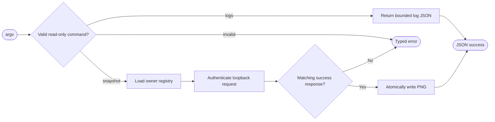

## Contract
<!-- type: logic lang: mermaid -->



The public surface is exactly `workbench snapshot --out <png-path>` and `workbench logs [--tail <count>]`. Both write one newline-terminated JSON object to stdout on success. `snapshot` succeeds with `{\"kind\":\"snapshot\",\"instanceId\":\"…\",\"path\":\"…\",\"bytes\":N}`. `logs` succeeds with `{\"kind\":\"logs\",\"path\":\"…\",\"lines\":[…],\"truncated\":false}`. Unknown flags, nonpositive values, duplicate options, unreadable output parents, non-PNG responses, oversized payloads, and a non-atomic output replacement are errors. The default log tail is 100 complete lines and any requested tail is clamped to 1,000; raw terminal bytes are never part of the result.

The registry is `~/.axiom-workbench/runtime/current.json`, created through atomic replacement and mode 0600 under a mode-0700 runtime directory. Its versioned fields are `protocolVersion`, `instanceId`, `pid`, `port`, and `token`. Only `127.0.0.1` ports in 1024…65535 are valid. The CLI connects with a bounded deadline and sends exactly one newline-delimited JSON request `{protocolVersion:1,requestId,token,method:\"snapshot\"}`. The response must echo `protocolVersion`, `requestId`, and `instanceId`, carry `ok:true`, declare `mimeType:\"image/png\"`, and hold a Base64 PNG no larger than 16 MiB. This is an internal local protocol, not a general RPC or public network API.

CLI errors use stderr JSON `{\"kind\":\"error\",\"code\":\"…\",\"message\":\"…\",\"next\":\"…\"}` and a nonzero exit. Stable codes are `invalid_arguments`, `log_unavailable`, `runtime_unavailable`, `runtime_protocol_mismatch`, `runtime_authentication_failed`, `snapshot_failed`, and `output_write_failed`. `runtime_unavailable` always recommends opening Workbench; the CLI never opens or activates the app by itself. The app accepts only `snapshot` and `uiState` after token validation; every request is bounded, request ids are nonzero, and unexpected methods fail closed.

The host acquires one per-user lock before registry publication. A second native launch probes the registered instance using its token, activates that instance on a positive response, and exits. Recovery may remove a stale registry only after both an absent/dead recorded pid and a failed endpoint probe. It never uses broad process scans. Snapshot capture is dispatched to the main actor and draws the Workbench window content view via AppKit bitmap caching; it excludes all other desktop windows and requires neither screen-recording nor Accessibility permission.
## Changes
<!-- type: changes lang: yaml -->

```yaml
changes:
  - path: apps/workbench/src/main.rs
    action: modify
    section: contract
    impl_mode: hand-written
    anchor: main
    description: Route only the documented snapshot and logs argv forms into the local observability CLI.
  - path: apps/workbench/src/observability_cli.rs
    action: create
    section: contract
    impl_mode: hand-written
    description: Implement the versioned registry and line-delimited request/response contract, typed JSON result envelopes, bounded PNG validation, and atomic caller-directed writes.
  - path: apps/workbench/src/lib.rs
    action: modify
    section: contract
    impl_mode: hand-written
    anchor: run
    description: Make the contract-owning CLI module available from the Workbench crate.
  - path: apps/workbench/tests/observability_cli.rs
    action: create
    section: contract
    impl_mode: hand-written
    description: Lock down accepted argv, JSON envelopes, registry validation, token propagation, payload bounds, and typed error codes.
  - path: apps/workbench/macos/Sources/WorkbenchMacCore/LocalRuntimeServer.swift
    action: create
    section: contract
    impl_mode: hand-written
    description: Implement the owner-only registry, singleton lock, loopback protocol version, request-id/token checks, uiState activation probe, and snapshot response contract.
  - path: apps/workbench/macos/Sources/WorkbenchMac/WorkbenchMacApp.swift
    action: modify
    section: contract
    impl_mode: hand-written
    description: Bind application lifecycle to one local runtime server lease and registered instance identity.
  - path: apps/workbench/macos/Tests/WorkbenchMacCoreTests/LocalRuntimeServerTests.swift
    action: create
    section: contract
    impl_mode: hand-written
    description: Prove the native registry file contract, token and request-id rejection, stale-record rules, and bounded PNG response envelope.
  - path: apps/workbench/macos/WorkbenchMac.xcodeproj/project.pbxproj
    action: modify
    section: contract
    impl_mode: hand-written
    description: Include the runtime protocol implementation in the Xcode application build.
  - path: apps/workbench/README.md
    action: modify
    section: contract
    impl_mode: hand-written
    description: Publish the supported local CLI forms, output/error behavior, and strict read-only security boundary.
```
## Unit Test

```mermaid
---
id: workbench-local-observability-contract-verification
requirements:
  native_contract_checks_identity_and_lease:
    id: R4
    text: "The native server publishes a 0600 versioned registry only while its lease is held; it accepts snapshot or uiState only after an exact token check and echoes request and instance identity in every response."
    kind: lifecycle
    risk: high
    verify: macos/Tests/WorkbenchMacCoreTests/LocalRuntimeServerTests.swift::testProtocolIdentityAuthenticationAndLeaseContract
  public_argv_and_envelopes_are_exact:
    id: R1
    text: "Only snapshot --out and logs with optional --tail are accepted, and success or failure emits one newline-terminated JSON envelope with stable result fields, error codes, and next command."
    kind: contract
    risk: high
    verify: tests/observability_cli.rs::public_argv_and_json_envelopes_are_exact
  registry_protocol_fails_closed:
    id: R2
    text: "Malformed registry fields, non-loopback ports, invalid protocol version, stale pid or endpoint, incorrect token, zero or mismatched request id, and an unexpected response method fail closed with the corresponding typed CLI error."
    kind: security
    risk: high
    verify: tests/observability_cli.rs::registry_and_response_validation_fail_closed
  snapshot_payload_is_png_and_bounded:
    id: R3
    text: "The CLI accepts only a matching image/png response below the protocol bound, validates the PNG signature before atomically replacing the explicit output path, and does not pass a filesystem destination to the app."
    kind: boundary
    risk: high
    verify: tests/observability_cli.rs::snapshot_png_contract_is_bounded_and_caller_owned
---
flowchart TD
    r1[R1 public argv and envelopes are exact] --> tests_observability_cli_rs_public_argv_and_json_envelopes_are_exact[tests/observability_cli.rs::public_argv_and_json_envelopes_are_exact]
    r2[R2 registry protocol fails closed] --> tests_observability_cli_rs_registry_and_response_validation_fail_closed[tests/observability_cli.rs::registry_and_response_validation_fail_closed]
    r3[R3 snapshot payload is png and bounded] --> tests_observability_cli_rs_snapshot_png_contract_is_bounded_and_caller_owned[tests/observability_cli.rs::snapshot_png_contract_is_bounded_and_caller_owned]
    r4[R4 native contract checks identity and lease] --> macos_tests_workbenchmaccoretests_localruntimeservertests_swift_testprotocolidentityauthenticationandleasecontract[macos/Tests/WorkbenchMacCoreTests/LocalRuntimeServerTests.swift::testProtocolIdentityAuthenticationAndLeaseContract]
```

<!-- type: unit-test lang: mermaid -->


