## Logic
<!-- type: logic lang: mermaid -->


Workbench.app is the only UI runtime. At launch it obtains a per-user singleton lease before presenting a window, starts a loopback-only control listener, and atomically publishes ~/.axiom-workbench/runtime/current.json containing protocolVersion, instanceId, pid, port, and a random token. The registry and token are owner-readable only. A second launch first probes the registered runtime with the token; a matching response receives an activate request and the second process exits. A dead PID plus unreachable endpoint is stale registration: the prospective owner removes only that record, obtains the lease, and publishes a fresh runtime. The CLI never uses pgrep or selects an arbitrary process.

workbench snapshot --out <png-path> is a Rust subcommand in the existing Workbench executable. It reads the registry, validates the version and bounded loopback endpoint, sends newline-framed JSON with a nonzero request id and token, and requires the response to echo the instance and request ids. The Swift listener authenticates first, then on MainActor rasterizes only the active Workbench content view through AppKit bitmap caching. It returns bounded PNG bytes; the CLI writes those bytes to the caller-selected output path, so the app never accepts an arbitrary filesystem write path. Missing registry, unreachable runtime, authentication failure, version mismatch, and encoding failure are typed results with executable remediation and never silently launch another app.

workbench logs --tail <count> does not need the app to be running. It reads only ~/.axiom-workbench/logs/workbench.log, clamps the tail count to a documented maximum, and returns newest complete lines. The existing diagnostic writer remains the privacy boundary: terminal input and output are never retained, and this CLI introduces no secondary transcript source. A missing log returns an explicit empty-log result.

The control protocol is read-only in this slice. It contains snapshot and an internal uiState identity response only; it cannot send terminal input, mutate projects, manage processes, or dispatch agents. MCP, remote access, generic screen capture, and write commands remain out of scope.

Verification covers registry/CLI parsing, loopback success, stale/not-running and version-mismatch behavior, bounded-log privacy behavior, and a deterministic native snapshot whose PNG signature and content-area dimensions are validated without Computer Use, Accessibility permission, or screen-recording permission.

## Changes
<!-- type: changes lang: yaml -->

```yaml
changes:
  - path: apps/workbench/src/main.rs
    action: modify
    section: logic
    impl_mode: hand-written
    anchor: main
    description: Dispatch the explicit read-only snapshot and logs subcommands before falling through to the existing desktop host.
  - path: apps/workbench/src/observability_cli.rs
    action: create
    section: logic
    impl_mode: hand-written
    description: Define strict Workbench CLI parsing, runtime-registry discovery, authenticated local snapshot requests, bounded log tailing, typed errors, and structured results.
  - path: apps/workbench/src/lib.rs
    action: modify
    section: logic
    impl_mode: hand-written
    anchor: run
    description: Export the observability CLI module while retaining the desktop-host entrypoint.
  - path: apps/workbench/tests/observability_cli.rs
    action: create
    section: unit-test
    impl_mode: hand-written
    description: Prove bounded log tails, malformed or stale runtime-registry recovery, authenticated snapshot request construction, unavailable-runtime errors, and output-path validation without a live GUI or screen capture.
  - path: apps/workbench/macos/Sources/WorkbenchMacCore/LocalRuntimeServer.swift
    action: create
    section: logic
    impl_mode: hand-written
    description: Own the single-instance lease, owner-readable runtime registry, loopback authenticated request handling, MainActor content-view PNG capture, bounded responses, and cleanup.
  - path: apps/workbench/macos/Sources/WorkbenchMac/WorkbenchMacApp.swift
    action: modify
    section: logic
    impl_mode: hand-written
    description: Start the local observability runtime once for the native application and release its lease during app teardown.
  - path: apps/workbench/macos/Tests/WorkbenchMacCoreTests/LocalRuntimeServerTests.swift
    action: create
    section: unit-test
    impl_mode: hand-written
    description: Verify registry publication and cleanup, token rejection, stale-registry recovery, bounded request parsing, and PNG capture response semantics using in-process views.
  - path: apps/workbench/macos/WorkbenchMac.xcodeproj/project.pbxproj
    action: modify
    section: logic
    impl_mode: hand-written
    description: Include the local runtime server source in the native app target so Xcode and SwiftPM compile the same runtime surface.
  - path: apps/workbench/README.md
    action: modify
    section: logic
    impl_mode: hand-written
    description: Document the single-instance local observability boundary and the snapshot and logs CLI contracts.
  - path: apps/workbench/CAPABILITIES.md
    action: modify
    section: unit-test
    impl_mode: hand-written
    description: Register the local snapshot and diagnostics capability work root with its deterministic test gates.
```

## Unit Test

```mermaid
---
id: workbench-local-observability-verification
requirements:
  logs_are_local_and_bounded:
    id: R1
    text: "workbench logs tails only the local diagnostic file, clamps the requested line count, preserves whole lines, and works while Workbench.app is not running."
    kind: functional
    risk: medium
    verify: tests/observability_cli.rs::logs_tail_is_local_line_bounded_and_runtime_independent
  native_capture_uses_own_content_view:
    id: R5
    text: "The native endpoint captures its own AppKit content view on the main actor and returns a PNG response within the configured bound, independent of macOS screen-capture permission or an external UI automation agent."
    kind: integration
    risk: high
    verify: macos/Tests/WorkbenchMacCoreTests/LocalRuntimeServerTests.swift::testContentViewCaptureReturnsBoundedPNG
  native_runtime_is_singleton_and_clean:
    id: R4
    text: "The native host holds one user-scoped lease, publishes one 0600 registry with a fresh token, rejects an invalid token, and removes its registry on orderly shutdown while only reclaiming stale state after PID and endpoint checks."
    kind: lifecycle
    risk: high
    verify: macos/Tests/WorkbenchMacCoreTests/LocalRuntimeServerTests.swift::testRegistryLeaseAuthenticationAndCleanup
  snapshot_requires_live_authenticated_runtime:
    id: R2
    text: "workbench snapshot discovers only the owner-readable runtime registry, sends the registry token on its local request, and returns a typed unavailable error for missing, malformed, stale, or unreachable runtime state without launching Workbench.app."
    kind: failure-recovery
    risk: high
    verify: tests/observability_cli.rs::snapshot_registry_and_authentication_fail_closed_without_launching_gui
  snapshot_writes_only_requested_png:
    id: R3
    text: "A successful snapshot response is accepted only as a bounded PNG payload and is atomically written to the explicit caller-selected output path; no screen recording, accessibility traversal, or terminal interaction occurs."
    kind: boundary
    risk: high
    verify: tests/observability_cli.rs::snapshot_accepts_bounded_png_and_writes_only_explicit_output
---
flowchart TD
    r1[R1 logs are local and bounded] --> tests_observability_cli_rs_logs_tail_is_local_line_bounded_and_runtime_independent[tests/observability_cli.rs::logs_tail_is_local_line_bounded_and_runtime_independent]
    r2[R2 snapshot requires live authenticated runtime] --> tests_observability_cli_rs_snapshot_registry_and_authentication_fail_closed_without_launching_gui[tests/observability_cli.rs::snapshot_registry_and_authentication_fail_closed_without_launching_gui]
    r3[R3 snapshot writes only requested png] --> tests_observability_cli_rs_snapshot_accepts_bounded_png_and_writes_only_explicit_output[tests/observability_cli.rs::snapshot_accepts_bounded_png_and_writes_only_explicit_output]
    r4[R4 native runtime is singleton and clean] --> macos_tests_workbenchmaccoretests_localruntimeservertests_swift_testregistryleaseauthenticationandcleanup[macos/Tests/WorkbenchMacCoreTests/LocalRuntimeServerTests.swift::testRegistryLeaseAuthenticationAndCleanup]
    r5[R5 native capture uses own content view] --> macos_tests_workbenchmaccoretests_localruntimeservertests_swift_testcontentviewcapturereturnsboundedpng[macos/Tests/WorkbenchMacCoreTests/LocalRuntimeServerTests.swift::testContentViewCaptureReturnsBoundedPNG]
```

<!-- type: unit-test lang: mermaid -->


