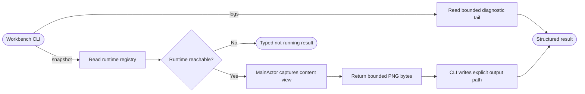

## Logic
<!-- type: logic lang: mermaid -->

Workbench.app is the only UI runtime. At launch it obtains a per-user singleton lease before presenting a window, starts a loopback-only control listener, and atomically publishes ~/.axiom-workbench/runtime/current.json containing protocolVersion, instanceId, pid, port, and a random token. The registry and token are owner-readable only. A second launch first probes the registered runtime with the token; a matching response receives an activate request and the second process exits. A dead PID plus unreachable endpoint is stale registration: the prospective owner removes only that record, obtains the lease, and publishes a fresh runtime. The CLI never uses pgrep or selects an arbitrary process.

workbench snapshot --out <png-path> is a Rust subcommand in the existing Workbench executable. It reads the registry, validates the version and bounded loopback endpoint, sends newline-framed JSON with a nonzero request id and token, and requires the response to echo the instance and request ids. The Swift listener authenticates first, then on MainActor rasterizes only the active Workbench content view through AppKit bitmap caching. It returns bounded PNG bytes; the CLI writes those bytes to the caller-selected output path, so the app never accepts an arbitrary filesystem write path. Missing registry, unreachable runtime, authentication failure, version mismatch, and encoding failure are typed results with executable remediation and never silently launch another app.

workbench logs --tail <count> does not need the app to be running. It reads only ~/.axiom-workbench/logs/workbench.log, clamps the tail count to a documented maximum, and returns newest complete lines. The existing diagnostic writer remains the privacy boundary: terminal input and output are never retained, and this CLI introduces no secondary transcript source. A missing log returns an explicit empty-log result.

The control protocol is read-only in this slice. It contains snapshot and an internal uiState identity response only; it cannot send terminal input, mutate projects, manage processes, or dispatch agents. MCP, remote access, generic screen capture, and write commands remain out of scope.

Verification covers registry/CLI parsing, loopback success, stale/not-running and version-mismatch behavior, bounded-log privacy behavior, and a deterministic native snapshot whose PNG signature and content-area dimensions are validated without Computer Use, Accessibility permission, or screen-recording permission.
