## Contract
<!-- type: logic lang: mermaid -->


The public surface is exactly `workbench snapshot --out <png-path>` and `workbench logs [--tail <count>]`. Both write one newline-terminated JSON object to stdout on success. `snapshot` succeeds with `{\"kind\":\"snapshot\",\"instanceId\":\"…\",\"path\":\"…\",\"bytes\":N}`. `logs` succeeds with `{\"kind\":\"logs\",\"path\":\"…\",\"lines\":[…],\"truncated\":false}`. Unknown flags, nonpositive values, duplicate options, unreadable output parents, non-PNG responses, oversized payloads, and a non-atomic output replacement are errors. The default log tail is 100 complete lines and any requested tail is clamped to 1,000; raw terminal bytes are never part of the result.

The registry is `~/.axiom-workbench/runtime/current.json`, created through atomic replacement and mode 0600 under a mode-0700 runtime directory. Its versioned fields are `protocolVersion`, `instanceId`, `pid`, `port`, and `token`. Only `127.0.0.1` ports in 1024…65535 are valid. The CLI connects with a bounded deadline and sends exactly one newline-delimited JSON request `{protocolVersion:1,requestId,token,method:\"snapshot\"}`. The response must echo `protocolVersion`, `requestId`, and `instanceId`, carry `ok:true`, declare `mimeType:\"image/png\"`, and hold a Base64 PNG no larger than 16 MiB. This is an internal local protocol, not a general RPC or public network API.

CLI errors use stderr JSON `{\"kind\":\"error\",\"code\":\"…\",\"message\":\"…\",\"next\":\"…\"}` and a nonzero exit. Stable codes are `invalid_arguments`, `log_unavailable`, `runtime_unavailable`, `runtime_protocol_mismatch`, `runtime_authentication_failed`, `snapshot_failed`, and `output_write_failed`. `runtime_unavailable` always recommends opening Workbench; the CLI never opens or activates the app by itself. The app accepts only `snapshot` and `uiState` after token validation; every request is bounded, request ids are nonzero, and unexpected methods fail closed.

The host acquires one per-user lock before registry publication. A second native launch probes the registered instance using its token, activates that instance on a positive response, and exits. Recovery may remove a stale registry only after both an absent/dead recorded pid and a failed endpoint probe. It never uses broad process scans. Snapshot capture is dispatched to the main actor and draws the Workbench window content view via AppKit bitmap caching; it excludes all other desktop windows and requires neither screen-recording nor Accessibility permission.
## Changes
<!-- type: changes lang: yaml -->

```yaml
changes:
  - path: apps/workbench/src/main.rs
    action: modify
    section: logic
    impl_mode: hand-written
    anchor: main
    description: Dispatch the explicit read-only snapshot and logs subcommands before falling through to the existing desktop host.
  - path: apps/workbench/src/observability_cli.rs
    action: create
    section: logic
    impl_mode: hand-written
    description: Define strict Workbench CLI parsing, runtime-registry discovery, authenticated local snapshot requests, bounded log tailing, typed errors, and structured results.
  - path: apps/workbench/src/lib.rs
    action: modify
    section: logic
    impl_mode: hand-written
    anchor: run
    description: Export the observability CLI module while retaining the desktop-host entrypoint.
  - path: apps/workbench/tests/observability_cli.rs
    action: create
    section: unit-test
    impl_mode: hand-written
    description: Prove bounded log tails, malformed or stale runtime-registry recovery, authenticated snapshot request construction, unavailable-runtime errors, and output-path validation without a live GUI or screen capture.
  - path: apps/workbench/macos/Sources/WorkbenchMacCore/LocalRuntimeServer.swift
    action: create
    section: logic
    impl_mode: hand-written
    description: Own the single-instance lease, owner-readable runtime registry, loopback authenticated request handling, MainActor content-view PNG capture, bounded responses, and cleanup.
  - path: apps/workbench/macos/Sources/WorkbenchMac/WorkbenchMacApp.swift
    action: modify
    section: logic
    impl_mode: hand-written
    description: Start the local observability runtime once for the native application and release its lease during app teardown.
  - path: apps/workbench/macos/Tests/WorkbenchMacCoreTests/LocalRuntimeServerTests.swift
    action: create
    section: unit-test
    impl_mode: hand-written
    description: Verify registry publication and cleanup, token rejection, stale-registry recovery, bounded request parsing, and PNG capture response semantics using in-process views.
  - path: apps/workbench/macos/WorkbenchMac.xcodeproj/project.pbxproj
    action: modify
    section: logic
    impl_mode: hand-written
    description: Include the local runtime server source in the native app target so Xcode and SwiftPM compile the same runtime surface.
  - path: apps/workbench/README.md
    action: modify
    section: logic
    impl_mode: hand-written
    description: Document the single-instance local observability boundary and the snapshot and logs CLI contracts.
  - path: apps/workbench/CAPABILITIES.md
    action: modify
    section: unit-test
    impl_mode: hand-written
    description: Register the local snapshot and diagnostics capability work root with its deterministic test gates.
```

## Unit Test

```mermaid
---
id: workbench-local-observability-verification
requirements:
  logs_are_local_and_bounded:
    id: R1
    text: "workbench logs tails only the local diagnostic file, clamps the requested line count, preserves whole lines, and works while Workbench.app is not running."
    kind: functional
    risk: medium
    verify: tests/observability_cli.rs::logs_tail_is_local_line_bounded_and_runtime_independent
  native_capture_uses_own_content_view:
    id: R5
    text: "The native endpoint captures its own AppKit content view on the main actor and returns a PNG response within the configured bound, independent of macOS screen-capture permission or an external UI automation agent."
    kind: integration
    risk: high
    verify: macos/Tests/WorkbenchMacCoreTests/LocalRuntimeServerTests.swift::testContentViewCaptureReturnsBoundedPNG
  native_runtime_is_singleton_and_clean:
    id: R4
    text: "The native host holds one user-scoped lease, publishes one 0600 registry with a fresh token, rejects an invalid token, and removes its registry on orderly shutdown while only reclaiming stale state after PID and endpoint checks."
    kind: lifecycle
    risk: high
    verify: macos/Tests/WorkbenchMacCoreTests/LocalRuntimeServerTests.swift::testRegistryLeaseAuthenticationAndCleanup
  snapshot_requires_live_authenticated_runtime:
    id: R2
    text: "workbench snapshot discovers only the owner-readable runtime registry, sends the registry token on its local request, and returns a typed unavailable error for missing, malformed, stale, or unreachable runtime state without launching Workbench.app."
    kind: failure-recovery
    risk: high
    verify: tests/observability_cli.rs::snapshot_registry_and_authentication_fail_closed_without_launching_gui
  snapshot_writes_only_requested_png:
    id: R3
    text: "A successful snapshot response is accepted only as a bounded PNG payload and is atomically written to the explicit caller-selected output path; no screen recording, accessibility traversal, or terminal interaction occurs."
    kind: boundary
    risk: high
    verify: tests/observability_cli.rs::snapshot_accepts_bounded_png_and_writes_only_explicit_output
---
flowchart TD
    r1[R1 logs are local and bounded] --> tests_observability_cli_rs_logs_tail_is_local_line_bounded_and_runtime_independent[tests/observability_cli.rs::logs_tail_is_local_line_bounded_and_runtime_independent]
    r2[R2 snapshot requires live authenticated runtime] --> tests_observability_cli_rs_snapshot_registry_and_authentication_fail_closed_without_launching_gui[tests/observability_cli.rs::snapshot_registry_and_authentication_fail_closed_without_launching_gui]
    r3[R3 snapshot writes only requested png] --> tests_observability_cli_rs_snapshot_accepts_bounded_png_and_writes_only_explicit_output[tests/observability_cli.rs::snapshot_accepts_bounded_png_and_writes_only_explicit_output]
    r4[R4 native runtime is singleton and clean] --> macos_tests_workbenchmaccoretests_localruntimeservertests_swift_testregistryleaseauthenticationandcleanup[macos/Tests/WorkbenchMacCoreTests/LocalRuntimeServerTests.swift::testRegistryLeaseAuthenticationAndCleanup]
    r5[R5 native capture uses own content view] --> macos_tests_workbenchmaccoretests_localruntimeservertests_swift_testcontentviewcapturereturnsboundedpng[macos/Tests/WorkbenchMacCoreTests/LocalRuntimeServerTests.swift::testContentViewCaptureReturnsBoundedPNG]
```

<!-- type: unit-test lang: mermaid -->


