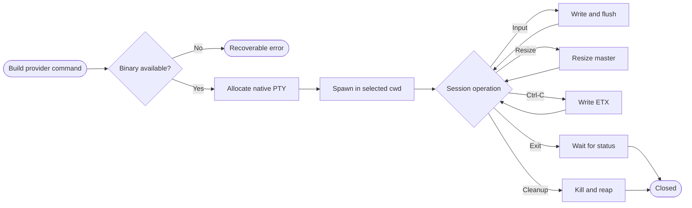

## Logic
<!-- type: logic lang: mermaid -->



`AgentKind` is a closed `ClaudeCode | Codex | Agy` enum and defaults to `ClaudeCode`. `AgentLaunchCommand::for_kind` is pure and inspectable: it emits exactly `claude`, `codex`, or `agy`, no hidden arguments, and the canonical selected folder as `cwd`. This keeps each vendor CLI and its native session/history behavior authoritative.

`PtySession::spawn` resolves the program against `PATH` or validates an explicit path before allocating anything. Absence returns a typed `PtyLaunchError::UnavailableBinary`, leaving callers free to retry. The resolved executable is passed to `portable_pty::CommandBuilder`; requested rows and columns create the native PTY, selected folder sets child cwd, and `TERM=xterm-256color` plus `COLORTERM=truecolor` preserve the interactive terminal contract.

The session retains the PTY master, its single writer, and the child handle. It can clone a blocking reader for a dedicated output thread, write and flush arbitrary input, query and change kernel PTY size, forward Ctrl-C by writing ETX through the controlling terminal, poll or wait for exact exit status, and explicitly terminate the child. `wait` and `terminate` reap the child; `Drop` best-effort kills and reaps an abandoned live child. No provider-specific mutable state enters this type.

Integration tests launch a real local shell command through the same generic runtime, never a mock. They prove round-trip bytes, selected cwd, resize, Ctrl-C signal handling, exit code, and cleanup. Pure construction and isolated-PATH failure tests cover all providers without requiring installed Claude Code, Codex, or AGY. Terminal cwd-to-context synchronization remains #2194; this WI owns only command and PTY lifecycle.
## Changes
<!-- type: changes lang: yaml -->

```yaml
changes:
  - path: Cargo.lock
    action: modify
    section: logic
    impl_mode: hand-written
    description: Lock portable-pty 0.9 and its native terminal dependency graph.
  - path: apps/workbench/Cargo.toml
    action: modify
    section: logic
    impl_mode: hand-written
    description: Add the portable-pty runtime dependency.
  - path: apps/workbench/src/native_agent_pty.rs
    action: create
    section: logic
    impl_mode: hand-written
    description: Define provider command construction, recoverable binary resolution, and the real native PTY session lifecycle.
  - path: apps/workbench/src/lib.rs
    action: modify
    section: logic
    impl_mode: hand-written
    anchor: run
    description: Export the native-agent PTY runtime from the existing Workbench host crate.
  - path: apps/workbench/tests/pty_agent_adapters.rs
    action: create
    section: unit-test
    impl_mode: hand-written
    description: Prove exact provider commands, recoverable missing binaries, real shell bidirectional IO, selected cwd, resize, interrupt, exit, and cleanup.
  - path: apps/workbench/README.md
    action: modify
    section: logic
    impl_mode: hand-written
    description: Document native CLI authority, Claude default, real PTY controls, and the boundary from vendor session state and cwd context.
  - path: apps/workbench/CAPABILITIES.md
    action: modify
    section: logic
    impl_mode: hand-written
    description: Advance the native-agent-pty work root and register its deterministic verification gate.
  - path: apps/workbench/CONTRIBUTING.md
    action: modify
    section: unit-test
    impl_mode: hand-written
    description: Record the real PTY test command and the ban on replacing it with mocks or installed-vendor requirements.
```
## Unit Test

```mermaid
---
id: workbench-native-agent-pty-verification
requirements:
  claude_initial_default:
    id: R2
    text: "AgentKind default resolves to Claude Code while every provider remains explicitly selectable through the same construction boundary."
    kind: regression
    risk: medium
    verify: tests/pty_agent_adapters.rs::adapter_commands_are_exact_and_claude_is_default
  exact_provider_commands:
    id: R1
    text: "Claude Code, Codex, and AGY adapters expose exactly the native program name, empty default argument list, and selected canonical cwd without hidden session flags."
    kind: contract
    risk: high
    verify: tests/pty_agent_adapters.rs::adapter_commands_are_exact_and_claude_is_default
  interrupt_and_cleanup:
    id: R4
    text: "The PTY forwards terminal interrupt input to the controlled child and explicit termination plus Drop cleanup kill and reap abandoned children without leaking a live session."
    kind: lifecycle
    risk: high
    verify: tests/pty_agent_adapters.rs::real_pty_interrupt_and_termination_cleanup
  real_pty_io_resize_exit_and_cwd:
    id: R3
    text: "A real local shell fixture receives input and returns output through the PTY, starts in the selected folder, observes kernel terminal resize, and yields its exact exit status."
    kind: integration
    risk: high
    verify: tests/pty_agent_adapters.rs::real_pty_round_trip_resize_cwd_and_exit
  recoverable_unavailable_binaries:
    id: R5
    text: "Each unavailable vendor binary returns a typed recoverable error before PTY allocation, after which the same runtime can still launch the deterministic local shell fixture."
    kind: failure-recovery
    risk: high
    verify: tests/pty_agent_adapters.rs::missing_vendor_binaries_are_recoverable
  vendor_sessions_remain_authoritative:
    id: R6
    text: "The runtime owns only program, args, cwd, PTY streams, size, signals, status, and cleanup; test source neither requires installed vendor CLIs nor introduces vendor history or resume state."
    kind: boundary
    risk: medium
    verify: tests/pty_agent_adapters.rs::runtime_has_no_vendor_session_model_or_required_vendor_smoke
---
flowchart TD
    r1[R1 exact provider commands] --> tests_pty_agent_adapters_rs_adapter_commands_are_exact_and_claude_is_default[tests/pty_agent_adapters.rs::adapter_commands_are_exact_and_claude_is_default]
    r2[R2 claude initial default] --> tests_pty_agent_adapters_rs_adapter_commands_are_exact_and_claude_is_default
    r3[R3 real pty io resize exit and cwd] --> tests_pty_agent_adapters_rs_real_pty_round_trip_resize_cwd_and_exit[tests/pty_agent_adapters.rs::real_pty_round_trip_resize_cwd_and_exit]
    r4[R4 interrupt and cleanup] --> tests_pty_agent_adapters_rs_real_pty_interrupt_and_termination_cleanup[tests/pty_agent_adapters.rs::real_pty_interrupt_and_termination_cleanup]
    r5[R5 recoverable unavailable binaries] --> tests_pty_agent_adapters_rs_missing_vendor_binaries_are_recoverable[tests/pty_agent_adapters.rs::missing_vendor_binaries_are_recoverable]
    r6[R6 vendor sessions remain authoritative] --> tests_pty_agent_adapters_rs_runtime_has_no_vendor_session_model_or_required_vendor_smoke[tests/pty_agent_adapters.rs::runtime_has_no_vendor_session_model_or_required_vendor_smoke]
```

<!-- type: unit-test lang: mermaid -->


