## Logic

```mermaid
---
id: workbench-native-agent-pty
entry: plan
nodes:
  plan: { kind: start, label: "construct exact native agent command for selected folder" }
  resolve: { kind: decision, label: "program resolves to an executable file?" }
  unavailable: { kind: terminal, label: "return recoverable unavailable-binary error before allocating a PTY" }
  allocate: { kind: process, label: "allocate native PTY at requested rows and columns" }
  spawn: { kind: process, label: "spawn resolved program in selected folder with TERM=xterm-256color" }
  stream: { kind: process, label: "expose blocking output reader and synchronized input writer" }
  control: { kind: decision, label: "input, resize, interrupt, wait, or terminate?" }
  input: { kind: process, label: "write bytes and flush them through PTY master" }
  resize: { kind: process, label: "resize PTY master and notify child terminal" }
  interrupt: { kind: process, label: "write terminal interrupt byte so the controlling PTY forwards SIGINT" }
  wait: { kind: process, label: "observe child exit status without inventing vendor session state" }
  terminate: { kind: process, label: "kill and reap the child; Drop performs best-effort cleanup" }
  exited: { kind: terminal, label: "PTY session is closed and resources are released" }
edges:
  - { from: plan, to: resolve }
  - { from: resolve, to: unavailable, label: "no" }
  - { from: resolve, to: allocate, label: "yes" }
  - { from: allocate, to: spawn }
  - { from: spawn, to: stream }
  - { from: stream, to: control }
  - { from: control, to: input, label: "stdin" }
  - { from: control, to: resize, label: "window size" }
  - { from: control, to: interrupt, label: "Ctrl-C" }
  - { from: control, to: wait, label: "exit" }
  - { from: control, to: terminate, label: "cleanup" }
  - { from: input, to: control }
  - { from: resize, to: control }
  - { from: interrupt, to: control }
  - { from: wait, to: exited }
  - { from: terminate, to: exited }
---
flowchart LR
    plan([Build native agent command]) --> resolve{Binary available?}
    resolve -->|No| unavailable([Recoverable error])
    resolve -->|Yes| allocate[Allocate native PTY]
    allocate --> spawn[Spawn in selected folder]
    spawn --> stream[Reader and writer]
    stream --> control{Session control}
    control -->|Input| input[Write and flush]
    control -->|Resize| resize[Resize PTY]
    control -->|Ctrl-C| interrupt[Terminal interrupt byte]
    control -->|Exit| wait[Wait for status]
    control -->|Cleanup| terminate[Kill and reap]
    input --> control
    resize --> control
    interrupt --> control
    wait --> exited([Closed])
    terminate --> exited
```

<!-- type: logic lang: mermaid -->



`AgentKind` is the closed provider enum: `ClaudeCode`, `Codex`, and `Agy`, with `ClaudeCode` as `Default`. `AgentLaunchCommand::for_kind` is a pure construction boundary. It preserves the selected canonical folder as `cwd` and emits exactly `claude`, `codex`, or `agy` with no hidden arguments. The returned command is inspectable before launch so tests and later UI code can disclose the authoritative native program, arguments, and cwd. Workbench stores no vendor session, history, or resume model.

`PtySession::spawn` accepts the inspectable command plus a `PtySize`. It first resolves the named program against `PATH` (or validates an explicit path) and returns `PtyLaunchError::UnavailableBinary` before PTY allocation when the executable cannot be found. A failed launch therefore does not poison shared shell state; callers may immediately retry another command. The resolved program is handed to `portable_pty::CommandBuilder`, with the selected folder as cwd and terminal capability variables set for a real interactive CLI.

The native PTY master owns a cloneable blocking output reader, a single synchronized input writer, terminal resize, child status, termination, and cleanup. Blocking reads are intentionally moved by callers to a dedicated thread rather than disguised as async I/O. Ordinary input is written and flushed unchanged. Interrupt forwarding writes the terminal ETX byte through the controlling PTY, producing the same Ctrl-C path a user terminal uses; explicit termination uses the child killer. `wait` reaps the child, and `Drop` performs best-effort kill and reap when a live session is abandoned.

The deterministic integration fixture launches the platform local shell through the same generic PTY runtime, not through a mock and not through an installed vendor binary. It proves bidirectional bytes, selected-folder cwd, kernel-visible resize, terminal interrupt delivery, exit status, and post-drop process cleanup. Adapter construction and unavailable-binary tests cover all three providers without requiring Claude Code, Codex, or AGY in CI. This slice provides the native runtime boundary only; terminal cwd-to-context synchronization remains owned by #2194 and rendered terminal integration remains part of the later production journey.

## Changes
<!-- type: changes lang: yaml -->

```yaml
changes:
  - path: Cargo.lock
    action: modify
    section: logic
    impl_mode: hand-written
    description: Lock portable-pty 0.9 and its native terminal dependency graph.
  - path: apps/workbench/Cargo.toml
    action: modify
    section: logic
    impl_mode: hand-written
    description: Add the portable-pty runtime dependency.
  - path: apps/workbench/src/native_agent_pty.rs
    action: create
    section: logic
    impl_mode: hand-written
    description: Define provider command construction, recoverable binary resolution, and the real native PTY session lifecycle.
  - path: apps/workbench/src/lib.rs
    action: modify
    section: logic
    impl_mode: hand-written
    anchor: run
    description: Export the native-agent PTY runtime from the existing Workbench host crate.
  - path: apps/workbench/tests/pty_agent_adapters.rs
    action: create
    section: unit-test
    impl_mode: hand-written
    description: Prove exact provider commands, recoverable missing binaries, real shell bidirectional IO, selected cwd, resize, interrupt, exit, and cleanup.
  - path: apps/workbench/README.md
    action: modify
    section: logic
    impl_mode: hand-written
    description: Document native CLI authority, Claude default, real PTY controls, and the boundary from vendor session state and cwd context.
  - path: apps/workbench/CAPABILITIES.md
    action: modify
    section: logic
    impl_mode: hand-written
    description: Advance the native-agent-pty work root and register its deterministic verification gate.
  - path: apps/workbench/CONTRIBUTING.md
    action: modify
    section: unit-test
    impl_mode: hand-written
    description: Record the real PTY test command and the ban on replacing it with mocks or installed-vendor requirements.
```

## Unit Test

```mermaid
---
id: workbench-native-agent-pty-verification
requirements:
  claude_initial_default:
    id: R2
    text: "AgentKind default resolves to Claude Code while every provider remains explicitly selectable through the same construction boundary."
    kind: regression
    risk: medium
    verify: tests/pty_agent_adapters.rs::adapter_commands_are_exact_and_claude_is_default
  exact_provider_commands:
    id: R1
    text: "Claude Code, Codex, and AGY adapters expose exactly the native program name, empty default argument list, and selected canonical cwd without hidden session flags."
    kind: contract
    risk: high
    verify: tests/pty_agent_adapters.rs::adapter_commands_are_exact_and_claude_is_default
  interrupt_and_cleanup:
    id: R4
    text: "The PTY forwards terminal interrupt input to the controlled child and explicit termination plus Drop cleanup kill and reap abandoned children without leaking a live session."
    kind: lifecycle
    risk: high
    verify: tests/pty_agent_adapters.rs::real_pty_interrupt_and_termination_cleanup
  real_pty_io_resize_exit_and_cwd:
    id: R3
    text: "A real local shell fixture receives input and returns output through the PTY, starts in the selected folder, observes kernel terminal resize, and yields its exact exit status."
    kind: integration
    risk: high
    verify: tests/pty_agent_adapters.rs::real_pty_round_trip_resize_cwd_and_exit
  recoverable_unavailable_binaries:
    id: R5
    text: "Each unavailable vendor binary returns a typed recoverable error before PTY allocation, after which the same runtime can still launch the deterministic local shell fixture."
    kind: failure-recovery
    risk: high
    verify: tests/pty_agent_adapters.rs::missing_vendor_binaries_are_recoverable
  vendor_sessions_remain_authoritative:
    id: R6
    text: "The runtime owns only program, args, cwd, PTY streams, size, signals, status, and cleanup; test source neither requires installed vendor CLIs nor introduces vendor history or resume state."
    kind: boundary
    risk: medium
    verify: tests/pty_agent_adapters.rs::runtime_has_no_vendor_session_model_or_required_vendor_smoke
---
flowchart TD
    r1[R1 exact provider commands] --> tests_pty_agent_adapters_rs_adapter_commands_are_exact_and_claude_is_default[tests/pty_agent_adapters.rs::adapter_commands_are_exact_and_claude_is_default]
    r2[R2 claude initial default] --> tests_pty_agent_adapters_rs_adapter_commands_are_exact_and_claude_is_default
    r3[R3 real pty io resize exit and cwd] --> tests_pty_agent_adapters_rs_real_pty_round_trip_resize_cwd_and_exit[tests/pty_agent_adapters.rs::real_pty_round_trip_resize_cwd_and_exit]
    r4[R4 interrupt and cleanup] --> tests_pty_agent_adapters_rs_real_pty_interrupt_and_termination_cleanup[tests/pty_agent_adapters.rs::real_pty_interrupt_and_termination_cleanup]
    r5[R5 recoverable unavailable binaries] --> tests_pty_agent_adapters_rs_missing_vendor_binaries_are_recoverable[tests/pty_agent_adapters.rs::missing_vendor_binaries_are_recoverable]
    r6[R6 vendor sessions remain authoritative] --> tests_pty_agent_adapters_rs_runtime_has_no_vendor_session_model_or_required_vendor_smoke[tests/pty_agent_adapters.rs::runtime_has_no_vendor_session_model_or_required_vendor_smoke]
```

<!-- type: unit-test lang: mermaid -->


