## Logic

```mermaid
---
id: workbench-native-observability-e2e
entry: fixture
nodes:
  fixture: { kind: start, label: isolated-native-fixture }
  build: { kind: process, label: build-xcode-app-and-rust-cli }
  launch: { kind: process, label: launch-one-workbench-app }
  registry: { kind: decision, label: owner-registry-ready }
  snapshot: { kind: process, label: invoke-real-snapshot-cli }
  png: { kind: decision, label: valid-bounded-png }
  logs: { kind: process, label: invoke-real-logs-cli }
  stop: { kind: process, label: terminate-fixture }
  unavailable: { kind: decision, label: typed-not-running }
  fail: { kind: terminal, label: regression-failure }
  done: { kind: terminal, label: deterministic-proof }
edges:
  - { from: fixture, to: build }
  - { from: build, to: launch }
  - { from: launch, to: registry }
  - { from: registry, to: fail, label: no }
  - { from: registry, to: snapshot, label: yes }
  - { from: snapshot, to: png }
  - { from: png, to: fail, label: no }
  - { from: png, to: logs, label: yes }
  - { from: logs, to: stop }
  - { from: stop, to: unavailable }
  - { from: unavailable, to: done, label: yes }
  - { from: unavailable, to: fail, label: no }
---
flowchart LR
  fixture([Isolated fixture]) --> build[Build app and CLI]
  build --> launch[Launch one Workbench app]
  launch --> registry{0600 registry ready?}
  registry -->|No| fail([Fail])
  registry -->|Yes| snapshot[Run real snapshot CLI]
  snapshot --> png{Valid bounded PNG?}
  png -->|No| fail
  png -->|Yes| logs[Run real logs CLI]
  logs --> stop[Stop fixture]
  stop --> unavailable{Typed not-running error?}
  unavailable -->|Yes| done([Proof])
  unavailable -->|No| fail
```

<!-- type: logic lang: mermaid -->

The integration harness owns an isolated temporary Workbench state root and launches exactly the built Xcode `Workbench.app`, then runs the built Rust `workbench` executable as an external child. It polls only the owner-readable runtime registry until it observes protocol v1, a live local port, a nonempty instance identity/token, and mode 0600. It does not inspect arbitrary processes, use screen capture, or call UI automation.

The harness invokes `workbench snapshot --out <temporary-png>` and asserts the returned JSON success envelope, a PNG signature, nonzero bounded file size, and that the output path is exactly the requested temporary file. It invokes `workbench logs --tail N` and verifies whole-line bounded JSON output from the privacy-filtered diagnostic file. After terminating only its owned fixture, it asserts a snapshot command returns the documented `runtime_unavailable` error and does not recreate the registry or launch an app.

The test controls build artifact paths through explicit environment variables, skips only when the native Xcode artifact cannot be built on a non-macOS host, and is required on macOS CI/local development. It keeps screenshots as temporary assertions, not repository evidence: the test is a contract gate, not a visual golden test.
