## Logic

```mermaid
---
id: workbench-macos-native-client
entry: open
nodes:
  open: { kind: start, label: "open native macOS Workbench" }
  client: { kind: process, label: "SwiftUI creates four idle terminal tabs" }
  folder: { kind: process, label: "user selects canonical launch folder" }
  start: { kind: decision, label: "explicitly start active tab?" }
  request: { kind: process, label: "send versioned tab-scoped request" }
  spawn: { kind: process, label: "Rust sidecar resolves profile and spawns PTY" }
  bytes: { kind: process, label: "stream byte-preserving output to SwiftTerm" }
  input: { kind: process, label: "route input resize signals by tab id" }
  add: { kind: process, label: "plus appends idle Shell tab" }
  done: { kind: terminal, label: "independent native terminal sessions" }
edges:
  - { from: open, to: client }
  - { from: client, to: folder }
  - { from: client, to: add, label: "plus" }
  - { from: add, to: start }
  - { from: folder, to: start }
  - { from: start, to: request, label: "yes" }
  - { from: start, to: done, label: "selection only" }
  - { from: request, to: spawn }
  - { from: spawn, to: bytes }
  - { from: bytes, to: input }
  - { from: input, to: done }
---
flowchart LR
    open([Open native app]) --> client[SwiftUI four idle tabs]
    client --> folder[Select canonical folder]
    client -->|Plus| add[Append idle Shell tab]
    folder --> start{Explicit Start?}
    add --> start
    start -->|Yes| request[Versioned tab-scoped request]
    request --> spawn[Rust sidecar real PTY]
    spawn --> bytes[Raw bytes to SwiftTerm]
    bytes --> input[Tab-scoped IO and lifecycle]
    input --> done([Independent native sessions])
    start -->|No| done
```

<!-- type: logic lang: mermaid -->



Workbench has one production desktop client: a macOS SwiftUI application with AppKit-backed SwiftTerm views. SwiftUI owns window structure, folder selection, ephemeral tab presentation, native commands, focus, and accessibility. It creates `Claude Code`, `Codex`, `AGY`, and `Shell` in that order, all idle. The plus control appends `Shell 2`, `Shell 3`, and so on and selects the new idle tab. Selection, focus, plus, and folder changes never launch a process; Start is the sole launch transition.

The Rust `workbench-core` sidecar owns the closed profile enum, safe bounded tab ids, selected-cwd validation, account-default-shell resolution, native agent command resolution, real PTY children, byte output, resize, input, interrupt, terminate, exit, and cleanup. On macOS the account shell is resolved from the user account database, with `SHELL` and then the platform fallback used only when necessary; zsh is never embedded as the product default. Every launch receives the currently selected canonical folder. Running sessions retain their launch cwd and are not moved by later folder selection.

The local protocol is newline-framed JSON with `protocolVersion`, monotonically unique request ids, a closed method enum, and a required safe `tabId` for session methods. Responses echo request id and return either a typed result or a typed recoverable error. Terminal output is byte-preserving Base64 in a per-tab poll frame with a monotonic sequence so SwiftTerm receives each byte once. Launch, poll, input, resize, interrupt, terminate, and shutdown are independently addressable. Unknown versions, methods, profiles, ids, invalid cwd, unavailable programs, already-running launches, and missing sessions fail without mutating another tab.

The Swift client starts and supervises exactly one sidecar child, serializes requests, validates response ids and protocol version, and routes frames only to the matching tab model and terminal view. A sidecar failure changes running tabs to a visible recoverable error without losing folder or tab presentation. The terminal surface is an `NSViewRepresentable` around SwiftTerm `TerminalView`; SwiftTerm renders ANSI/VT bytes while the Rust sidecar remains the only PTY owner. Each terminal delegate sends keystrokes and dimensions back with that tab id. Native focus rings, VoiceOver labels, state text, commands for tab selection and new tabs, minimum 44-point controls, constrained window layout, and reduced-motion-safe transitions are required. Existing context/provenance Rust modules remain reusable but are not duplicated into Swift in this vertical slice; the Tauri/WebView host is retired rather than kept as a second production application.
## Changes
<!-- type: changes lang: yaml -->

```yaml
changes:
  - path: apps/workbench/Cargo.toml
    action: modify
    section: logic
    impl_mode: hand-written
    description: Register the workbench-core sidecar binary and byte-safe protocol dependencies while retaining reusable Rust modules.
  - path: apps/workbench/src/lib.rs
    action: modify
    section: logic
    impl_mode: hand-written
    anchor: configure_builder
    description: Export the standalone terminal-core and sidecar-protocol modules without moving PTY ownership into Swift.
  - path: apps/workbench/src/terminal_core.rs
    action: create
    section: logic
    impl_mode: hand-written
    description: Own profiles, macOS account-default-shell resolution, safe tab ids, real PTY sessions, byte frames, cwd, lifecycle state, and isolation.
  - path: apps/workbench/src/core_protocol.rs
    action: create
    section: logic
    impl_mode: hand-written
    description: Define and dispatch the versioned newline-framed JSON request, response, result, and recoverable error contract.
  - path: apps/workbench/src/bin/workbench-core.rs
    action: create
    section: logic
    impl_mode: hand-written
    description: Run one stdin/stdout sidecar loop with JSON only on stdout, ordered responses, explicit shutdown, and terminal cleanup.
  - path: apps/workbench/tests/macos_sidecar_protocol.rs
    action: create
    section: unit-test
    impl_mode: hand-written
    description: Exercise the built sidecar through its exact protocol and real shell PTYs for versioning, bytes, cwd, isolation, lifecycle, and failures.
  - path: apps/workbench/macos/Package.swift
    action: create
    section: logic
    impl_mode: hand-written
    description: Declare the macOS Swift package, SwiftTerm dependency, native executable, model library, and XCTest target.
  - path: apps/workbench/macos/Sources/WorkbenchMacCore/CoreProtocol.swift
    action: create
    section: logic
    impl_mode: hand-written
    description: Mirror the closed Rust wire contract and supervise request-id checked sidecar communication.
  - path: apps/workbench/macos/Sources/WorkbenchMacCore/WorkbenchModel.swift
    action: create
    section: logic
    impl_mode: hand-written
    description: Own four idle default tabs, added Shell tabs, selected folder, explicit launch, per-tab output and lifecycle, polling, and command routing.
  - path: apps/workbench/macos/Sources/WorkbenchMac/WorkbenchMacApp.swift
    action: create
    section: logic
    impl_mode: hand-written
    description: Bootstrap the macOS-only SwiftUI application and native commands.
  - path: apps/workbench/macos/Sources/WorkbenchMac/WorkbenchView.swift
    action: create
    section: logic
    impl_mode: hand-written
    description: Render the native folder sidebar, accessible terminal tabs, plus, lifecycle controls, terminal stack, status, and constrained layout.
  - path: apps/workbench/macos/Sources/WorkbenchMac/TerminalSurface.swift
    action: create
    section: logic
    impl_mode: hand-written
    description: Embed SwiftTerm TerminalView through NSViewRepresentable and route raw input and resize only to the represented tab.
  - path: apps/workbench/macos/Tests/WorkbenchMacCoreTests/WorkbenchModelTests.swift
    action: create
    section: unit-test
    impl_mode: hand-written
    description: Prove default ordering, no implicit launch, plus behavior, request scoping, selected cwd, lifecycle text, and response routing.
  - path: apps/workbench/README.md
    action: modify
    section: logic
    impl_mode: hand-written
    description: Declare macOS SwiftUI and AppKit plus Rust core as the production stack and document native terminal behavior and build/run commands.
  - path: apps/workbench/CAPABILITIES.md
    action: modify
    section: logic
    impl_mode: hand-written
    description: Register #2278 as the macOS-native production-client work root with Rust and Swift verification gates.
  - path: apps/workbench/CONTRIBUTING.md
    action: modify
    section: unit-test
    impl_mode: hand-written
    description: Record the one-production-client boundary, protocol and PTY ownership, native accessibility rules, and exact Cargo and Swift gates.
```
## Unit Test
<!-- type: unit-test lang: mermaid -->


