## Logic
<!-- type: logic lang: mermaid -->


PtyRuntime searches inherited PATH first. On macOS only, a failed bare-program lookup appends the bounded account-local locations HOME/.local/bin, HOME/.cargo/bin, and /opt/homebrew/bin. Duplicates are removed. Absolute or relative program paths never use fallback search.

Tests inject the path and HOME boundary to prove fallback, inherited precedence, and recoverable misses. The shared Rust workbench-core is embedded by both Stable and Beta, so both products receive identical agent discovery without parsing shell startup files or modifying global process environment.
## Changes
<!-- type: changes lang: yaml -->

```yaml
changes:
  - path: apps/workbench/src/native_agent_pty.rs
    action: modify
    section: logic
    impl_mode: hand-written
    anchor: PtyRuntime
  - path: apps/workbench/tests/pty_agent_adapters.rs
    action: modify
    section: unit-test
    impl_mode: hand-written
    anchor: resolver_accepts_account_local_macOS_fallback_paths
```

## Unit Test

```mermaid
---
id: workbench-macos-agent-path-verification
requirements:
  failure:
    id: R3
    text: "Missing executable remains a recoverable unavailable error."
    kind: regression
    risk: medium
    verify: pty_agent_adapters::unavailable_agent_is_recoverable
  fallback:
    id: R1
    text: "A macOS account-local executable resolves after an inherited PATH miss."
    kind: functional
    risk: high
    verify: pty_agent_adapters::resolver_accepts_account_local_macos_fallback_paths
  precedence:
    id: R2
    text: "An inherited executable keeps precedence over fallback locations."
    kind: regression
    risk: medium
    verify: pty_agent_adapters::inherited_path_precedes_account_local_fallback
---
flowchart TD
    r1[R1 fallback] --> pty_agent_adapters_resolver_accepts_account_local_macos_fallback_paths[pty_agent_adapters::resolver_accepts_account_local_macos_fallback_paths]
    r2[R2 precedence] --> pty_agent_adapters_inherited_path_precedes_account_local_fallback[pty_agent_adapters::inherited_path_precedes_account_local_fallback]
    r3[R3 failure] --> pty_agent_adapters_unavailable_agent_is_recoverable[pty_agent_adapters::unavailable_agent_is_recoverable]
```

<!-- type: unit-test lang: mermaid -->


