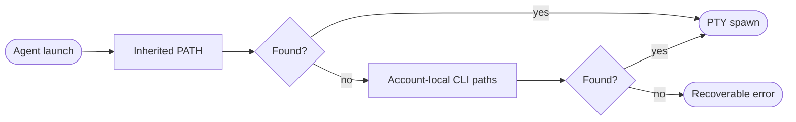

## Logic
<!-- type: logic lang: mermaid -->

PtyRuntime retains inherited PATH lookup order. On macOS only, if that lookup does not find a bare agent program, it appends a bounded account-local fallback list derived from HOME: .local/bin, .cargo/bin, and /opt/homebrew/bin. Duplicate directories are ignored; an explicit absolute or relative program path never uses fallback search.

The resolver accepts an injected home directory and search path in tests. It validates executable regular files exactly as today and returns the same UnavailableBinary error when no candidate exists. The sidecar does not execute shell startup files, parse user configuration, install a tool, or mutate PATH globally. Stable and Beta bundle the same Rust sidecar, so both receive this resolver behavior.
