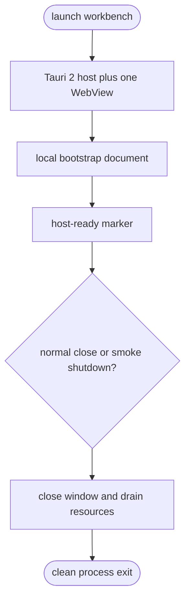

## Logic
<!-- type: logic lang: mermaid -->

The desktop boundary is Rust plus Tauri 2. The initial document is deliberately local and bounded; later renderer slices may compile Jet/WASM or another renderer into the same WebView contract without changing PTY ownership. The host owns native window and process lifecycle only. Native Claude Code, Codex, and AGY processes remain authoritative and are not launched in this slice. The smoke protocol is test-only host control, not a user-facing CLI session model.
