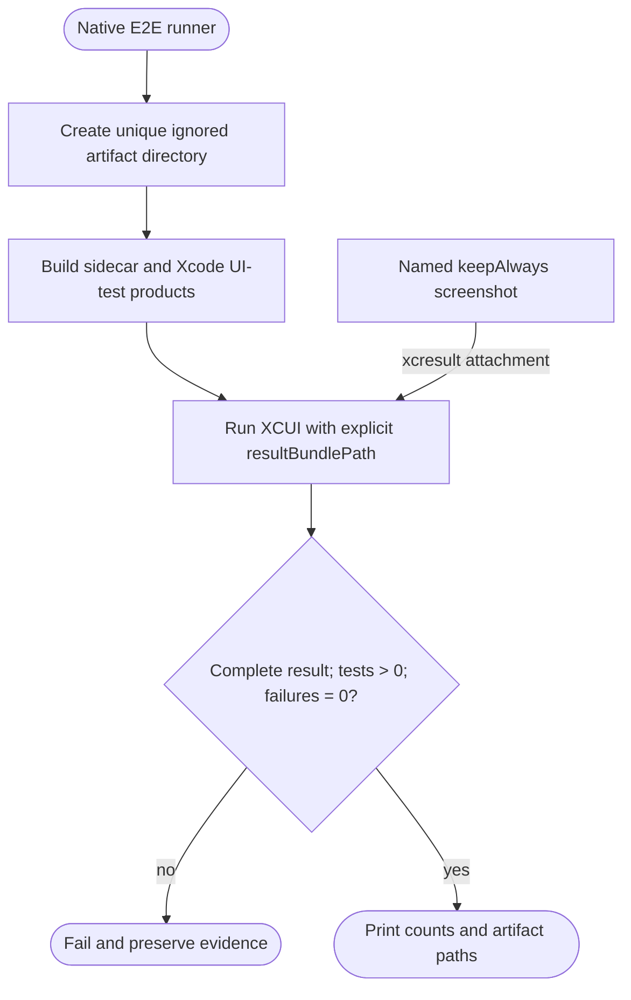
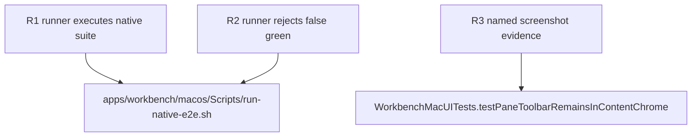

## Logic
<!-- type: logic lang: mermaid -->



## Changes
<!-- type: changes lang: yaml -->

```yaml
changes:
  - path: apps/workbench/macos/Scripts/run-native-e2e.sh
    action: create
    section: logic
    impl_mode: hand-written
  - path: apps/workbench/macos/UITests/WorkbenchMacUITests.swift
    action: modify
    section: unit-test
    impl_mode: hand-written
    anchor: WorkbenchMacUITests
```

## Unit Test
<!-- type: unit-test lang: mermaid -->


