## Logic
<!-- type: logic lang: mermaid -->


The macOS SwiftUI shell resolves WorkbenchRuntimeProfile once and mounts AuxiliaryColumnView only when it is beta. Stable retains its current two-column project-and-terminal composition.

ProjectFileListing performs Foundation-only metadata enumeration over the selected registered root. It reads immediate non-hidden children, avoids recursion and content reads, does not follow external symlink targets, groups directories before files, localized-case-insensitively sorts both groups, and returns an immutable at-most-200 record snapshot with an explicit truncation flag. A no-project, missing/unreadable root, or empty listing is an explicit state.

The Files UI is a compact 240-to-320-point read-only auxiliary column between Projects and Terminal. It renders the selected root and accessible folder/file rows with copyable path text. It never opens, writes, renames, deletes, invokes Git/GitHub/GitLab, starts a process, changes project selection, changes PTY cwd, or changes terminal state.
## Changes
<!-- type: changes lang: yaml -->

```yaml
changes:
  - path: apps/workbench/macos/Sources/WorkbenchMacCore/ProjectFileListing.swift
    action: create
    section: logic
    impl_mode: hand-written
    anchor: ProjectFileListing
  - path: apps/workbench/macos/Sources/WorkbenchMacCore/WorkbenchModel.swift
    action: modify
    section: logic
    impl_mode: hand-written
    anchor: WorkbenchModel
  - path: apps/workbench/macos/Sources/WorkbenchMac/WorkbenchView.swift
    action: modify
    section: logic
    impl_mode: hand-written
    anchor: WorkbenchView
  - path: apps/workbench/macos/WorkbenchMac.xcodeproj/project.pbxproj
    action: modify
    section: logic
    impl_mode: hand-written
    anchor: PBXSourcesBuildPhase
  - path: apps/workbench/macos/Tests/WorkbenchMacCoreTests/ProjectFileListingTests.swift
    action: create
    section: unit-test
    impl_mode: hand-written
    anchor: ProjectFileListingTests
  - path: apps/workbench/macos/UITests/WorkbenchMacUITests.swift
    action: modify
    section: unit-test
    impl_mode: hand-written
    anchor: WorkbenchMacUITests
```
## Unit Test

```mermaid
---
id: workbench-beta-auxiliary-files-verification
requirements:
  beta_only_layout:
    id: R1
    text: "Beta renders a bounded read-only Files auxiliary column while Stable remains unchanged."
    kind: functional
    risk: medium
    verify: WorkbenchRuntimeProfileTests.testStableAndBetaProductsAreDistinct
  desktop_interaction:
    id: R4
    text: "The Beta app exposes accessible Files column and rows when a fixture project is selected."
    kind: e2e
    risk: medium
    verify: WorkbenchMacUITests.testFilesAuxiliaryColumnShowsFixtureEntries
  deterministic_listing:
    id: R2
    text: "The selected project root lists only immediate visible entries in directory-first localized order and caps output."
    kind: functional
    risk: medium
    verify: ProjectFileListingTests.testVisibleEntriesAreSortedAndBounded
  read_only_failure_states:
    id: R3
    text: "No project, unreadable roots, and empty roots render actionable state without launching a terminal or mutating files."
    kind: regression
    risk: medium
    verify: ProjectFileListingTests.testUnavailableAndEmptyRootsRemainExplicit
---
flowchart TD
    r1[R1 beta only layout] --> workbenchruntimeprofiletests_teststableandbetaproductsaredistinct[WorkbenchRuntimeProfileTests.testStableAndBetaProductsAreDistinct]
    r2[R2 deterministic listing] --> projectfilelistingtests_testvisibleentriesaresortedandbounded[ProjectFileListingTests.testVisibleEntriesAreSortedAndBounded]
    r3[R3 read only failure states] --> projectfilelistingtests_testunavailableandemptyrootsremainexplicit[ProjectFileListingTests.testUnavailableAndEmptyRootsRemainExplicit]
    r4[R4 desktop interaction] --> workbenchmacuitests_testfilesauxiliarycolumnshowsfixtureentries[WorkbenchMacUITests.testFilesAuxiliaryColumnShowsFixtureEntries]
```

<!-- type: unit-test lang: mermaid -->


