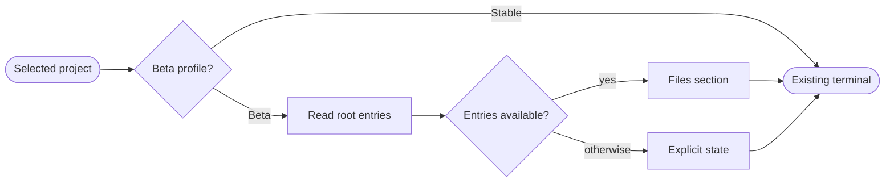

## Logic
<!-- type: logic lang: mermaid -->



This change is applicable to the macOS-native Workbench host. The current Beta product needs a third, read-only auxiliary column between the registered-project navigation and the terminal workspace; Stable retains its existing two-column layout.

WorkbenchRuntimeProfile is resolved once at the SwiftUI view boundary. Only beta renders AuxiliaryColumnView; the Stable hierarchy remains the existing project sidebar plus terminal workspace. The column observes the selected registered project but never changes project selection, terminal tabs, current working directories, or PTY lifecycle.

ProjectFileListing accepts the selected project root and uses Foundation directory enumeration limited to immediate children. It omits hidden paths, does not recurse, identifies directory versus regular file through resource values without following a symlink outside the root, and returns immutable records with display name, absolute path, and kind. It groups directories before files, sorts both groups localized-case-insensitively, and returns at most 200 records plus a truncation flag. A missing root, read failure, no project, or empty root is an explicit presentation state.

The compact FILES section shows the selected root label and a scrollable read-only row for each result. Rows have distinct folder/file symbols, readable names, selection-copyable paths, and accessibility identifiers/labels. This slice deliberately has no recursion, editor, file opener, rename/delete, Git command, GitHub/GitLab request, process start, or repository mutation; future auxiliary sections occupy the same column without changing this contract.

## Changes
<!-- type: changes lang: yaml -->

```yaml
changes:
  - path: apps/workbench/macos/Sources/WorkbenchMacCore/ProjectFileListing.swift
    action: create
    section: logic
    impl_mode: hand-written
    anchor: ProjectFileListing
  - path: apps/workbench/macos/Sources/WorkbenchMacCore/WorkbenchModel.swift
    action: modify
    section: logic
    impl_mode: hand-written
    anchor: WorkbenchModel
  - path: apps/workbench/macos/Sources/WorkbenchMac/WorkbenchView.swift
    action: modify
    section: logic
    impl_mode: hand-written
    anchor: WorkbenchView
  - path: apps/workbench/macos/WorkbenchMac.xcodeproj/project.pbxproj
    action: modify
    section: logic
    impl_mode: hand-written
    anchor: PBXSourcesBuildPhase
  - path: apps/workbench/macos/Tests/WorkbenchMacCoreTests/ProjectFileListingTests.swift
    action: create
    section: unit-test
    impl_mode: hand-written
    anchor: ProjectFileListingTests
  - path: apps/workbench/macos/UITests/WorkbenchMacUITests.swift
    action: modify
    section: unit-test
    impl_mode: hand-written
    anchor: WorkbenchMacUITests
```
