## Logic

```mermaid
---
id: workbench-graph-context-adapter
entry: request
nodes:
  request: { kind: start, label: "workspace context request" }
  present: { kind: decision, label: "graphify-out/workbench-graph.json is a regular file?" }
  read: { kind: process, label: "read at most 1 MiB through GraphPayloadSource" }
  parse: { kind: process, label: "parse workbench.graph-context.v1 nodes and edges" }
  validate: { kind: decision, label: "unique ids, valid endpoints, bounded fields, classified sources?" }
  provenance: { kind: process, label: "resolve every node and edge through provider-neutral provenance" }
  render: { kind: process, label: "escape graph cards, badges, and source navigation" }
  unsupported: { kind: process, label: "remain unsupported so other registry renderers run" }
  isolated: { kind: process, label: "return renderer error so registry records warning and continues" }
  done: { kind: terminal, label: "read-only graph ContextDocument" }
edges:
  - { from: request, to: present }
  - { from: present, to: read, label: "yes" }
  - { from: present, to: unsupported, label: "no" }
  - { from: read, to: parse }
  - { from: parse, to: validate }
  - { from: validate, to: provenance, label: "yes" }
  - { from: validate, to: isolated, label: "no" }
  - { from: provenance, to: render }
  - { from: render, to: done }
  - { from: unsupported, to: done }
  - { from: isolated, to: done }
---
flowchart LR
    request([Workspace request]) --> present{Compatibility payload?}
    present -->|No| unsupported[Other renderers remain usable]
    present -->|Yes| read[Bounded read]
    read --> parse[Parse v1 graph]
    parse --> validate{Valid graph?}
    validate -->|No| isolated[Warn and continue registry]
    validate -->|Yes| provenance[Resolve node and edge provenance]
    provenance --> render[Escaped graph document]
    render --> done([Read-only context])
```

<!-- type: logic lang: mermaid -->

`GraphContextRenderer` is an optional, read-only workspace renderer with priority 350. It activates only when the selected canonical root contains the regular file `graphify-out/workbench-graph.json`; absence returns `Unsupported`, so Markdown, Git, PTY operation, and any independently registered AW renderer remain unchanged. Workbench owns the `workbench.graph-context.v1` JSON compatibility contract and copies no Graphify code, schema, or SDK. The payload contains a provider id/label, bounded nodes, and bounded directed edges. Every node and edge has a stable id, display label, `extracted | inferred | ambiguous` classification, and one or more repository-relative source locations with optional one-based spans. Edges must reference existing node ids; duplicate ids, unknown endpoints, oversized inputs, and unsafe paths are rejected.

`GraphPayloadSource` is a read-only byte-source boundary. Production uses `FileGraphPayloadSource`, which performs one metadata check and reads at most one MiB from the compatibility path. Tests may inject a failing source to prove provider-failure isolation without starting Graphify or importing third-party code. `GraphContextRenderer::render` parses and validates the payload, converts every node and edge into `ContextProvenanceItem`, resolves it against the selected root, and renders escaped node/edge cards. Canonical extracted inputs become navigation links; inferred or ambiguous records always show their derived classification/provider badge and every canonical, missing, or invalid input. No graph fact is presented as repository authority.

Malformed payloads and source failures return `RendererError`; `RendererRegistry` records the graph warning and continues to lower-priority renderers. `RendererRegistry::production` registers Graph, optional AW typed, Markdown, and Git renderers, while tests use a local registry-sentinel renderer to prove AW-like usability without importing `AwTypedRenderer`. The adapter exposes no repository writes, subprocesses, provider invocation, AW/GitHub mutation, PTY ownership, approval, or lifecycle transition. Refresh is a fresh bounded read; close is ordinary drop. Graphify remains reference-only interaction input, while repository files and executable gates remain canonical.
