## Logic

```mermaid
---
id: workbench-graph-context-adapter
entry: request
nodes:
  request: { kind: start, label: "workspace context request" }
  present: { kind: decision, label: "graphify-out/workbench-graph.json is a regular file?" }
  read: { kind: process, label: "read at most 1 MiB through GraphPayloadSource" }
  parse: { kind: process, label: "parse workbench.graph-context.v1 nodes and edges" }
  validate: { kind: decision, label: "unique ids, valid endpoints, bounded fields, classified sources?" }
  provenance: { kind: process, label: "resolve every node and edge through provider-neutral provenance" }
  render: { kind: process, label: "escape graph cards, badges, and source navigation" }
  unsupported: { kind: process, label: "remain unsupported so other registry renderers run" }
  isolated: { kind: process, label: "return renderer error so registry records warning and continues" }
  done: { kind: terminal, label: "read-only graph ContextDocument" }
edges:
  - { from: request, to: present }
  - { from: present, to: read, label: "yes" }
  - { from: present, to: unsupported, label: "no" }
  - { from: read, to: parse }
  - { from: parse, to: validate }
  - { from: validate, to: provenance, label: "yes" }
  - { from: validate, to: isolated, label: "no" }
  - { from: provenance, to: render }
  - { from: render, to: done }
  - { from: unsupported, to: done }
  - { from: isolated, to: done }
---
flowchart LR
    request([Workspace request]) --> present{Compatibility payload?}
    present -->|No| unsupported[Other renderers remain usable]
    present -->|Yes| read[Bounded read]
    read --> parse[Parse v1 graph]
    parse --> validate{Valid graph?}
    validate -->|No| isolated[Warn and continue registry]
    validate -->|Yes| provenance[Resolve node and edge provenance]
    provenance --> render[Escaped graph document]
    render --> done([Read-only context])
```

<!-- type: logic lang: mermaid -->



`GraphContextRenderer` is an optional, read-only workspace renderer with priority 350. It activates only when the selected canonical root contains the regular file `graphify-out/workbench-graph.json`; absence returns `Unsupported`, so Markdown, Git, PTY operation, and any independently registered AW renderer remain unchanged. Workbench owns the `workbench.graph-context.v1` JSON compatibility contract and copies no Graphify code, schema, or SDK. The payload contains a provider id/label, bounded nodes, and bounded directed edges. Every node and edge has a stable id, display label, `extracted | inferred | ambiguous` classification, and one or more repository-relative source locations with optional one-based spans. Edges must reference existing node ids; duplicate ids, unknown endpoints, oversized inputs, and unsafe paths are rejected.

`GraphPayloadSource` is a read-only byte-source boundary. Production uses `FileGraphPayloadSource`, which performs one metadata check and reads at most one MiB from the compatibility path. Tests may inject a failing source to prove provider-failure isolation without starting Graphify or importing third-party code. `GraphContextRenderer::render` parses and validates the payload, converts every node and edge into `ContextProvenanceItem`, resolves it against the selected root, and renders escaped node/edge cards. Canonical extracted inputs become navigation links; inferred or ambiguous records always show their derived classification/provider badge and every canonical, missing, or invalid input. No graph fact is presented as repository authority.

Malformed payloads and source failures return `RendererError`; `RendererRegistry` records the graph warning and continues to lower-priority renderers. `RendererRegistry::production` registers Graph, optional AW typed, Markdown, and Git renderers, while tests use a local registry-sentinel renderer to prove AW-like usability without importing `AwTypedRenderer`. The adapter exposes no repository writes, subprocesses, provider invocation, AW/GitHub mutation, PTY ownership, approval, or lifecycle transition. Refresh is a fresh bounded read; close is ordinary drop. Graphify remains reference-only interaction input, while repository files and executable gates remain canonical.

## Changes
<!-- type: changes lang: yaml -->

```yaml
changes:
  - path: apps/workbench/src/context/graph.rs
    action: create
    section: logic
    impl_mode: hand-written
    description: Define the repository-owned v1 graph payload, bounded read source, node/edge validation, provenance mapping, escaped graph rendering, and provider-failure surface.
  - path: apps/workbench/src/context/mod.rs
    action: modify
    section: logic
    impl_mode: hand-written
    anchor: impl RendererRegistry
    description: Export graph types, add Graph document kind, and register Graph ahead of optional AW, Markdown, and Git in the production registry.
  - path: apps/workbench/src/production_journey.rs
    action: modify
    section: logic
    impl_mode: hand-written
    anchor: render_journey_context
    description: Route desktop context requests through the production registry that includes the optional graph adapter.
  - path: apps/workbench/tests/graph_context_adapter.rs
    action: create
    section: unit-test
    impl_mode: hand-written
    description: Prove every node/edge has canonical navigation or a visible derived label, plus absence, malformed data, injected source failure, sentinel isolation, and no mutation surface.
  - path: apps/workbench/tests/fixtures/graph-context/graphify-out/workbench-graph.json
    action: create
    section: unit-test
    impl_mode: hand-written
    description: Deterministic workbench.graph-context.v1 payload covering extracted, inferred, ambiguous, missing, and spanned sources.
  - path: apps/workbench/tests/fixtures/graph-context/src/service.rs
    action: create
    section: unit-test
    impl_mode: hand-written
    description: Canonical source fixture for graph nodes and edges.
  - path: apps/workbench/tests/fixtures/graph-context/src/handler.rs
    action: create
    section: unit-test
    impl_mode: hand-written
    description: Second canonical source fixture for multi-input inference and edge provenance.
  - path: apps/workbench/README.md
    action: modify
    section: logic
    impl_mode: hand-written
    description: Document optional Graphify-compatible payload activation, derived authority, fallback, and reference-only ownership.
  - path: apps/workbench/CAPABILITIES.md
    action: modify
    section: logic
    impl_mode: hand-written
    description: Complete the optional graph adapter work root and register its deterministic gate.
  - path: apps/workbench/CONTRIBUTING.md
    action: modify
    section: unit-test
    impl_mode: hand-written
    description: Record compatibility schema limits, provenance, sentinel isolation, failure, and read-only verification rules.
```

## Unit Test

```mermaid
---
id: workbench-graph-context-adapter-verification
requirements:
  bounded_confined_payload:
    id: R5
    text: "The one-MiB compatibility boundary, graph-count limits, endpoint validation, HTML escaping, source confinement, and one-based spans fail closed without fabricated links."
    kind: security
    risk: high
    verify: tests/graph_context_adapter.rs::payload_limits_and_source_confinement_fail_closed
  malformed_and_failure_isolation:
    id: R3
    text: "Malformed graphs, duplicate ids, missing endpoints, oversized data, unsafe sources, and injected byte-source failure become graph warnings while lower-priority renderers still return context."
    kind: failure-recovery
    risk: high
    verify: tests/graph_context_adapter.rs::malformed_and_failing_provider_are_isolated
  node_edge_provenance:
    id: R1
    text: "Every valid graph node and edge renders with canonical source navigation or an explicit inferred or ambiguous derived-authority label and retains all source inputs."
    kind: contract
    risk: high
    verify: tests/graph_context_adapter.rs::renders_source_or_visible_inference_for_every_node_and_edge
  provider_absence_isolation:
    id: R2
    text: "With no compatibility payload, Graph remains unsupported and Markdown, Git, PTY source boundaries, and an independently registered AW sentinel remain usable."
    kind: failure-recovery
    risk: high
    verify: tests/graph_context_adapter.rs::provider_absence_leaves_generic_and_aw_sentinel_renderers_usable
  repository_owned_contract:
    id: R4
    text: "The adapter parses only workbench.graph-context.v1 fixtures, imports no Graphify implementation or SDK, and performs no repository, AW, provider, subprocess, or verification mutation."
    kind: boundary
    risk: high
    verify: tests/graph_context_adapter.rs::adapter_contract_is_reference_only_and_read_only
---
flowchart TD
    r1[R1 node edge provenance] --> tests_graph_context_adapter_rs_renders_source_or_visible_inference_for_every_node_and_edge[tests/graph_context_adapter.rs::renders_source_or_visible_inference_for_every_node_and_edge]
    r2[R2 provider absence isolation] --> tests_graph_context_adapter_rs_provider_absence_leaves_generic_and_aw_sentinel_renderers_usable[tests/graph_context_adapter.rs::provider_absence_leaves_generic_and_aw_sentinel_renderers_usable]
    r3[R3 malformed and failure isolation] --> tests_graph_context_adapter_rs_malformed_and_failing_provider_are_isolated[tests/graph_context_adapter.rs::malformed_and_failing_provider_are_isolated]
    r4[R4 repository owned contract] --> tests_graph_context_adapter_rs_adapter_contract_is_reference_only_and_read_only[tests/graph_context_adapter.rs::adapter_contract_is_reference_only_and_read_only]
    r5[R5 bounded confined payload] --> tests_graph_context_adapter_rs_payload_limits_and_source_confinement_fail_closed[tests/graph_context_adapter.rs::payload_limits_and_source_confinement_fail_closed]
```

<!-- type: unit-test lang: mermaid -->


