## Logic

```mermaid
---
id: workbench-derived-page-context-adapter
entry: request
nodes:
  request: { kind: start, label: "workspace context request" }
  present: { kind: decision, label: "llm-wiki-out/workbench-pages.json is a regular file?" }
  read: { kind: process, label: "read at most 1 MiB through DerivedPagePayloadSource" }
  parse: { kind: process, label: "parse workbench.derived-page-context.v1 pages and sections" }
  validate: { kind: decision, label: "bounded ids, citations, freshness, and confined sources?" }
  provenance: { kind: process, label: "resolve every section through provider-neutral provenance" }
  render: { kind: process, label: "render safe Markdown plus citation and freshness labels" }
  unsupported: { kind: process, label: "remain unsupported so other renderers run" }
  isolated: { kind: process, label: "return renderer error so registry warns and continues" }
  done: { kind: terminal, label: "read-only derived-page ContextDocument" }
edges:
  - { from: request, to: present }
  - { from: present, to: read, label: "yes" }
  - { from: present, to: unsupported, label: "no" }
  - { from: read, to: parse }
  - { from: parse, to: validate }
  - { from: validate, to: provenance, label: "yes" }
  - { from: validate, to: isolated, label: "no" }
  - { from: provenance, to: render }
  - { from: render, to: done }
  - { from: unsupported, to: done }
  - { from: isolated, to: done }
---
flowchart LR
    request([Workspace request]) --> present{Compatibility payload?}
    present -->|No| unsupported[Other renderers remain usable]
    present -->|Yes| read[Bounded read]
    read --> parse[Parse derived pages]
    parse --> validate{Valid contract?}
    validate -->|No| isolated[Warn and continue registry]
    validate -->|Yes| provenance[Resolve section citations]
    provenance --> render[Safe derived page]
    render --> done([Read-only context])
```

<!-- type: logic lang: mermaid -->



`DerivedPageContextRenderer` is an optional, read-only workspace renderer with priority 340, below the graph adapter and above the optional AW, Markdown, and Git renderers. It activates only when the canonical root contains the regular file `llm-wiki-out/workbench-pages.json`; absence returns `Unsupported`. Workbench owns the bounded `workbench.derived-page-context.v1` JSON compatibility contract and reuses no LLM-Wiki code, schema, license-covered implementation, subprocess, or SDK. The payload contains a provider identity and one selected page with bounded sections. Every section has a stable id, heading, bounded Markdown body, `extracted | inferred | ambiguous` classification, one or more repository-relative citations with optional one-based spans, and `current | stale | unknown` provider-reported freshness.

`DerivedPagePayloadSource` is a read-only byte-source boundary. Production uses `FileDerivedPagePayloadSource`, which performs a confined regular-file check and reads at most one MiB. Tests inject a failing source without starting a provider. The renderer validates unique ids, bounded fields and section/citation counts, safe relative citation paths, valid spans, and freshness notes. It maps each section to `ContextProvenanceItem`, resolves citations below the selected root, and emits safe Markdown, canonical source navigation where available, all missing inputs, a visible derived-authority badge for inferred/ambiguous sections, and an explicit `provider-reported current|stale|unknown` freshness badge.

Raw repository sources and executable gates remain authoritative; a derived page and its freshness claim never replace them. Malformed payloads and source failures return `RendererError`; `RendererRegistry` records the warning and continues to lower-priority renderers. Tests use a local registry-sentinel renderer to prove AW-like usability without importing the concrete AW renderer. The adapter exposes no repository writes, provider invocation, AW/GitHub mutation, PTY ownership, approval, lifecycle transition, or retained mutable page state. Refresh is a fresh bounded read and close is ordinary drop. LLM-Wiki remains reference-only interaction input, and source citations remain the authority boundary.

## Changes
<!-- type: changes lang: yaml -->

```yaml
changes:
  - path: apps/workbench/src/context/derived_page.rs
    action: create
    section: logic
    impl_mode: hand-written
    description: Define the repository-owned v1 derived-page payload, bounded byte source, section and citation validation, safe Markdown rendering, freshness labels, and provider-failure surface.
  - path: apps/workbench/src/context/mod.rs
    action: modify
    section: logic
    impl_mode: hand-written
    anchor: impl RendererRegistry
    description: Export derived-page types, add the DerivedPage document kind, and register the page renderer between Graph and optional AW in the production registry.
  - path: apps/workbench/src/production_journey.rs
    action: modify
    section: logic
    impl_mode: hand-written
    anchor: render_journey_context
    description: Retain the shared production registry path that now includes the optional derived-page adapter.
  - path: apps/workbench/tests/derived_page_context_adapter.rs
    action: create
    section: unit-test
    impl_mode: hand-written
    description: Prove every derived section has canonical citation navigation or a visible inference label, freshness disclosure, absence and failure isolation, sentinel independence, and no mutation.
  - path: apps/workbench/tests/fixtures/derived-page/llm-wiki-out/workbench-pages.json
    action: create
    section: unit-test
    impl_mode: hand-written
    description: Deterministic workbench.derived-page-context.v1 fixture covering extracted, inferred, ambiguous, current, stale, unknown, missing, and spanned citations.
  - path: apps/workbench/tests/fixtures/derived-page/src/lib.rs
    action: create
    section: unit-test
    impl_mode: hand-written
    description: Canonical raw source fixture for derived page citations.
  - path: apps/workbench/tests/fixtures/derived-page/docs/architecture.md
    action: create
    section: unit-test
    impl_mode: hand-written
    description: Second canonical raw source fixture for multi-input inference.
  - path: apps/workbench/README.md
    action: modify
    section: logic
    impl_mode: hand-written
    description: Document optional LLM-Wiki-compatible activation, raw-source authority, freshness disclosure, fallback, and reference-only ownership.
  - path: apps/workbench/CAPABILITIES.md
    action: modify
    section: logic
    impl_mode: hand-written
    description: Complete the optional derived-page adapter work root and register its deterministic gate.
  - path: apps/workbench/CONTRIBUTING.md
    action: modify
    section: unit-test
    impl_mode: hand-written
    description: Record payload limits, citation provenance, freshness, sentinel isolation, failure, license, and read-only verification rules.
```
