## Logic

```mermaid
---
id: workbench-terminal-tabs
entry: folder
nodes:
  folder: { kind: start, label: "selected canonical launch folder" }
  defaults: { kind: process, label: "render Claude Code, Codex, AGY, and default-shell tabs" }
  select: { kind: process, label: "select tab without starting a process" }
  add: { kind: process, label: "plus appends and selects another shell tab" }
  start: { kind: decision, label: "Start active tab?" }
  resolve: { kind: process, label: "resolve agent binary or host default shell" }
  spawn: { kind: process, label: "spawn real PTY at selected folder and store by tab id" }
  poll: { kind: process, label: "poll every running tab and retain per-tab transcript and exit" }
  switch: { kind: process, label: "switch active view without replacing another session" }
  done: { kind: terminal, label: "independent accessible terminal tabs" }
edges:
  - { from: folder, to: defaults }
  - { from: defaults, to: select }
  - { from: defaults, to: add, label: "plus" }
  - { from: add, to: select }
  - { from: select, to: start }
  - { from: start, to: resolve, label: "explicit start" }
  - { from: start, to: switch, label: "focus only" }
  - { from: resolve, to: spawn }
  - { from: spawn, to: poll }
  - { from: poll, to: switch }
  - { from: switch, to: done }
---
flowchart LR
    folder([Selected folder]) --> defaults[Four default tabs]
    defaults --> select[Select only]
    defaults -->|Plus| add[New shell tab]
    add --> select
    select --> start{Start?}
    start -->|Yes| resolve[Resolve profile]
    resolve --> spawn[Real PTY keyed by tab id]
    spawn --> poll[Per-tab snapshots]
    start -->|No| switch[Switch view]
    poll --> switch
    switch --> done([Independent tabs])
```

<!-- type: logic lang: mermaid -->



`TerminalProfile` is the closed launch-profile enum `claude | codex | agy | shell`. Agent profiles preserve their exact native program names and labels. The shell profile resolves the host default from `SHELL` on Unix or `COMSPEC` on Windows and falls back to the platform shell only when that environment value is absent; Workbench never hard-codes zsh. Every explicit launch receives the currently selected canonical folder as `cwd`. `ProductionJourneyStore` replaces its single optional session with a `BTreeMap<TerminalTabId, JourneySession>`. Tab ids are bounded safe identifiers. Launching an unstarted or exited tab inserts/replaces only that tab; launching an already-running tab fails visibly. Poll, input, resize, interrupt, and terminate all require a tab id and cannot address another tab accidentally.

The WebView owns ephemeral tab presentation only. It initializes four tabs in the order Claude Code, Codex, AGY, Shell and selects Claude Code without launching it. The plus button appends and selects `Shell 2`, `Shell 3`, and so on; newly added tabs also remain unstarted until Start. One polling loop updates every running tab and the active view renders only its own transcript, cwd, source, and lifecycle state. Switching tabs never terminates or overwrites another session. Changing the selected folder affects the initial cwd of future launches; already-running PTYs retain their own actual cwd. Tabs are intentionally not persisted, closed, renamed, or reordered in this slice.

The center pane uses an accessible horizontal `tablist`: arrow, Home, and End keys move and activate tabs; selected state uses text plus shape, running/exited/not-started state has visible labels rather than color alone, focus-visible rings remain clear, and the strip scrolls horizontally at constrained widths without clipping the terminal. The plus control has a 44px target and an explicit accessible name. Start names the active profile, remains disabled without a folder or while that tab is running, and no process starts from folder selection, tab focus, keyboard navigation, or plus alone. Existing bounded transcript, real PTY cleanup, OSC 7 cwd, renderer, recovery, efficiency, and production evidence contracts remain unchanged.

## Changes
<!-- type: changes lang: yaml -->

```yaml
changes:
  - path: apps/workbench/src/production_journey.rs
    action: modify
    section: logic
    impl_mode: hand-written
    anchor: impl ProductionJourneyStore
    description: Add the closed terminal profile contract, host-default-shell resolution, safe tab ids, and independent real PTY session storage and commands keyed by tab id.
  - path: apps/workbench/ui/index.html
    action: modify
    section: logic
    impl_mode: hand-written
    description: Replace agent radios with a four-tab accessible terminal strip and an adjacent add-shell-tab control.
  - path: apps/workbench/ui/journey.js
    action: modify
    section: logic
    impl_mode: hand-written
    description: Own ephemeral default and added tab models, per-tab snapshots and polling, explicit launch, keyboard selection, plus behavior, and tab-scoped IPC arguments.
  - path: apps/workbench/ui/shell.css
    action: modify
    section: logic
    impl_mode: hand-written
    description: Style compact accessible terminal tabs, focus/running/exited labels, 44px add control, and constrained horizontal overflow without disturbing the three-column shell.
  - path: apps/workbench/tests/terminal_tabs.rs
    action: create
    section: unit-test
    impl_mode: hand-written
    description: Prove default order, no implicit launch, host shell resolution, selected-folder cwd, independent real PTY sessions and transcripts, added shell tabs, safe tab ids, and no cross-tab commands.
  - path: apps/workbench/tests/production_journey.rs
    action: modify
    section: unit-test
    impl_mode: hand-written
    anchor: production_tauri_ipc_bridge_journey_passes
    description: Extend the exact Tauri handler and Jet journeys with tab ids, default/additional shell interaction, tab switching, keyboard/focus/readability, and retained viewport evidence.
  - path: apps/workbench/README.md
    action: modify
    section: logic
    impl_mode: hand-written
    description: Document four explicit terminal profiles, independent session semantics, default-shell resolution, plus behavior, and selected-folder launch cwd.
  - path: apps/workbench/CAPABILITIES.md
    action: modify
    section: logic
    impl_mode: hand-written
    description: Register #2268 as an implemented and verified terminal-tabs work root with deterministic gates.
  - path: apps/workbench/CONTRIBUTING.md
    action: modify
    section: unit-test
    impl_mode: hand-written
    description: Record multi-tab PTY isolation, host-shell, no-auto-launch, accessibility, viewport, and evidence verification rules.
```
