## Logic

```mermaid
---
id: workbench-two-pane-terminal-workspace
entry: selected-project
nodes:
  selected-project: { kind: start, label: "selected project" }
  workspace: { kind: process, label: "project pane workspace" }
  profile-menu: { kind: process, label: "profile menu creates idle session" }
  panes: { kind: process, label: "one or two focused panes" }
  pty: { kind: terminal, label: "explicit PTY launch" }
edges:
  - { from: selected-project, to: workspace }
  - { from: workspace, to: profile-menu }
  - { from: profile-menu, to: panes }
  - { from: panes, to: pty }
---
flowchart LR
  project([Selected project]) --> workspace[Pane workspace]
  workspace --> menu[Profile menu]
  menu --> panes[One or two panes]
  panes --> pty([Explicit terminal launch])
```

<!-- type: logic lang: mermaid -->



Each registered project owns a terminal workspace containing one or two panes. A pane holds at most one terminal session and has its own focus identity. The profile menu creates an idle Claude Code, Codex, AGY, or Shell session: it never launches the process. Selecting a profile fills an empty focused pane, or adds a right pane when one does not yet exist.

Pane headers contain only profile icon, profile name, state dot, split-right action, and close action. Fixed default tabs and the global tab strip are removed. The Rust PTY remains project-qualified and starts only through the existing explicit start action.

The first release supports a single right split only. Git worktrees, nested/vertical splits, drag-drop rearrangement, and restart persistence are out of scope.

## Changes
<!-- type: changes lang: yaml -->

```yaml
changes:
  - path: apps/workbench/macos/Sources/WorkbenchMacCore/WorkbenchModel.swift
    action: modify
    section: logic
    impl_mode: hand-written
    anchor: WorkbenchModel
  - path: apps/workbench/macos/Sources/WorkbenchMac/WorkbenchView.swift
    action: modify
    section: logic
    impl_mode: hand-written
    anchor: WorkbenchView
  - path: apps/workbench/macos/Tests/WorkbenchMacCoreTests/WorkbenchModelTests.swift
    action: modify
    section: unit-test
    impl_mode: hand-written
    anchor: WorkbenchModelTests
  - path: apps/workbench/macos/UITests/WorkbenchMacUITests.swift
    action: modify
    section: unit-test
    impl_mode: hand-written
    anchor: WorkbenchMacUITests
```

## Unit Test

```mermaid
---
id: workbench-two-pane-workspace-verification
requirements:
  idle_profile_creation:
    id: R2
    text: "Profile selection creates an idle session without contacting the PTY sidecar."
    kind: regression
    risk: medium
    verify: WorkbenchModelTests.testProfileMenuCreatesIdlePaneSession
  native_ui:
    id: R3
    text: "The native UI exposes profile menu and pane controls without a fixed terminal tab strip."
    kind: e2e
    risk: medium
    verify: WorkbenchMacUITests.testProfileMenuCreatesPaneSession
  package_tests:
    id: R4
    text: "The native package compiles and passes regression tests."
    kind: regression
    risk: low
    verify: swift test --package-path apps/workbench/macos
  project_panes:
    id: R1
    text: "Each project restores its own one-or-two-pane terminal workspace and focus."
    kind: functional
    risk: medium
    verify: WorkbenchModelTests.testProjectsRestoreIndependentPaneWorkspaces
---
flowchart TD
    r1[R1 project panes] --> workbenchmodeltests_testprojectsrestoreindependentpaneworkspaces[WorkbenchModelTests.testProjectsRestoreIndependentPaneWorkspaces]
    r2[R2 idle profile creation] --> workbenchmodeltests_testprofilemenucreatesidlepanesession[WorkbenchModelTests.testProfileMenuCreatesIdlePaneSession]
    r3[R3 native ui] --> workbenchmacuitests_testprofilemenucreatespanesession[WorkbenchMacUITests.testProfileMenuCreatesPaneSession]
    r4[R4 package tests] --> swift_test_package_path_apps_workbench_macos[swift test --package-path apps/workbench/macos]
```

<!-- type: unit-test lang: mermaid -->


