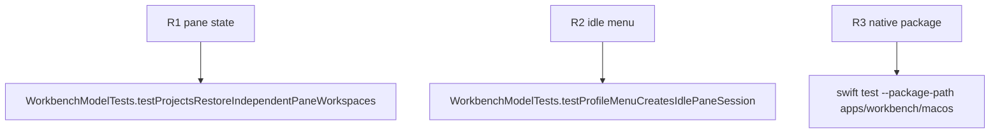

## Logic
<!-- type: logic lang: mermaid -->


A `ProjectTerminalWorkspace` contains session tabs plus ordered pane records. Each pane references zero or one session tab. The first profile choice fills the selected empty pane. A second profile choice adds the right pane when capacity permits. A pane close terminates only its running session and leaves one empty pane when it was the last pane.

The view renders a project-qualified pane layout and keeps inactive project renderers mounted but noninteractive. Pane focus is model state. The profile menu and pane actions provide visible labels and keyboard-focusable controls; state dots convey lifecycle without a redundant text status.
## Changes
<!-- type: changes lang: yaml -->

```yaml
changes:
  - path: apps/workbench/macos/Sources/WorkbenchMacCore/WorkbenchModel.swift
    action: modify
    section: logic
    impl_mode: hand-written
    anchor: WorkbenchModel
  - path: apps/workbench/macos/Sources/WorkbenchMac/WorkbenchView.swift
    action: modify
    section: logic
    impl_mode: hand-written
    anchor: WorkbenchView
  - path: apps/workbench/macos/Tests/WorkbenchMacCoreTests/WorkbenchModelTests.swift
    action: modify
    section: unit-test
    impl_mode: hand-written
    anchor: WorkbenchModelTests
  - path: apps/workbench/macos/UITests/WorkbenchMacUITests.swift
    action: modify
    section: unit-test
    impl_mode: hand-written
    anchor: WorkbenchMacUITests
```
## Unit Test
<!-- type: unit-test lang: mermaid -->


