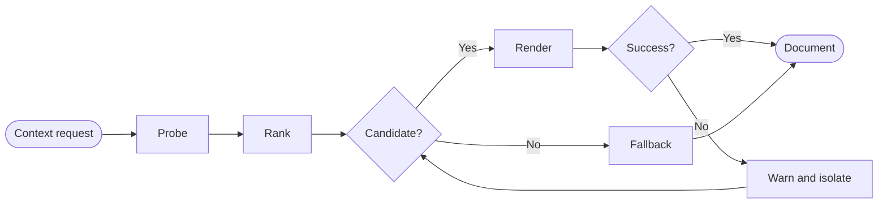

## Logic
<!-- type: logic lang: mermaid -->



The `ContextRenderer` trait exposes stable id, priority, support probing, and read-only rendering. `RendererRegistry` ranks all supporting implementations by priority descending then id ascending. Errors are appended as warnings and the next candidate is tried; exhaustion returns a navigable fallback. `ContextRequest` confines relative file targets below a canonical root, and `ContextDocument` discloses renderer id, kind, root/path provenance, warnings, safe HTML, and source navigation.

`MarkdownRenderer` accepts bounded UTF-8 `.md`/`.markdown` files and renders CommonMark with tables, task lists, and strikethrough. Raw HTML is escaped into text and unsafe link or image schemes are neutralized before `pulldown-cmark` emits HTML. `GitRenderer` supports ordinary working trees and runs only explicit read-only `git -C <root> status --short --branch`, `git diff --stat`, and `git diff` commands with bounded, escaped output; changed paths become navigation targets.

The generic registry is usable with no `aw.toml` or AW artifacts. Missing Git, corrupt or oversized Markdown, unsupported targets, and renderer failures produce fallback documents without touching PTY state, cwd telemetry, launch folders, repository content, or lifecycle state.
## Changes
<!-- type: changes lang: yaml -->

```yaml
changes:
  - path: Cargo.lock
    action: modify
    section: logic
    impl_mode: hand-written
    description: Record the Workbench direct pulldown-cmark dependency.
  - path: apps/workbench/Cargo.toml
    action: modify
    section: logic
    impl_mode: hand-written
    description: Add bounded CommonMark rendering support.
  - path: apps/workbench/src/context/mod.rs
    action: create
    section: logic
    impl_mode: hand-written
    description: Define renderer requests, structured documents, deterministic registry selection, error isolation, fallback, and path confinement.
  - path: apps/workbench/src/context/markdown.rs
    action: create
    section: logic
    impl_mode: hand-written
    description: Render bounded UTF-8 Markdown to safe HTML with explicit source navigation.
  - path: apps/workbench/src/context/git.rs
    action: create
    section: logic
    impl_mode: hand-written
    description: Render read-only Git status, diff stat, diff, and changed-path navigation for ordinary repositories.
  - path: apps/workbench/src/lib.rs
    action: modify
    section: logic
    impl_mode: hand-written
    anchor: run
    description: Export the generic context-renderer registry from the Workbench host crate.
  - path: apps/workbench/tests/generic_context_renderers.rs
    action: create
    section: unit-test
    impl_mode: hand-written
    description: Prove non-AW Markdown and Git rendering, deterministic selection, failure isolation, safe output, and navigable fallback.
  - path: apps/workbench/README.md
    action: modify
    section: logic
    impl_mode: hand-written
    description: Document provider-neutral Markdown/Git context, selection, provenance, and fallback behavior.
  - path: apps/workbench/CAPABILITIES.md
    action: modify
    section: logic
    impl_mode: hand-written
    description: Advance the generic-context-renderers work root and register its verification gate.
  - path: apps/workbench/CONTRIBUTING.md
    action: modify
    section: unit-test
    impl_mode: hand-written
    description: Record the non-AW renderer fixture gate and read-only isolation rules.
```
## Unit Test

```mermaid
---
id: workbench-generic-context-renderers-verification
requirements:
  deterministic_registry_selection:
    id: R1
    text: "Supported renderers are selected deterministically by priority descending and stable id, while one renderer failure is disclosed and isolated before the next candidate runs."
    kind: contract
    risk: high
    verify: tests/generic_context_renderers.rs::selection_is_deterministic_and_failures_are_isolated
  navigable_fallback:
    id: R4
    text: "Unsupported, oversized, corrupt, missing, or renderer-failed artifacts return a structured fallback with source navigation and warnings rather than panicking."
    kind: failure-recovery
    risk: high
    verify: tests/generic_context_renderers.rs::unsupported_and_corrupt_artifacts_have_navigable_fallbacks
  non_aw_git_rendering:
    id: R3
    text: "The same ordinary Git fixture renders read-only branch/status/diff context and navigable changed paths without requiring aw.toml."
    kind: integration
    risk: high
    verify: tests/generic_context_renderers.rs::non_aw_fixture_renders_markdown_and_git_context
  non_aw_markdown_rendering:
    id: R2
    text: "A repository with no AW artifacts renders bounded UTF-8 Markdown to safe HTML with canonical source provenance and navigation."
    kind: integration
    risk: high
    verify: tests/generic_context_renderers.rs::non_aw_fixture_renders_markdown_and_git_context
  renderer_boundary_is_read_only:
    id: R5
    text: "Generic renderers cannot mutate PTY, cwd telemetry, registered folders, repository files, or AW lifecycle state, and traversal outside the request root is rejected."
    kind: boundary
    risk: high
    verify: tests/generic_context_renderers.rs::renderers_are_path_confined_and_runtime_independent
---
flowchart TD
    r1[R1 deterministic registry selection] --> tests_generic_context_renderers_rs_selection_is_deterministic_and_failures_are_isolated[tests/generic_context_renderers.rs::selection_is_deterministic_and_failures_are_isolated]
    r2[R2 non aw markdown rendering] --> tests_generic_context_renderers_rs_non_aw_fixture_renders_markdown_and_git_context[tests/generic_context_renderers.rs::non_aw_fixture_renders_markdown_and_git_context]
    r3[R3 non aw git rendering] --> tests_generic_context_renderers_rs_non_aw_fixture_renders_markdown_and_git_context
    r4[R4 navigable fallback] --> tests_generic_context_renderers_rs_unsupported_and_corrupt_artifacts_have_navigable_fallbacks[tests/generic_context_renderers.rs::unsupported_and_corrupt_artifacts_have_navigable_fallbacks]
    r5[R5 renderer boundary is read only] --> tests_generic_context_renderers_rs_renderers_are_path_confined_and_runtime_independent[tests/generic_context_renderers.rs::renderers_are_path_confined_and_runtime_independent]
```

<!-- type: unit-test lang: mermaid -->


